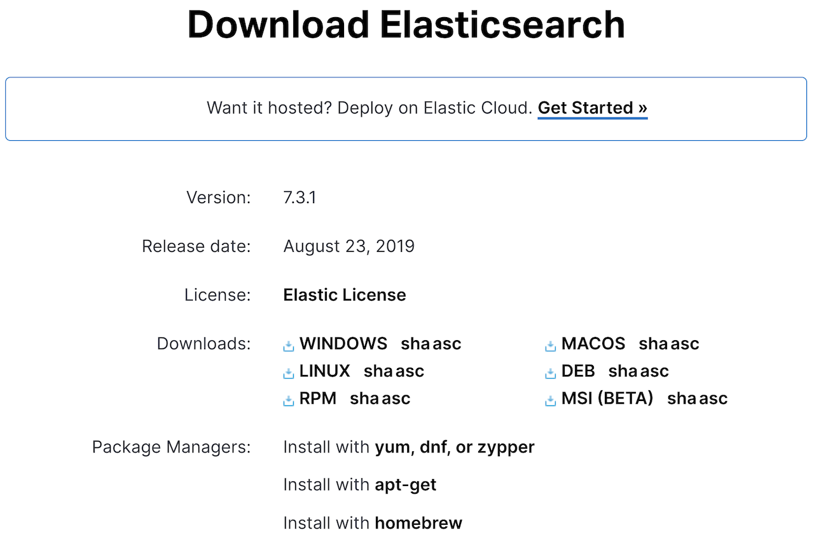
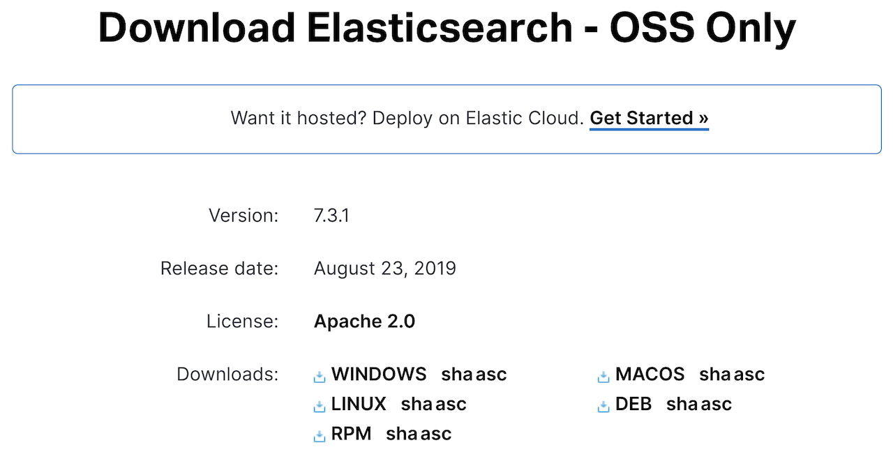

Elasticsearch는 홈페이지 ([https://www.elastic.co](https://www.elastic.co))의 Product 또는 다운로드 메뉴를 통해 다운로드를 할 수 있습니다. 다음과 같이 ZIP, TAR, DEB, RPM 등의 다운로드 파일과 yum, apt-get 등의 설치에 대한 메뉴얼이 있습니다.

ZIP 또는 TAR 파일을 내려받아 압축을 풀고, 생성된 bin 디렉토리 아래에 있는 elasticsearch (Windowns의 경우 elasticsearch.bat) 파일을 실행합니다. 데비안이나 레드햇 리눅스 시스템의 경우 DEB, RPM 파일을 내려받아 백그라운드 서비스로 실행도 가능합니다.

6.3 버전 부터는 아파치 2.0 라이센스와 Elastic 라이센스 (X-Pack) 가 혼합된 배포판을 기본으로 제공하기 때문에 아파치 2.0 라이센스에 속한 기능만을 내려받으려면 OSS 페이지로 이동해서 내려받아야 합니다.

