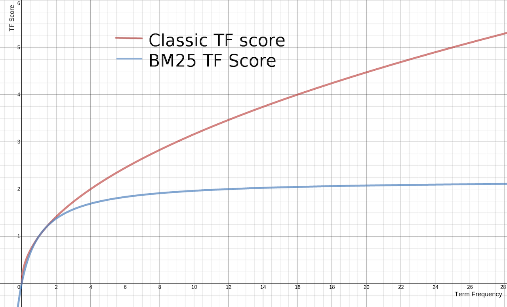
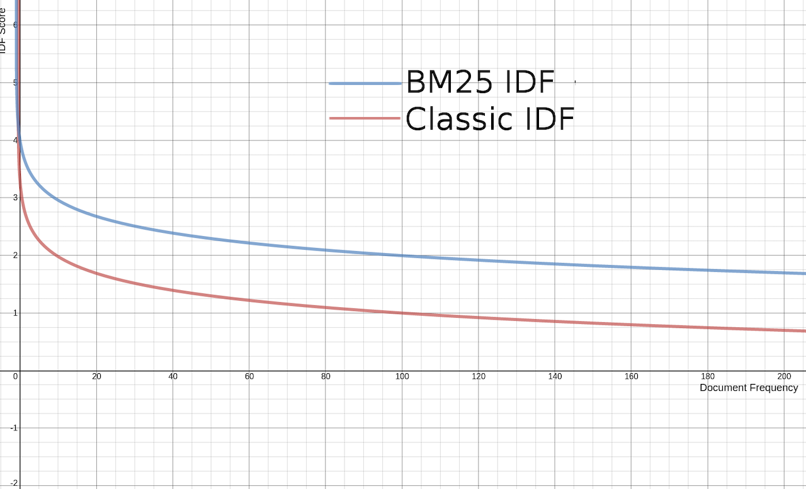

RDBMS 같은 시스템에서는 쿼리 조건에 부합하는 지만 판단하여 결과를 가져올 뿐 각 결과들이 얼마나 정확한지에 대한 판단은 보통 불가능합니다. Elasticsearch 와 같은 풀 텍스트 검색엔진은 검색 결과가 입력된 검색 조건과 얼마나 정확하게 일치하는 지를 계산하는 알고리즘을 가지고 있어 이 정확도를 기반으로 사용자가 가장 원하는 결과를 먼저 보여줄 수 있습니다. 이 정확한 정도를 **relevancy** 라고 합니다 \(렐러번시 라고 읽습니다\). 한국어로 번역하면 연관성 또는 관련성 이라고 번역이 되는데, 이 책에서는 이해를 돕기 위해 **정확도** 라는 표현을 쓰겠습니다. 스터디 또는 강연 등에서 언급 하실 때는 원래 용어 relevancy 로 사용하실 것을 권장 드립니다.

검색을 할 때 사용자는 찾고자 하는 정확한 결과만 보고싶어 합니다. 검색 조건에 포함 되더라도 사용자가 찾으려는 결과와 상관 없는 결과는 보여주지 않는 것이 좋습니다. 구글 또는 네이버 같은 웹 검색엔진들도 검색을 하면 찾은 결과들 중에 어떤 것이 사용자가 입력한 검색어와 가장 연관성이 있는지를 계산하여 정확도가 가장 높은 결과들 부터 보여줍니다.

## 스코어 \(score\) 점수

Elasticsearch의 검색 결과에는 스코어 점수가 표시가 됩니다. 이 점수는 검색된 결과가 얼마나 검색 조건과 일치하는지를 나타내며 점수가 높은 순으로 결과를 보여줍니다. 다음의 match 쿼리 결과를 살펴보겠습니다.

<DocTabs>
  <DocTab name="request">
```javascript
GET my_index/_search
{
  "query": {
    "match": {
      "message": "quick dog"
    }
  }
}
```
  </DocTab>
  <DocTab name="response">
```javascript
{
  "took" : 1,
  "timed_out" : false,
  "_shards" : {
    "total" : 1,
    "successful" : 1,
    "skipped" : 0,
    "failed" : 0
  },
  "hits" : {
    "total" : {
    "value" : 5,
    "relation" : "eq"
    },
    "max_score" : 0.8762741,
    "hits" : [
      {
        "_index" : "my_index",
        "_type" : "_doc",
        "_id" : "3",
        "_score" : 0.8762741,
        "_source" : {
          "message" : "The quick brown fox jumps over the quick dog"
        }
      },
      {
        "_index" : "my_index",
        "_type" : "_doc",
        "_id" : "2",
        "_score" : 0.6744513,
        "_source" : {
          "message" : "The quick brown fox jumps over the lazy dog"
        }
      },
      {
        "_index" : "my_index",
        "_type" : "_doc",
        "_id" : "1",
        "_score" : 0.6173784,
        "_source" : {
          "message" : "The quick brown fox"
        }
      },
      {
        "_index" : "my_index",
        "_type" : "_doc",
        "_id" : "5",
        "_score" : 0.35847884,
        "_source" : {
          "message" : "Lazy jumping dog"
        }
      },
      {
        "_index" : "my_index",
        "_type" : "_doc",
        "_id" : "4",
        "_score" : 0.32951736,
        "_source" : {
          "message" : "Brown fox brown dog"
        }
      }
    ]
  }
}
```
  </DocTab>
</DocTabs>

각 검색 결과의 `_score` 항목에 스코어 점수가 표시되고 이 점수가 높은 결과부터 나타납니다. 그리고 상단의 `max_score`에는 전체 결과 중에서 가장 높은 점수가 표시됩니다. Elasticsearch 는 이 점수를 계산하기 위해 **BM25** 라는 알고리즘을 이용합니다. BM은 Best Matching 을 뜻합니다.

다음은 **BM25**의 계산식입니다.


[BM25 계산식 - 출처: https://en.wikipedia.org/wiki/Okapi_BM25](https://en.wikipedia.org/wiki/Okapi_BM25)

복잡해 보이는 이 계산에는 크게 **TF**, **IDF** 그리고 **Field Length** 총 3가지 요소가 사용됩니다.

## TF \(Term Frequency\)

구글에서 **"쥬라기 공원"** 이라는 검색어로 검색을 한다고 가정 해 보겠습니다. **"쥬라기 공원"**이라는 단어가 **5**번 들어 있는 웹 페이지 보다는 **10**번 들어있는 웹 페이지가 내가 보고싶어 하는 정보가 있는 페이지일 확률이 높을 것입니다. 도큐먼트 내에 검색된 **텀\(term\)**이 더 많을수록 점수가 높아지는 것을 **Term Frequency** 라고 합니다.

앞의 검색에서는 값이 "The **quick** brown fox jumps over the **quick** **dog**" 인 도큐먼트가 텀 **quick**, **dog** 총 세개를 포함하고 있어 가장 점수가 높습니다. 포함하고 있는 텀이 증가할수록 아래 그래프와 같이 TF 값도 증가를 하며, BM25에서는 최대 25까지 증가합니다. 즉 25 이상 부터는 TF 점수의 변화가 없습니다.


[출처 : https://opensourceconnections.com/blog/2015/10/16/bm25-the-next-generation-of-lucene-relevation](https://opensourceconnections.com/blog/2015/10/16/bm25-the-next-generation-of-lucene-relevation)

## IDF \(Inverse Document Frequency\)

다시 구글에서 **"쥬라기 공원"** 이라는 검색어로 검색을 했을 때 **"쥬라기"** 또는 **"공원"** 중 어떤 단어든 포함하는 페이지들은 검색 결과에 나타날 수 있을 것입니다. 이 때 전체 검색 결과 중에 **"쥬라기"** 가 포함된 결과는 **10**개 **"공원"**이 포함된 결과는 **100**개 라고 가정한다면 흔한 단어인 **"공원"** 보다는 희소한 단어인 **"쥬라기"** 가 검색에 더 중요한 텀일 가능성이 높습니다. 검색한 텀을 포함하고 있는 도큐먼트 개수가 많을수록 그 텀의 자신의 점수가 감소하는 것을 **Inverse Document Frequency** 라고 합니다.

앞의 검색 결과 중 값이 "The **quick** brown fox" 인 도큐먼트와 "Lazy jumping **dog**" 인 도큐먼트는 **quick**과 **dog**가 각각 한 번씩만 들어가지만 전체 인덱스를 놓고 보면 **quick**이 들어간 문서는 **3**개, **dog**이 들어간 문서는 **4**개 가 있어 **quick** 이 들어가 있는 결과가 점수가 높습니다. 전체 인덱스에 포함된 텀이 증가할수록 아래 그래프와 같이 IDF 감소하게 됩니다. \(그래서 Inverse 입니다\)


[출처 : https://opensourceconnections.com/blog/2015/10/16/bm25-the-next-generation-of-lucene-relevation](https://opensourceconnections.com/blog/2015/10/16/bm25-the-next-generation-of-lucene-relevation)

## Field Length

도큐먼트에서 필드 길이가 큰 필드 보다는 짧은 필드에 있는 텀의 비중이 클 것입니다. 블로그 포스트를 검색하는 경우 검색 하려는 단어가 **제목**과 **내용** 필드에 모두 있는 경우 텍스트 길이가 긴 **내용** 필드 보다는 텍스트 길이가 짧은 **제목** 필드에 검색어를 포함하고 있는 블로그 포스트가 더 점수가 높게 나타납니다. 다음 **lazy** 를 검색한 쿼리의 결과를 살펴보겠습니다.

<DocTabs>
  <DocTab name="request">
```javascript
GET my_index/_search
{
  "query": {
    "match": {
      "message": "lazy"
    }
  }
}
```
  </DocTab>
  <DocTab name="response">
```javascript
{
  "took" : 1,
  "timed_out" : false,
  "_shards" : {
    "total" : 1,
    "successful" : 1,
    "skipped" : 0,
    "failed" : 0
  },
  "hits" : {
    "total" : {
      "value" : 2,
      "relation" : "eq"
    },
    "max_score" : 1.0909162,
    "hits" : [
      {
        "_index" : "my_index",
        "_type" : "_doc",
        "_id" : "5",
        "_score" : 1.0909162,
        "_source" : {
          "message" : "Lazy jumping dog"
        }
      },
      {
        "_index" : "my_index",
        "_type" : "_doc",
        "_id" : "2",
        "_score" : 0.71425706,
        "_source" : {
          "message" : "The quick brown fox jumps over the lazy dog"
        }
      }
    ]
  }
}
```
  </DocTab>
</DocTabs>

검색 결과에서 **lazy** 를 포함하고 있는 2개 도큐먼트 들이 나타났지만 "The quick brown fox jumps over the lazy dog" 보다 길이가 짧은 "Lazy jumping dog" 가 점수가 더 높게 나타납니다.