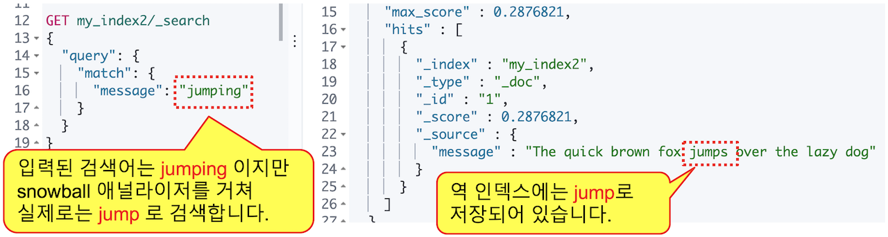
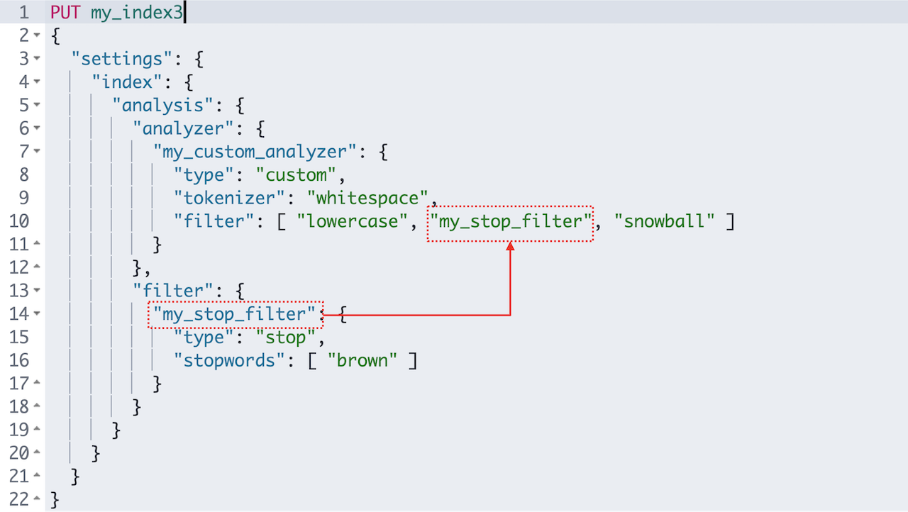

Elasticsearch 에는 애널라이저를 조합하고 그 동작을 자세히 확인할 수 있는 API 들이 있습니다. 계속해서 애널라이저와 관련된 기능들에 대해 살펴보겠습니다.

## 6.3.1 _analyze API

Elasticsearch 에서는 분석된 문장을 `_analyze` API를 이용해서 확인할 수 있습니다. 토크나이저는 `tokenizer`, 토큰 필터는 `filter` 항목의 값으로 입력하면 됩니다. 토크나이저는 하나만 적용되기 때문에 바로 입력하고, 토큰필터는 여러개를 적용할 수 있기 때문에 **\[ \]** 안에 배열 형식으로 입력합니다. **"The quick brown fox jumps over the lazy dog"** 문장을 `whitespace` 토크나이저와 `lowercase`, `stop`, `snowball` 토큰 필터를 적용하면 다음과 같은 결과를 확인할 수 있습니다.

<DocTabs>
  <DocTab name="request">
```javascript
GET _analyze
{
  "text": "The quick brown fox jumps over the lazy dog",
  "tokenizer": "whitespace",
  "filter": [
    "lowercase",
    "stop",
    "snowball"
  ]
}
```
  </DocTab>
  <DocTab name="response">
```javascript
{
  "tokens" : [
    {
      "token" : "quick",
      "start_offset" : 4,
      "end_offset" : 9,
      "type" : "word",
      "position" : 1
    },
    {
      "token" : "brown",
      "start_offset" : 10,
      "end_offset" : 15,
      "type" : "word",
      "position" : 2
    },
    {
      "token" : "fox",
      "start_offset" : 16,
      "end_offset" : 19,
      "type" : "word",
      "position" : 3
    },
    {
      "token" : "jump",
      "start_offset" : 20,
      "end_offset" : 25,
      "type" : "word",
      "position" : 4
    },
    {
      "token" : "over",
      "start_offset" : 26,
      "end_offset" : 30,
      "type" : "word",
      "position" : 5
    },
    {
      "token" : "lazi",
      "start_offset" : 35,
      "end_offset" : 39,
      "type" : "word",
      "position" : 7
    },
    {
      "token" : "dog",
      "start_offset" : 40,
      "end_offset" : 43,
      "type" : "word",
      "position" : 8
    }
  ]
}
```
  </DocTab>
</DocTabs>

토크나이저, 토큰필터를 이용해 처리된 `"token" : "jump"`, `"token" : "lazi"` 같은 결과들을 확인할 수 있습니다.

여러 토큰 필터를 입력 할 때는 순서가 중요하며 만약에 `stop` 토큰 필터를 `lowercase` 보다 먼저 놓게 되면 `stop` 토큰필터 처리시 대문자로 시작하는 **"The"**는 불용어로 간주되지 않아 그냥 남아있게 됩니다. 그 후에 `lowercase`가 적용되어 소문자 **"the"**가 최종 검색 텀으로 역 색인에 남아있게 됩니다.

<DocTabs>
  <DocTab name="request">
```javascript
GET _analyze
{
  "text": "The quick brown fox jumps over the lazy dog",
  "tokenizer": "whitespace",
  "filter": [
    "stop",
    "lowercase",
    "snowball"
  ]
}
```
  </DocTab>
  <DocTab name="response">
```javascript
{
  "tokens" : [
    {
      "token" : "the",
      "start_offset" : 0,
      "end_offset" : 3,
      "type" : "word",
      "position" : 0
    },
    {
      "token" : "quick",
      "start_offset" : 4,
      "end_offset" : 9,
      "type" : "word",
      "position" : 1
    },
    {
      "token" : "brown",
      "start_offset" : 10,
      "end_offset" : 15,
      "type" : "word",
      "position" : 2
    },
    {
      "token" : "fox",
      "start_offset" : 16,
      "end_offset" : 19,
      "type" : "word",
      "position" : 3
    },
    {
      "token" : "jump",
      "start_offset" : 20,
      "end_offset" : 25,
      "type" : "word",
      "position" : 4
    },
    {
      "token" : "over",
      "start_offset" : 26,
      "end_offset" : 30,
      "type" : "word",
      "position" : 5
    },
    {
      "token" : "lazi",
      "start_offset" : 35,
      "end_offset" : 39,
      "type" : "word",
      "position" : 7
    },
    {
      "token" : "dog",
      "start_offset" : 40,
      "end_offset" : 43,
      "type" : "word",
      "position" : 8
    }
  ]
}
```
  </DocTab>
</DocTabs>

애널라이저는 `_analyze` API에서 `analyzer` 항목으로 적용해서 사용이 가능합니다. 애널라이저는 **캐릭터 필터**, **토크나이저** 그리고 **토큰 필터**들을 조합해서 사용자 정의 애널라이저를 만들 수도 있고, Elasticsearch 에 사전에 정의되어 있어 바로 사용 가능 한 애널라이저들도 있습니다. 앞서 실행한 `whitespace` 토크나이저 그리고 `lowercase`, `stop`, `snowball` 토큰필터들을 조합한 것 것이 **`snowball`** 애널라이저 입니다. 다음은 **`snowball`** 애널라이저를 적용해서 **"The quick brown fox jumps over the lazy dog"** 문장을 분석한 예제입니다.

<DocTabs>
  <DocTab name="request">
```javascript
GET _analyze
{
  "text": "The quick brown fox jumps over the lazy dog",
  "analyzer": "snowball"
}
```
  </DocTab>
  <DocTab name="response">
```javascript
{
  "tokens" : [
    {
      "token" : "quick",
      "start_offset" : 4,
      "end_offset" : 9,
      "type" : "<ALPHANUM>",
      "position" : 1
    },
    {
      "token" : "brown",
      "start_offset" : 10,
      "end_offset" : 15,
      "type" : "<ALPHANUM>",
      "position" : 2
    },
    {
      "token" : "fox",
      "start_offset" : 16,
      "end_offset" : 19,
      "type" : "<ALPHANUM>",
      "position" : 3
    },
    {
      "token" : "jump",
      "start_offset" : 20,
      "end_offset" : 25,
      "type" : "<ALPHANUM>",
      "position" : 4
    },
    {
      "token" : "over",
      "start_offset" : 26,
      "end_offset" : 30,
      "type" : "<ALPHANUM>",
      "position" : 5
    },
    {
      "token" : "lazi",
      "start_offset" : 35,
      "end_offset" : 39,
      "type" : "<ALPHANUM>",
      "position" : 7
    },
    {
      "token" : "dog",
      "start_offset" : 40,
      "end_offset" : 43,
      "type" : "<ALPHANUM>",
      "position" : 8
    }
  ]
}
```
  </DocTab>
</DocTabs>

**`snowball`** 애널라이저를 사용한 결과는 앞의 **`whitespace`** 토크나이저 그리고 **`lowercase`**, **`stop`**, **`snowball`** 토큰필터를 사용한 결과와 동일하게 나타납니다.

인덱스의 매핑(mappings) 설정에 snowball 애널라이저를 적용하고 "The quick brown fox jumps over the lazy dog" 값을 색인하면 **fox**, **jump**, **lazi** 등의 단어가 검색 텀으로 저장됩니다. `match` 쿼리로 검색을 수행하면 입력한 검색어도 앞에서 적용한 `snowball` 애널라이저를 똑같이 거치게 됩니다. **jumps** 또는 **jumping** 등으로 검색을 수행하면 `lowercase`, `snowball`토큰 필터 등이 적용되어 검색어를 **jump**로 바꾸어 검색합니다.

인덱스에 애널라이저는 아래 예제와 같이 지정합니다. 다음은 my_index2 인덱스의 message 필드에 snowball 애널라이저를 적용한 예제입니다. 매핑에 대해서는 다음 장에서 더 자세히 설명하겠습니다.

```javascript
PUT my_index2
{
  "mappings": {
    "properties": {
      "message": {
        "type": "text",
        "analyzer": "snowball"
      }
    }
  }
}
```

<DocCallOut color="warning">
6.x 이전 버전의 매핑에서는 `"mappings"` |`"properties"`  사이에  도큐먼트 타입 값이 들어갑니다.
</DocCallOut>

위에서 생성한 my_index2 인덱스에 `"message": "The quick brown fox jumps over the lazy dog"` 값을 넣고 `jumping` 으로 검색을 해 보도록 하겠습니다.

```javascript
PUT my_index2/_doc/1
{
  "message": "The quick brown fox jumps over the lazy dog"
}
```

match 쿼리로 **jump**, **jumping** 또는 **jumps** 중 어떤 값으로 검색 해도 결과가 나타납니다.

<DocTabs>
  <DocTab name="request">
```javascript
GET my_index2/_search
{
  "query": {
    "match": {
      "message": "jumping"
    }
  }
}
```
  </DocTab>
  <DocTab name="response">
```javascript
{
  "took" : 1,
  "timed_out" : false,
  "_shards" : {
    "total" : 1,
    "successful" : 1,
    "skipped" : 0,
    "failed" : 0
  },
  "hits" : {
    "total" : {
      "value" : 1,
      "relation" : "eq"
    },
    "max_score" : 0.2876821,
    "hits" : [
      {
        "_index" : "my_index2",
        "_type" : "_doc",
        "_id" : "1",
        "_score" : 0.2876821,
        "_source" : {
          "message" : "The quick brown fox jumps over the lazy dog"
        }
      }
    ]
  }
}
```
  </DocTab>
</DocTabs>



## 6.3.2 Term 쿼리

Elasticsearch에서 제공하는 쿼리 중에는 `term` 쿼리가 있습니다. `match` 쿼리와 문법은 유사하지만 `term` 쿼리는 입력한 검색어는 애널라이저를 적용하지 않고 입력된 검색어 그대로 일치하는 텀을 찾습니다. 따라서 **jumps**, **jumping** 으로 검색하면 결과가 나타나지 않고 **jump**로 검색해야 결과가 나타납니다.

<DocTabs>
  <DocTab name="request">
```javascript
GET my_index2/_search
{
  "query": {
    "term": {
      "message": "jumps"
    }
  }
}
```
  </DocTab>
  <DocTab name="response">
```javascript
{
  "took" : 0,
  "timed_out" : false,
  "_shards" : {
    "total" : 1,
    "successful" : 1,
    "skipped" : 0,
    "failed" : 0
  },
  "hits" : {
    "total" : {
      "value" : 0,
      "relation" : "eq"
    },
    "max_score" : null,
    "hits" : [ ]
  }
}
```
  </DocTab>
</DocTabs>

<DocTabs>
  <DocTab name="request">
```javascript
GET my_index2/_search
{
  "query": {
    "term": {
      "message": "jump"
    }
  }
}
```
  </DocTab>
  <DocTab name="response">
```javascript
{
  "took" : 0,
  "timed_out" : false,
  "_shards" : {
    "total" : 1,
    "successful" : 1,
    "skipped" : 0,
    "failed" : 0
  },
  "hits" : {
    "total" : {
      "value" : 1,
      "relation" : "eq"
    },
    "max_score" : 0.2876821,
    "hits" : [
      {
        "_index" : "my_index2",
        "_type" : "_doc",
        "_id" : "1",
        "_score" : 0.2876821,
        "_source" : {
          "message" : "The quick brown fox jumps over the lazy dog"
        }
      }
    ]
  }
}
```
  </DocTab>
</DocTabs>

이렇게 도큐먼트의 원문은 **jumps** 이지만 어떤 쿼리를 사용하느냐에 따라 원문과 같은 **jumps** 검색어를 넣어도 검색이 되지 않는 경우가 있습니다.

<DocCallOut color="danger">
텍스트 분석(Analysis) 과정은 검색에 사용되는 **역 인덱스**에만 관여합니다. 원본 데이터는 변하지 않으므로 쿼리 결과의 **_source** 항목에는 항상 **원본 데이터**가 나옵니다.
</DocCallOut>

지금까지 본 것 처럼 Elasticsearch는 데이터를 실제로 검색에 사용되는 텀(Term) 으로 분석 과정을 거쳐 저장하기 때문에 검색 시 대소문자, 단수나 복수, 원형 여부와 상관 없이 검색이 가능합니다. 이러한 Elasticsearch의 특징을 <DocLink id="esG7-05-01-fulltext" text="풀 텍스트 검색(Full Text Search)"/>  이라고 하며 한국어로 **전문 검색** 이라고도 합니다.

앞에서 설명한 것들 외에도 elasticsearch에서 사용 가능한 애널라이저, 캐릭터 필터, 토크나이저, 토큰필터 들의 목록은 공식 [홈페이지 도큐먼트](https://www.elastic.co/guide/en/elasticsearch/reference/current/analysis-analyzers.html)에서 확인이 가능합니다.

## 6.3.3 사용자 정의 애널라이저 - Custom Analyzer

**_analyze API**로 애널라이저, 토크나이저, 토큰필터들의 테스트가 가능하지만, 실제로 인덱스에 저장되는 데이터의 처리에 대한 설정은 **애널라이저만 적용할 수 있습니다**. 인덱스 매핑에 애널라이저를 적용 할 때 보통은 이미 정의되어 제공되는 애널라이저 보다는 토크나이저, 토큰필터 등을 조합하여 만든 **사용자 정의 애널라이저(Custom Analyzer)**를 주로 사용합니다. 이미 정의된 애널라이저들은 매핑에 정의한 text 필드의 **analyzer** 항목에 이름을 명시하기만 하면 쉽게 적용이 가능합니다.

이 책에서는 사용자 정의 애널라이저만 설명하겠으니 Elasticsearch에 사전에 만들어진 애널라이저들은 [https://www.elastic.co/](https://www.elastic.co/) 홈페이지의 공식 도큐먼트를 참고하시기 바랍니다. 매핑에 아무 설정을 하지 않는 경우 디폴트로 적용되는 애널라이저는 **standard** 애널라이저 입니다.

사용자 정의 애널라이저는 인덱스 **settings** 의 `"index" : { "analysis" :` 부분에 정의합니다. 생성한 다음에는 해당 인덱스에서 `GET` 또는 `POST <인덱스명>/_analyze` 명령으로 사용이 가능합니다. 다음은 **my_index3** 안에 `whitespace` 토큰크나이저 그리고 `lowercase`, `stop`, `snowball` 토큰필터를 사용하는 `my_custom_analyzer` 라는 이름의 애널라이저를 추가하는 예제입니다.

```javascript
PUT my_index3
{
  "settings": {
    "index": {
      "analysis": {
        "analyzer": {
          "my_custom_analyzer": {
            "type": "custom",
            "tokenizer": "whitespace",
            "filter": [
              "lowercase",
              "stop",
              "snowball"
            ]
          }
        }
      }
    }
  }
}
```

이제 **my_index3** 에서 **my_custom_analyzer**를 사용할 수 있습니다.

<DocTabs>
  <DocTab name="request">
```javascript
GET my_index3/_analyze
{
  "analyzer": "my_custom_analyzer",
  "text": [
    "The quick brown fox jumps over the lazy dog"
  ]
}
```
  </DocTab>
  <DocTab name="response">
```javascript
{
  "tokens" : [
    {
      "token" : "quick",
      "start_offset" : 4,
      "end_offset" : 9,
      "type" : "word",
      "position" : 1
    },
    {
      "token" : "brown",
      "start_offset" : 10,
      "end_offset" : 15,
      "type" : "word",
      "position" : 2
    },
    {
      "token" : "fox",
      "start_offset" : 16,
      "end_offset" : 19,
      "type" : "word",
      "position" : 3
    },
    {
      "token" : "jump",
      "start_offset" : 20,
      "end_offset" : 25,
      "type" : "word",
      "position" : 4
    },
    {
      "token" : "over",
      "start_offset" : 26,
      "end_offset" : 30,
      "type" : "word",
      "position" : 5
    },
    {
      "token" : "lazi",
      "start_offset" : 35,
      "end_offset" : 39,
      "type" : "word",
      "position" : 7
    },
    {
      "token" : "dog",
      "start_offset" : 40,
      "end_offset" : 43,
      "type" : "word",
      "position" : 8
    }
  ]
}
```
  </DocTab>
</DocTabs>

### 사용자 정의 토큰필터

토크나이저, 토큰필터의 경우에도 옵션을 지정하는 경우에는 사용자 정의 토크나이저, 토큰필터로 만들어 추가해야 합니다. 다음은 `stop` 토큰필터에 **"brown"**을 불용어로 적용한 **my_stop_filter** 사용자 정의 토큰필터를 생성하고 이것을 **my_custom_analyzer**에서 사용하도록 설정 한 예제입니다.

<DocCallOut color="warning">
아래 명령 실행 전에 기존 my_index3 인덱스는 먼저 삭제해야 합니다.
</DocCallOut>

```javascript
PUT my_index3
{
  "settings": {
    "index": {
      "analysis": {
        "analyzer": {
          "my_custom_analyzer": {
            "type": "custom",
            "tokenizer": "whitespace",
            "filter": [
              "lowercase",
              "my_stop_filter",
              "snowball"
            ]
          }
        },
        "filter": {
          "my_stop_filter": {
            "type": "stop",
            "stopwords": [
              "brown"
            ]
          }
        }
      }
    }
  }
}
```



이제 다시 **my_custom_analyzer**를 사용해서 텍스트를 분석 해 보면 **brown**이 불용어 처리가 되어 사라진 것을 확인할 수 있습니다.

<DocTabs>
  <DocTab name="request">
```javascript
GET my_index3/_analyze
{
  "analyzer": "my_custom_analyzer",
  "text": [
    "The quick brown fox jumps over the lazy dog"
  ]
}
```
  </DocTab>
  <DocTab name="response">
```javascript
{
  "tokens" : [
    {
      "token" : "the",
      "start_offset" : 0,
      "end_offset" : 3,
      "type" : "word",
      "position" : 0
    },
    {
      "token" : "quick",
      "start_offset" : 4,
      "end_offset" : 9,
      "type" : "word",
      "position" : 1
    },
    {
      "token" : "fox",
      "start_offset" : 16,
      "end_offset" : 19,
      "type" : "word",
      "position" : 3
    },
    {
      "token" : "jump",
      "start_offset" : 20,
      "end_offset" : 25,
      "type" : "word",
      "position" : 4
    },
    {
      "token" : "over",
      "start_offset" : 26,
      "end_offset" : 30,
      "type" : "word",
      "position" : 5
    },
    {
      "token" : "the",
      "start_offset" : 31,
      "end_offset" : 34,
      "type" : "word",
      "position" : 6
    },
    {
      "token" : "lazi",
      "start_offset" : 35,
      "end_offset" : 39,
      "type" : "word",
      "position" : 7
    },
    {
      "token" : "dog",
      "start_offset" : 40,
      "end_offset" : 43,
      "type" : "word",
      "position" : 8
    }
  ]
}
```
  </DocTab>
</DocTabs>

### 매핑에 사용자 정의 애널라이저 적용

애널라이저를 실제 인덱스에 입력할 데이터에 적용하려면 **settings** 부분에서 만든 애널라이저를 **mappings** 의 text 필드별로 지정합니다. 앞에서 만든 **my_custom_analyzer** 를 **message** 필드에 적용하는 방법은 다음과 같습니다. **setting** 부분은 위 예제와 동일합니다.

```javascript
PUT my_index3
{
  "settings": {
    "index": {
      "analysis": {
        "analyzer": {
          "my_custom_analyzer": {
            "type": "custom",
            "tokenizer": "whitespace",
            "filter": [
              "lowercase",
              "my_stop_filter",
              "snowball"
            ]
          }
        },
        "filter": {
          "my_stop_filter": {
            "type": "stop",
            "stopwords": [
              "brown"
            ]
          }
        }
      }
    }
  },
  "mappings": {
    "properties": {
      "message": {
        "type": "text",
        "analyzer": "my_custom_analyzer"
      }
    }
  }
}
```

이제 **my_index** 에 **message** 필드에 입력되는 값은 위에 지정된 **my_custom_analyzer** 애널라이저가 적용됩니다. my_index의 message 필드에 값을 입력하고 검색 해 보면 **brown**은 불용어 처리가 되어 검색되지 않는 것을 확인할 수 있습니다.

```javascript
PUT my_index3/_doc/1
{
  "message": "The quick brown fox jumps over the lazy dog"
}
```

<DocTabs>
  <DocTab name="request">
```javascript
GET my_index3/_search
{
  "query": {
    "match": {
      "message": "brown"
    }
  }
}
```
  </DocTab>
  <DocTab name="response">
```javascript
{
  "took" : 468,
  "timed_out" : false,
  "_shards" : {
    "total" : 1,
    "successful" : 1,
    "skipped" : 0,
    "failed" : 0
  },
  "hits" : {
    "total" : {
      "value" : 0,
      "relation" : "eq"
    },
    "max_score" : null,
    "hits" : [ ]
  }
}
```
  </DocTab>
</DocTabs>

## 6.3.4 텀 벡터 - _termvectors API

색인된 도큐먼트의 역 인덱스의 내용을 확인할 때는 도큐먼트 별로 **_termvectors** API를이용해서 확인이 가능합니다. `GET <인덱스>/_termvectors/<도큐먼트id>?fields=<필드명>` 형식으로 사용하며 **6.x** 이전 버전에서는 `GET <인덱스>/<도큐먼트 타입>/<도큐먼트id>/_termvectors?fields=<필드명>` 형식으로 사용합니다.

다음은 앞에서 입력한 **my_index3/_doc/1** 도큐먼트의 **message** 필드를 확인하는 예제입니다.

<DocTabs>
  <DocTab name="request">
```javascript
GET my_index3/_termvectors/1?fields=message
```
  </DocTab>
  <DocTab name="response">
```javascript
{
  "_index" : "my_index3",
  "_type" : "_doc",
  "_id" : "1",
  "_version" : 1,
  "found" : true,
  "took" : 1,
  "term_vectors" : {
    "message" : {
      "field_statistics" : {
        "sum_doc_freq" : 7,
        "doc_count" : 1,
        "sum_ttf" : 8
      },
      "terms" : {
        "dog" : {
          "term_freq" : 1,
          "tokens" : [
            {
              "position" : 8,
              "start_offset" : 40,
              "end_offset" : 43
            }
          ]
        },
        "fox" : {
          "term_freq" : 1,
          "tokens" : [
            {
              "position" : 3,
              "start_offset" : 16,
              "end_offset" : 19
            }
          ]
        },
        "jump" : {
          "term_freq" : 1,
          "tokens" : [
            {
              "position" : 4,
              "start_offset" : 20,
              "end_offset" : 25
            }
          ]
        },
        "lazi" : {
          "term_freq" : 1,
          "tokens" : [
            {
              "position" : 7,
              "start_offset" : 35,
              "end_offset" : 39
            }
          ]
        },
        "over" : {
          "term_freq" : 1,
          "tokens" : [
            {
              "position" : 5,
              "start_offset" : 26,
              "end_offset" : 30
            }
          ]
        },
        "quick" : {
          "term_freq" : 1,
          "tokens" : [
            {
              "position" : 1,
              "start_offset" : 4,
              "end_offset" : 9
            }
          ]
        },
        "the" : {
          "term_freq" : 2,
          "tokens" : [
            {
              "position" : 0,
              "start_offset" : 0,
              "end_offset" : 3
            },
            {
              "position" : 6,
              "start_offset" : 31,
              "end_offset" : 34
            }
          ]
        }
      }
    }
  }
}
```
  </DocTab>
</DocTabs>

여러개의 필드를 같이 확인하고 싶을 때는 `?fields=field1,field2` 처럼 쉼표로 나열해서 볼 수 있습니다.
