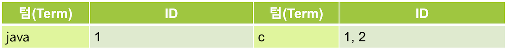
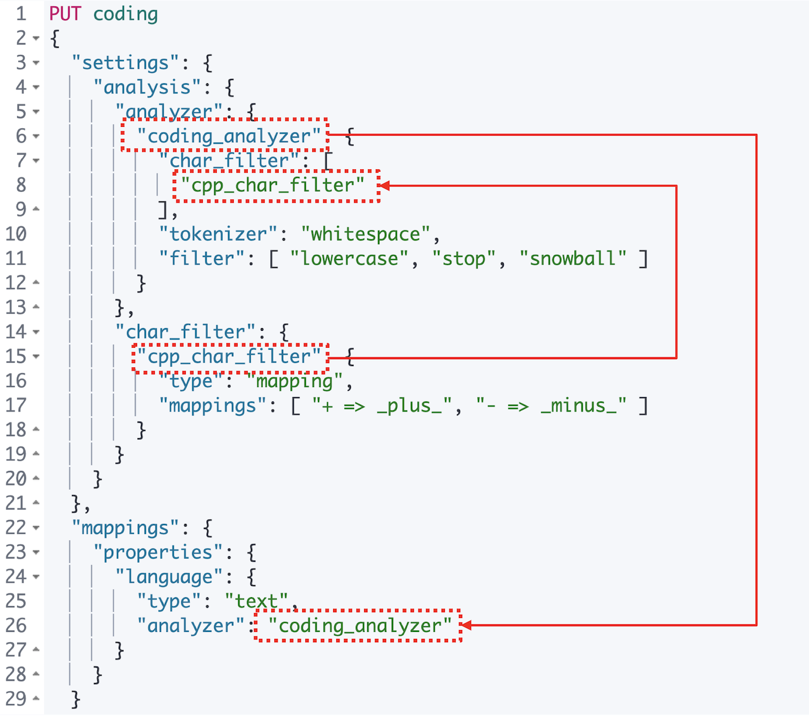
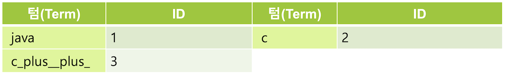

캐릭터 필터는 텍스트 분석 중 가장 먼저 처리되는 과정으로 색인된 텍스트가 토크나이저에 의해 텀으로 분리되기 전에 전체 문장에 대해 적용되는 일종의 전처리 도구입니다. 이 책에서 설명하는 7.0 버전 기준으로 캐릭터 필터는 **HTML Strip**, **Mapping**, **Pattern Replace** 총 3개가 존재합니다. `char_filter` 항목에 배열로 입력하며 하나만 적용하거나 차례대로 입력해서 3개를 모두 적용할 수도 있습니다.

## 6.4.1 HTML Strip

입력된 텍스트가 HTML 인 경우 HTML 태그들을 제거하여 일반 텍스트로 만듭니다. `<>`로 된 태그를 제거할 뿐 아니라 `&nbsp;` 같은 HTML 문법 용어들도 해석합니다. 입력 값은 `html_strip` 입니다.

다음은 HTML Strip 캐릭터 필터를 이용해서 `<p>I&apos;m so <b>happy</b>!</p>` 문장을 처리 한 결과입니다.

<DocTabs>
  <DocTab name="request">
```javascript
POST _analyze
{
  "tokenizer": "keyword",
  "char_filter": [
    "html_strip"
  ],
  "text": "<p>I&apos;m so <b>happy</b>!</p>"
}
```
  </DocTab>
  <DocTab name="response">
```javascript
{
  "tokens" : [
    {
      "token" : """

I'm so happy!

""",
      "start_offset" : 0,
      "end_offset" : 32,
      "type" : "word",
      "position" : 0
    }
  ]
}
```
  </DocTab>
</DocTabs>

모든 태그들이 제거되고 해석되어 **"I'm so happy!"** 라는 문장으로 변경 된 것을 확인할 수 있습니다.

<DocCallOut color="warning">
애널라이저는 항상 최소 1개의 토크나이저를 필요로 하기 때문에 캐릭터 필터만 적용하면 오류가 발생합니다. 위 예제에서는 **keyword** 토크나이저를 같이 사용했습니다.
</DocCallOut>

## 6.4.2 Mapping

Mapping 캐릭터 필터를 이용하면 지정한 단어를 다른 단어로 치환이 가능합니다. 특수문자 등을 포함하는 검색 기능을 구현하려는 경우 반드시 적용해야 해서 실제로 캐릭터 필터 중에는 가장 많이 쓰입니다. 다음 예제를 위해 **language** 필드에 값이 **Java**, **C**, **C++** 인 도큐먼트들이 있는 **coding** 인덱스를 생성 해 보겠습니다.

```javascript
POST coding/_bulk
{"index":{"_id":"1"}}
{"language":"Java"}
{"index":{"_id":"2"}}
{"language":"C"}
{"index":{"_id":"3"}}
{"language":"C++"}
```

이제 coding 인덱스에서 match 쿼리로 **C++** 을 검색 해 보겠습니다.

<DocTabs>
  <DocTab name="request">
```javascript
GET coding/_search
{
  "query": {
    "match": {
      "language": "C++"
    }
  }
}
```
  </DocTab>
  <DocTab name="response">
```javascript
{
  "took" : 255,
  "timed_out" : false,
  "_shards" : {
    "total" : 1,
    "successful" : 1,
    "skipped" : 0,
    "failed" : 0
  },
  "hits" : {
    "total" : {
      "value" : 2,
      "relation" : "eq"
    },
    "max_score" : 0.47000363,
    "hits" : [
      {
        "_index" : "coding",
        "_type" : "_doc",
        "_id" : "2",
        "_score" : 0.47000363,
        "_source" : {
          "language" : "C"
        }
      },
      {
        "_index" : "coding",
        "_type" : "_doc",
        "_id" : "3",
        "_score" : 0.47000363,
        "_source" : {
          "language" : "C++"
        }
      }
    ]
  }
}
```
  </DocTab>
</DocTabs>

**C++**을 검색했는데 값이 **C**, **C++** 인 두개의 도큐먼트가 결과로 나타났습니다. 검색어를 **C** 또는 **c**로 검색을 해 보아도 동일한 결과가 나타납니다. 도큐먼트가 색인 될 때 **standard** 애널라이저가 적용되면서 **C++**에서 특수문자 **+**는 제거 되고 **C**는 소문자로 처리 되면서 실제로 역 인덱는 **c** 가 저장됩니.



Match 쿼리로 검색했을 때 검색어 **C++** 도 마찬가지로 standard 애널라이저가 적용되어 **c** 로 검색을 수행하여 `"_id" : "1"`, `"_id" : "2"` 인 도큐먼트들이 결과로 나타나게 됩니다. standard 뿐 아니라 대다수의 애널라이저들이 특수문자에 대해서는 불용어로 간주하고 제거 해 버리기 때문에 특수문자가 포함된 검색어들을 검색하려면 먼저 특수문자를 다른 문자로 치환해서 저장해야 합니다.

**C++** 텀을 **cpp** 처럼 치환하는 방법도 있는데, 이 경우라면 검색될 가능성이 있는 특수문자를 포함하는 모든 텀을 치환 해 주어야 하기 때문에 다소 번거롭습니다. 여기서는 특수문자 `+` 를 `_plus_` 라는 단어로 치환해서 색인을 해 보도록 하겠습니다. coding 인덱스를 삭제하고 `mapping` 캐릭터 필터를 이용해서 인덱스의 매핑을 새로 지정 한 뒤 앞의 _bulk 명령으로 입력했던 도큐먼트들을 다시 색인 해 보도록 합니다.

```javascript
PUT coding
{
  "settings": {
    "analysis": {
      "analyzer": {
        "coding_analyzer": {
          "char_filter": [
            "cpp_char_filter"
          ],
          "tokenizer": "whitespace",
          "filter": [ "lowercase", "stop", "snowball" ]
        }
      },
      "char_filter": {
        "cpp_char_filter": {
          "type": "mapping",
          "mappings": [ "+ => _plus_", "- => _minus_" ]
        }
      }
    }
  },
  "mappings": {
    "properties": {
      "language": {
        "type": "text",
        "analyzer": "coding_analyzer"
      }
    }
  }
}
```



`+` 기호는 `_plus_` 로, `-` 기호는 `_minus_` 로 치환하는 **cpp_char_filter** 라는 캐릭터 필터를 생성했습니다. 그리고 **cpp_char_filter** 캐릭터 필터와, whitespace 토크나이저, lowercase, stop, snowball 토큰필터들로 구성된 **coding_analyzer** 애널라이저를 생성해서 **language** 필드에 적용을 시켰습니다.

이제 **C++** 로 검색을 해 보면 **C++** 를 가지고 있는 도큐먼트 하나만 검색이 됩니다.

<DocTabs>
  <DocTab name="request">
```javascript
GET coding/_search
{
  "query": {
    "match": {
      "language": "C++"
    }
  }
}
```
  </DocTab>
  <DocTab name="response">
```javascript
{
  "took" : 2,
  "timed_out" : false,
  "_shards" : {
    "total" : 1,
    "successful" : 1,
    "skipped" : 0,
    "failed" : 0
  },
  "hits" : {
    "total" : {
      "value" : 1,
      "relation" : "eq"
    },
    "max_score" : 0.9808292,
    "hits" : [
      {
        "_index" : "coding",
        "_type" : "_doc",
        "_id" : "3",
        "_score" : 0.9808292,
        "_source" : {
          "language" : "C++"
        }
      }
    ]
  }
}
```
  </DocTab>
</DocTabs>

새로운 애널라이저 적용 후에 단어 **C++** 는 `+` 가 `_plus_` 로 변경된 **C_plus__plus_** 로 치환되어 색인이 됩니다. 이후 토크나이저 토큰필터를 거치며 새로운 역 인덱스 다음과 같이 생성됩니다.



match 쿼리로 검색을 하면 검색어 **C++** 역시 동일한 애널라이저가 적용되어 **c_plus__plus_** 로 바뀌어 검색됩니다. 그렇기 때문에 텀 **c_plus__plus_** 가 해당되는 `"_id" : "3"` 도큐먼트만 검색이 되게 됩니다.

## 6.4.3 Pattern Replace

Pattern Replace 캐릭터 필터는 **정규식(Regular Expression)**을 이용해서 좀더 복잡한 패턴들을 치환할 수 있는 캐릭터 필터입니다. 다음은 **카멜 표기법(camelCase)**으로 된 단어를 대문자가 시작하는 단위 마다 공백을 삽입하여 세부 단어별로 토크나이징 될 수 있도록 **camel** 인덱스에 **camel_analyzer** 라는 애널라이저를 생성하는 예제입니다.

```javascript
PUT camel
{
  "settings": {
    "analysis": {
      "analyzer": {
        "camel_analyzer": {
          "char_filter": [
            "camel_filter"
          ],
          "tokenizer": "standard",
          "filter": [
            "lowercase"
          ]
        }
      },
      "char_filter": {
        "camel_filter": {
          "type": "pattern_replace",
          "pattern": "(?<=\\p{Lower})(?=\\p{Upper})",
          "replacement": " "
        }
      }
    }
  }
}
```

이제 camel 인덱스에서 **"FooBazBar"** 라는 단어를 분석 해 보면 다음과 같이 **foo**, **baz**, **bar** 세개의 단어로 분리되는 것을 확인할 수 있습니다.

<DocTabs>
  <DocTab name="request">
```javascript
GET camel/_analyze
{
  "analyzer": "camel_analyzer",
  "text": [
    "public void FooBazBar()"
  ]
}
```
  </DocTab>
  <DocTab name="response">
```javascript
{
  "tokens" : [
    {
      "token" : "public",
      "start_offset" : 0,
      "end_offset" : 6,
      "type" : "<ALPHANUM>",
      "position" : 0
    },
    {
      "token" : "void",
      "start_offset" : 7,
      "end_offset" : 11,
      "type" : "<ALPHANUM>",
      "position" : 1
    },
    {
      "token" : "foo",
      "start_offset" : 12,
      "end_offset" : 14,
      "type" : "<ALPHANUM>",
      "position" : 2
    },
    {
      "token" : "baz",
      "start_offset" : 15,
      "end_offset" : 17,
      "type" : "<ALPHANUM>",
      "position" : 3
    },
    {
      "token" : "bar",
      "start_offset" : 18,
      "end_offset" : 21,
      "type" : "<ALPHANUM>",
      "position" : 4
    }
  ]
}
```
  </DocTab>
</DocTabs>

<DocCallOut color="warning">
캐릭터 필터는 토크나이저가 적용되기 이전에 해당 필드 전체 내용을 치환하는 일종의 전처리 작업입니다. 유사한 기능을 구현하여 적용하더라도 뒤에 나올 토큰필터에서 텀을 처리하는 것과는 결과에 있어 position 같은 값들의 차이가 생깁니다.
</DocCallOut>