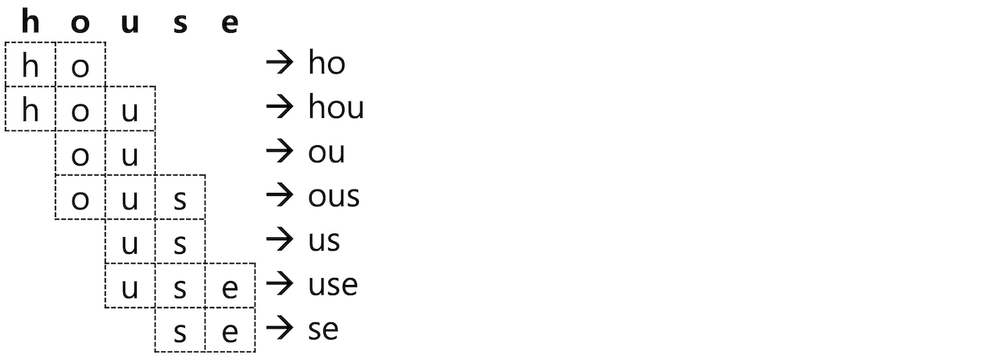
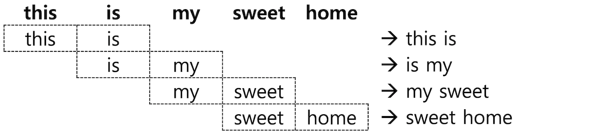

토크나이저를 이용한 텀 분리 과정 이후에는 분리된 각각의 텀 들을 지정한 규칙에 따라 처리를 해 주는데 이 과정을 담당하는 것이 **토큰 필터**입니다. 토큰 필터는 `filter` _**\(token_filter가 아닙니다!\)**_ 항목에 배열 값으로 나열해서 지정합니다. 하나만 사용하더라도 배열 값으로 입력해야 하며 나열된 순서대로 처리되기 때문에 순서를 잘 고려해서 입력해야 합니다.

토큰 필터 역시 종류가 상당히 많고 계속 업데이트 되기 때문에 이 책에서는 자주 사용되는 토큰 필터 위주로 살펴보겠습니다. [공식 도큐먼트](https://www.elastic.co/guide/en/elasticsearch/reference/current/analysis-tokenfilters.html)에서 내가 필요로 하는 토큰 필터가 있는지 종종 들러서 살펴보시기 바랍니다.

## 6.6.1 Lowercase, Uppercase

영어나 유럽어 기반의 텍스트는 대소문자가 있어 검색할 때는 대소문자에 상관 없이검색이 가능하도록 처리 해 주어야 합니다. 보통은 텀 들을 모두 소문자로 변경하여 저장하는데 이 역할을 하는 것이 **Lowercase** 토큰 필터입니다. **Lowercase** 토큰 필터는 거의 모든 텍스트 검색 사례에서 사용되는 토큰 필터입니다.

**Uppercase** 토큰 필터는 모든 텀을 대문자로 변경하는 것 이며 Lowercase 와 동일하게 설정합니다. 다음은 **"Harry Potter and the Philosopher's Stone"** 문장을 lowercase와 uppercase 로 분석한 예제입니다.

<DocTabs>
  <DocTab name="request">
```javascript
# lowercase 토큰 필터로 문장 분석
GET _analyze
{
  "filter": [ "lowercase" ],
  "text": [ "Harry Potter and the Philosopher's Stone" ]
}
```
  </DocTab>
  <DocTab name="response">
```javascript
# lowercase 토큰 필터로 문장 분석 결과
{
  "tokens" : [
    {
      "token" : "harry potter and the philosopher's stone",
      "start_offset" : 0,
      "end_offset" : 40,
      "type" : "word",
      "position" : 0
    }
  ]
}
```
  </DocTab>
</DocTabs>

<DocTabs>
  <DocTab name="request">
```javascript
# uppercase 토큰 필터로 문장 분석
GET _analyze
{
  "filter": [ "uppercase" ],
  "text": [ "Harry Potter and the Philosopher's Stone" ]
}
```
  </DocTab>
  <DocTab name="response">
```javascript
# uppercase 토큰 필터로 문장 분석 결과
{
  "tokens" : [
    {
      "token" : "HARRY POTTER AND THE PHILOSOPHER'S STONE",
      "start_offset" : 0,
      "end_offset" : 40,
      "type" : "word",
      "position" : 0
    }
  ]
}
```
  </DocTab>
</DocTabs>

## 6.6.2 Stop

블로그 포스트나 뉴스 기사 같은 글에는 검색에서는 큰 의미가 없는 조사나 전치사 등이 많습니다. 영문에서도 **the**, **is**, **a** 같은 단어들은 대부분 검색어로 쓰이지 않는데 이런 단어를 한국어로는 **불용어**, 영어로는 **stopword**라고 합니다. **Stop** 토큰 필터를 적용하면 불용어에 해당되는 텀 들을 제거합니다.

`stopwords` 항목에 불용어로 지정할 단어들을 배열 형태로 나열하거나 `"_english_"`, `"_german_"` 같이 언어를 지정해서 해당 언어팩에 있는 불용어를 지정할 수도 있습니다. 지원되는 언어팩은 [공식 도큐먼트](https://www.elastic.co/guide/en/elasticsearch/reference/current/analysis-stop-tokenfilter.html)에서 확인할 수 있으며 한, 중, 일어 등은 별도의 형태소 분석기를 사용해야 합니다. 불용어 목록을 별도의 텍스트 파일로 저장하고 저장된 파일 경로를 `stopwords_path` 항목의 값으로 지정하여 사용하는 것도 가능합니다.

다음은 **my_stop** 인덱스에 **"in"**, **"the"**, **"days"** 를 불용어로 처리하는 **my_stop_filter** 라는 이름의 `stop` 토큰필터를 정의하고 `lowercase` 필터와 함께 **"Around the World in Eighty Days"** 문장을 분석 하는 예제입니다.

<DocCallOut color="warning">
불용어로 처리할 단어들이 소문자이기 때문에 분석할 때는 반드시 lowercase 토큰필터를 먼저 적용해야 합니다.
</DocCallOut>

```javascript
# my_stop 인덱스에 my_stop_filter 토큰필터 생성
PUT my_stop
{
  "settings": {
    "analysis": {
      "filter": {
        "my_stop_filter": {
          "type": "stop",
          "stopwords": [
            "in",
            "the",
            "days"
          ]
        }
      }
    }
  }
}
```

<DocTabs>
  <DocTab name="request">
```javascript
# my_stop_filter 토큰 필터로 문장 분석
GET my_stop/_analyze
{
  "tokenizer": "whitespace",
  "filter": [
    "lowercase",
    "my_stop_filter"
  ],
  "text": [ "Around the World in Eighty Days" ]
}
```
  </DocTab>
  <DocTab name="response">
```javascript
# my_stop_filter 토큰 필터로 문장 분석 결과
{
  "tokens" : [
    {
      "token" : "around",
      "start_offset" : 0,
      "end_offset" : 6,
      "type" : "word",
      "position" : 0
    },
    {
      "token" : "world",
      "start_offset" : 11,
      "end_offset" : 16,
      "type" : "word",
      "position" : 2
    },
    {
      "token" : "eighty",
      "start_offset" : 20,
      "end_offset" : 26,
      "type" : "word",
      "position" : 4
    }
  ]
}
```
  </DocTab>
</DocTabs>

이번에는 불용어 **"in"**, **"the"**, **"eighty"**를 **my_stop_dic.txt** 파일 안에 저장하고 이 파일을 읽어들여 동일한 문장을 분석 해 보는 예제입니다. 불용어는 모두 줄바꿈으로 입력해야 하며 사전 파일 경로는 **elasticsearch** 의 **config** 디렉토리를 기준으로 상대 경로를 지정해야 하며 텍스트 인코딩은 반드시 **UTF-8** 로 되어 있어야 합니다. **my_stop_dic.txt** 파일은 **elasticsearch** 홈 아래의 **config/user_dic** 디렉토리에 저장되었다고 가정하겠습니다.

```bash
# config/user_dic 디렉토리 생성 후 my_stop_dic.txt 파일 생성

$ mkdir config/user_dic
$ echo 'in
the
eighty' > config/user_dic/my_stop_dic.txt
```

```javascript
# stopwords_path 설정을 가진 my_stop_filter 토큰필터 생성
PUT my_stop
{
  "settings": {
    "analysis": {
      "filter": {
        "my_stop_filter": {
          "type": "stop",
          "stopwords_path": "user_dic/my_stop_dic.txt"
        }
      }
    }
  }
}
```

<DocTabs>
  <DocTab name="request">
```javascript
# my_stop_filter 토큰 필터로 문장 분석
GET my_stop/_analyze
{
  "tokenizer": "whitespace",
  "filter": [
    "lowercase",
    "my_stop_filter"
  ],
  "text": [ "Around the World in Eighty Days" ]
}
```
  </DocTab>
  <DocTab name="response">
```javascript
# my_stop_filter 토큰 필터로 문장 분석 결과
{
  "tokens" : [
    {
      "token" : "around",
      "start_offset" : 0,
      "end_offset" : 6,
      "type" : "word",
      "position" : 0
    },
    {
      "token" : "world",
      "start_offset" : 11,
      "end_offset" : 16,
      "type" : "word",
      "position" : 2
    },
    {
      "token" : "days",
      "start_offset" : 27,
      "end_offset" : 31,
      "type" : "word",
      "position" : 5
    }
  ]
}
```
  </DocTab>
</DocTabs>

**my_stop_dic.txt** 파일 내용인 **in**, **the**, **eight** 가 제거된 나머지 텀 들만 결과로 나타난 것을 확인할 수 있습니다.

<DocCallOut color="danger">
기존의 사전 파일의 내용이 변경 된 경우 인덱스를 새로 고침을 해 주어야 토큰 필터가 새로 적용됩니다. 이것은 **stop** 외에도 뒤에 설명할 **synonym** 이나 **nori 한글 형태소 분석기** 사전에도 동일하게 적용됩니다. 새로 고침을 하는 방법은

**POST \<인덱스명\>/_close**
**POST \<인덱스명\>/_open**

을 차례대로 실행 해 주면 됩니다. 인덱스가 close 된 중에는 색인이나 검색이 불가능 하게 되니 주의해야 합니다.

또한 애널라이저의 사전만 갱신되는 것이기 때문에 이미 색인된 도큐먼트들의 역 색인 내용은 변경되지 않습니다. 인덱스 새로 고침 이후에 색인되는 데이터들과 match 쿼리의 검색 등에만 적용이 됩니다. 기존 도큐먼트의 역 색인을 변경하려면 데이터를 모두 다시 재색인을 해야 합니다.
</DocCallOut>

## 6.6.3 Synonym

검색 서비스에 따라서 **동의어** 검색을 제공해야 하는 경우가 있습니다. 예를 들면 클라우드 서비스 관련 정보를 검색하는 시스템에서 "AWS" 라는 단어를 검색했을 때 "Amazon" 또는 한글 "아마존" 도 같이 검색을 하도록 하면 관련된 정보를 더 많이 찾을 수 있을 것입니다. 이 때 **Synonym** 토큰 필터를 사용하면 텀의 동의어 저장이 가능합니다.&#x20;

동의어를 설정하는 옵션은 `synonyms` 항목에서 직접 동의어 목록을 입력하는 방법과 동의어 사전 파일을 만들어 `synonyms_path` 로 지정하는 방법이 있습니다. 동의어 사전 명시 규칙에는 다음의 것들이 있습니다.

* `"A, B => C"` : 왼쪽의 A, B 대신 오른쪽의 C 텀을 저장합니다. A, B 로는 C 의 검색이 가능하지만 C 로는 A, B 가 검색되지 않습니다.
* `"A, B"` : A, B 각 텀이 A 와 B 두개의 텀을 모두 저장합니다. A 와 B 모두 서로의 검색어로 검색이 됩니다.

다음은 **my_synonym** 인덱스에 `"amazon => aws"` 으로 동의어를 지정하는 예제입니다.

```javascript
# "amazon => aws" 동의어를 지정하는 my_synonym 인덱스 생성
PUT my_synonym
{
  "settings": {
    "analysis": {
      "analyzer": {
        "my_syn": {
          "tokenizer": "whitespace",
          "filter": [
            "lowercase",
            "syn_aws"
          ]
        }
      },
      "filter": {
        "syn_aws": {
          "type": "synonym",
          "synonyms": [
            "amazon => aws"
          ]
        }
      }
    }
  },
  "mappings": {
    "properties": {
      "message": {
        "type": "text",
        "analyzer": "my_syn"
      }
    }
  }
}
```

이제 여기에 **"Amazon Web Service"**, **"AWS"** 값을 가진 도큐먼트 두 개를 저장하고 각 도큐먼트의 `_termvectors` 를 확인 해 보겠습니다.

```javascript
# AWS, Amazon Web Service 도큐먼트 저장
PUT my_synonym/_doc/1
{ "message" : "Amazon Web Service" }
PUT my_synonym/_doc/2
{ "message" : "AWS" }
```

<DocTabs>
  <DocTab name="request">
```javascript
# 1 도큐먼트 message 필드의 termvectors 확인
GET my_synonym/_termvectors/1?fields=message
```
  </DocTab>
  <DocTab name="response">
```javascript
# 1 도큐먼트 message 필드의 termvectors 확인 결과
{
  "_index" : "my_synonym",
  "_type" : "_doc",
  "_id" : "1",
  "_version" : 1,
  "found" : true,
  "took" : 9,
  "term_vectors" : {
    "message" : {
      "field_statistics" : {
        "sum_doc_freq" : 4,
        "doc_count" : 2,
        "sum_ttf" : 4
      },
      "terms" : {
        "aws" : {
          "term_freq" : 1,
          "tokens" : [
            {
              "position" : 0,
              "start_offset" : 0,
              "end_offset" : 6
            }
          ]
        },
        "service" : {
          "term_freq" : 1,
          "tokens" : [
            {
              "position" : 2,
              "start_offset" : 11,
              "end_offset" : 18
            }
          ]
        },
        "web" : {
          "term_freq" : 1,
          "tokens" : [
            {
              "position" : 1,
              "start_offset" : 7,
              "end_offset" : 10
            }
          ]
        }
      }
    }
  }
}
```
  </DocTab>
</DocTabs>

<DocTabs>
  <DocTab name="request">
```javascript
# 2 도큐먼트 message 필드의 termvectors 확인
GET my_synonym/_termvectors/2?fields=message
```
  </DocTab>
  <DocTab name="response">
```javascript
# 2 도큐먼트 message 필드의 termvectors 확인 결과
{
  "_index" : "my_synonym",
  "_type" : "_doc",
  "_id" : "2",
  "_version" : 1,
  "found" : true,
  "took" : 0,
  "term_vectors" : {
    "message" : {
      "field_statistics" : {
        "sum_doc_freq" : 4,
        "doc_count" : 2,
        "sum_ttf" : 4
      },
      "terms" : {
        "aws" : {
          "term_freq" : 1,
          "tokens" : [
            {
              "position" : 0,
              "start_offset" : 0,
              "end_offset" : 3
            }
          ]
        }
      }
    }
  }
}
```
  </DocTab>
</DocTabs>

1 도큐먼트의 **"Amazon Web Service"**가 **amazon** 대신 **"aws"**, **"web"**, **"service"** 로 저장된 것을 확인할 수 있습니다. 다음은 각각 **term** 쿼리로 **aws**, **amazon** 을 검색한 결과와 **match** 쿼리로 **amazon** 을 검색한 결과입니다.

<DocTabs>
  <DocTab name="request">
```javascript
# term 쿼리로 aws 검색
GET my_synonym/_search
{
  "query": {
    "term": {
      "message": "aws"
    }
  }
}
```
  </DocTab>
  <DocTab name="response">
```javascript
# term 쿼리로 aws 검색 결과
{
  "took" : 2,
  "timed_out" : false,
  "_shards" : {
    "total" : 1,
    "successful" : 1,
    "skipped" : 0,
    "failed" : 0
  },
  "hits" : {
    "total" : {
      "value" : 2,
      "relation" : "eq"
    },
    "max_score" : 0.22920427,
    "hits" : [
      {
        "_index" : "my_synonym",
        "_type" : "_doc",
        "_id" : "2",
        "_score" : 0.22920427,
        "_source" : {
          "message" : "AWS"
        }
      },
      {
        "_index" : "my_synonym",
        "_type" : "_doc",
        "_id" : "1",
        "_score" : 0.1513613,
        "_source" : {
          "message" : "Amazon Web Service"
        }
      }
    ]
  }
}
```
  </DocTab>
</DocTabs>

<DocTabs>
  <DocTab name="request">
```javascript
# term 쿼리로 amazon 검색
GET my_synonym/_search
{
  "query": {
    "term": {
      "message": "amazon"
    }
  }
}
```
  </DocTab>
  <DocTab name="response">
```javascript
# term 쿼리로 amazon 검색 결과
{
  "took" : 1,
  "timed_out" : false,
  "_shards" : {
    "total" : 1,
    "successful" : 1,
    "skipped" : 0,
    "failed" : 0
  },
  "hits" : {
    "total" : {
      "value" : 0,
      "relation" : "eq"
    },
    "max_score" : null,
    "hits" : [ ]
  }
}
```
  </DocTab>
</DocTabs>

<DocTabs>
  <DocTab name="request">
```javascript
# match 쿼리로 amazon 검색
GET my_synonym/_search
{
  "query": {
    "match": {
      "message": "amazon"
    }
  }
}
```
  </DocTab>
  <DocTab name="response">
```javascript
# match 쿼리로 amazon 검색 결과
{
  "took" : 1,
  "timed_out" : false,
  "_shards" : {
    "total" : 1,
    "successful" : 1,
    "skipped" : 0,
    "failed" : 0
  },
  "hits" : {
    "total" : {
      "value" : 2,
      "relation" : "eq"
    },
    "max_score" : 0.22920427,
    "hits" : [
      {
        "_index" : "my_synonym",
        "_type" : "_doc",
        "_id" : "2",
        "_score" : 0.22920427,
        "_source" : {
          "message" : "AWS"
        }
      },
      {
        "_index" : "my_synonym",
        "_type" : "_doc",
        "_id" : "1",
        "_score" : 0.1513613,
        "_source" : {
          "message" : "Amazon Web Service"
        }
      }
    ]
  }
}
```
  </DocTab>
</DocTabs>

첫 번째 쿼리와 마지막 세 번째 쿼리의 결과가 동일합니다.

**term** 쿼리는 검색어에 애널라이저를 적용하지 않고 그대로 검색하기 때문에 **term** 쿼리로 **aws** 를 검색하면 두개의 도큐먼트가 모두 검색되고 **amazon**을 검색 하면 검색이 되지 않습니다. **match** 쿼리는 검색어 **amazon**도 **my_syn** 애널라이저가 적용이 되어 **aws** 로 변환하여 검색을 하기 때문에 **aws**로 검색을 한 것과 같은 결과가 나타납니다.

이번에는 **my_synonym** 인덱스에 `"amazon, aws"`  로 동의어를 지정하는 예제입니다. 기존의 **my_synonym** 인덱스를 먼저 삭제하고 입력합니다.

```javascript
# "amazon, aws" 동의어를 지정하는 my_synonym 인덱스 생성
PUT my_synonym
{
  "settings": {
    "analysis": {
      "analyzer": {
        "my_syn": {
          "tokenizer": "whitespace",
          "filter": [
            "lowercase",
            "syn_aws"
          ]
        }
      },
      "filter": {
        "syn_aws": {
          "type": "synonym",
          "synonyms": [
            "amazon, aws"
          ]
        }
      }
    }
  },
  "mappings": {
    "properties": {
      "message": {
        "type": "text",
        "analyzer": "my_syn"
      }
    }
  }
}
```

앞의 예제와 동일하게 **"Amazon Web Service"**, **"AWS"** 값을 가진 도큐먼트 두 개를 저장하고 각 도큐먼트의 `_termvectors` 를 확인 해 보겠습니다.

```javascript
# AWS, Amazon Web Service 도큐먼트 저장
PUT my_synonym/_doc/1
{ "message" : "Amazon Web Service" }
PUT my_synonym/_doc/2
{ "message" : "AWS" }
```

<DocTabs>
  <DocTab name="request">
```javascript
# 1 도큐먼트 message 필드의 termvectors 확인
GET my_synonym/_termvectors/1?fields=message
```
  </DocTab>
  <DocTab name="response">
```javascript
# 1 도큐먼트 message 필드의 termvectors 확인 결과
{
  "_index" : "my_synonym",
  "_type" : "_doc",
  "_id" : "1",
  "_version" : 1,
  "found" : true,
  "took" : 0,
  "term_vectors" : {
    "message" : {
      "field_statistics" : {
        "sum_doc_freq" : 6,
        "doc_count" : 2,
        "sum_ttf" : 6
      },
      "terms" : {
        "amazon" : {
          "term_freq" : 1,
          "tokens" : [
            {
              "position" : 0,
              "start_offset" : 0,
              "end_offset" : 6
            }
          ]
        },
        "aws" : {
          "term_freq" : 1,
          "tokens" : [
            {
              "position" : 0,
              "start_offset" : 0,
              "end_offset" : 6
            }
          ]
        },
        "service" : {
          "term_freq" : 1,
          "tokens" : [
            {
              "position" : 2,
              "start_offset" : 11,
              "end_offset" : 18
            }
          ]
        },
        "web" : {
          "term_freq" : 1,
          "tokens" : [
            {
              "position" : 1,
              "start_offset" : 7,
              "end_offset" : 10
            }
          ]
        }
      }
    }
  }
}
```
  </DocTab>
</DocTabs>

<DocTabs>
  <DocTab name="request">
```javascript
# 2 도큐먼트 message 필드의 termvectors 확인
GET my_synonym/_termvectors/2?fields=message
```
  </DocTab>
  <DocTab name="response">
```javascript
# 2 도큐먼트 message 필드의 termvectors 확인 결과
{
  "_index" : "my_synonym",
  "_type" : "_doc",
  "_id" : "2",
  "_version" : 1,
  "found" : true,
  "took" : 0,
  "term_vectors" : {
    "message" : {
      "field_statistics" : {
        "sum_doc_freq" : 6,
        "doc_count" : 2,
        "sum_ttf" : 6
      },
      "terms" : {
        "amazon" : {
          "term_freq" : 1,
          "tokens" : [
            {
              "position" : 0,
              "start_offset" : 0,
              "end_offset" : 3
            }
          ]
        },
        "aws" : {
          "term_freq" : 1,
          "tokens" : [
            {
              "position" : 0,
              "start_offset" : 0,
              "end_offset" : 3
            }
          ]
        }
      }
    }
  }
}
```
  </DocTab>
</DocTabs>

두 도큐먼트 모두 `"position" : 0` 위치에 **"aws"**, **"amazon"** 두개의 텀들이 모두 저장된 것을 확인할 수 있습니다. 이제 **term** 쿼리로 **amazon** 을 검색해도 두개 도큐먼트가 모두 검색이 됩니다. 이것은 한번 직접 실행 해 보시기 바랍니다.

동의어 여러 개를 입력 할 때는 `"synonyms": [ ... ]` 항목 안에 배열로 넣어도 되지만, 그 보다는 파일을 따로 만들어 관리하는 것이 편합니다. **stop** 토큰 필터와 마찬가지로 **synonyms_path** 항목에 **config** 디렉토리 기준의 상대 경로에 파일을 저장하고 경로명을 입력하면 됩니다. 동의어는 하나의 규칙당 **한 줄씩** 입력해야 하며 파일은 **UTF-8**로 인코딩 되어야 합니다.

다음은 **"hop, jump"**, **"quick, fast"** 를 **user_dic/my_syn_dic.txt** 에 저장해서 동의어 사전으로 사용하는 예제입니다.

```bash
# config/user_dic 디렉토리 아래에 my_syn_dic.txt 파일 생성
$ echo 'quick, fast
hop, jump' > config/user_dic/my_syn_dic.txt
```

```javascript
# synonyms_path 설정을 가진 my_synonym 인덱스 생성
PUT my_synonym
{
  "settings": {
    "analysis": {
      "analyzer": {
        "my_syn": {
          "tokenizer": "whitespace",
          "filter": [
            "lowercase",
            "syn_aws"
          ]
        }
      },
      "filter": {
        "syn_aws": {
          "type": "synonym",
          "synonyms_path": "user_dic/my_syn_dic.txt"
        }
      }
    }
  },
  "mappings": {
    "properties": {
      "message": {
        "type": "text",
        "analyzer": "my_syn"
      }
    }
  }
}
```

이제 **term** 쿼리로 **quick** 과 **jump**를 검색하면 **hop**, **fast** 도 검색이 됩니다.

```javascript
# quick, jump, hop, fast 를 포함하는 도큐먼트 저장
PUT my_synonym/_doc/1
{ "message": "Quick brown fox jump" }
PUT my_synonym/_doc/2
{ "message": "hop rabbit is fast" }
```

<DocTabs>
  <DocTab name="request">
```javascript
# term 쿼리로 quick, jump 검색
GET my_synonym/_search
{
  "query": {
    "bool": {
      "must": [
        {
          "term": {
            "message": "quick"
          }
        },
        {
          "term": {
            "message": "jump"
          }
        }
      ]
    }
  }
}
```
  </DocTab>
  <DocTab name="response">
```javascript
# term 쿼리로 quick, jump 검색 결과
{
  "took" : 370,
  "timed_out" : false,
  "_shards" : {
    "total" : 1,
    "successful" : 1,
    "skipped" : 0,
    "failed" : 0
  },
  "hits" : {
    "total" : {
      "value" : 2,
      "relation" : "eq"
    },
    "max_score" : 0.42221838,
    "hits" : [
      {
        "_index" : "my_synonym",
        "_type" : "_doc",
        "_id" : "1",
        "_score" : 0.42221838,
        "_source" : {
          "message" : "Quick brown fox jump"
        }
      },
      {
        "_index" : "my_synonym",
        "_type" : "_doc",
        "_id" : "2",
        "_score" : 0.42221838,
        "_source" : {
          "message" : "hop rabbit is fast"
        }
      }
    ]
  }
}
```
  </DocTab>
</DocTabs>

마지막으로 **synonym** 토큰 필터에는 추가적으로 다음과 같은 옵션들이 있습니다.

- **expand** (true / false. 디폴트는 **true**)
  `"expand": false` 로 설정하게 되면 `"synonyms": "aws, amazon"` 같은 설정에 토큰들을 모두 저장하지 않고 맨 처음에 명시된 토큰 하나만 저장합니다. 앞의 설정은 `"synonyms": "aws, amazon => aws"` 로 설정한 것과 동일하게 동작합니다.
- **lenient** (true / false. 디폴트는 **false**)
  `"lenient": true` 로 설정하면 synonym 설정에 오류가 있는 경우 오류가 있는 부분을 무시하고 실행합니다.

## 6.6.4 NGram, Edge NGram, Shingle

### NGram

Elasticsearch는 빠른 검색을 위해 검색에 사용될 텀 들을 미리 분리해서 역 인덱스에 저장합니다. 하지만 과학 용어집 검색 같은 특정한 사용 사례에 따라 텀이 아닌 단어의 일부만 가지고도 검색해야 하는 기능이 필요한 경우도 있습니다. RDBMS의 LIKE 검색 처럼 사용하는 **wildcard** 쿼리나 **regexp (정규식)** 쿼리도 지원을 하지만, 이런 쿼리들은 메모리 소모가 많고 느리기 때문에 Elasticsearch의 장점을 활용하지 못합니다. 이런 사용을 위해 검색 텀의 일부만 미리 분리해서 저장을 할 수 있는데 이렇게 단어의 일부를 나눈 부위를 **NGram** 이라고 합니다. 보통은 **unigram**(유니그램 – 1글자), **bigram**(바이그램 - 2자) 등으로 부릅니다.

Elasticsearch는 **NGram**을 처리하는 토큰 필터를 제공하며 설정은 `"type": "nGram"` 으로 합니다. **"house"** 라는 단어를 2 글자의 NGram (bigram) 으로 처리하면 다음과 같이 "**ho"**, **"ou"**, **"us"**, **"se"** 총 4개의 토큰들이 추출됩니다. ngram 토큰필터를 사용하면 이렇게 2글자씩 추출된 텀들이 모두 검색 토큰으로 저장됩니다. 이제 이 인덱스의 경우에는 검색어를 **"ho"** 라고만 검색을 해도 **ho**use 가 포함된 도큐먼트들이 검색이 됩니다.


<DocCallOut color="danger">
**ngram** 토큰필터를 사용하면 저장되는 텀의 갯수도 기하급수적으로 늘어나고 검색어를 **"ho"**로 검색 했을 때 **ho**use, s**ho**es 처럼 검색 결과를 예상하기 어렵기 때문에 일반적인 텍스트 검색에는 사용하지 않는 것이 좋습니다. ngram을 사용하기 적합한 사례는 카테고리 목록이나 태그 목록과 같이 전체 개수가 많지 않은 데이터 집단에 **자동완성** 같은 기능을 구현하는 데에 적합합니다.
</DocCallOut>

ngram 토큰 필터에는 `min_gram` (디폴트 1), `max_gram` (디폴트 2) 옵션이 있습니다. 짐작할 수 있듯이 최소, 최대 문자수의 토큰을 구분하는 단위입니다. **house**를 `"min_gram": 2`, `"max_gram": 3` 으로 설정하면 다음과 같이 분석되어 총 7개의 토큰을 저장합니다.



다음은 **my_ngram** 인덱스에 `"min_gram": 2`, `"max_gram": 3` 인 **my_ngram_f** 토큰필터를 만들고 house 를 분석하는 예제입니다.

```javascript
PUT my_ngram
{
  "settings": {
    "analysis": {
      "filter": {
        "my_ngram_f": {
          "type": "nGram",
          "min_gram": 2,
          "max_gram": 3
        }
      }
    }
  }
}
```

<DocTabs>
  <DocTab name="request">
```javascript
# my_ngram_f 토큰필터로 "house" 분석
GET my_ngram/_analyze
{
  "tokenizer": "keyword",
  "filter": [
    "my_ngram_f"
  ],
  "text": "house"
}
```
  </DocTab>
  <DocTab name="response">
```javascript
# my_ngram_f 토큰필터로 "house" 분석 결과
{
  "tokens" : [
    {
      "token" : "ho",
      "start_offset" : 0,
      "end_offset" : 5,
      "type" : "word",
      "position" : 0
    },
    {
      "token" : "hou",
      "start_offset" : 0,
      "end_offset" : 5,
      "type" : "word",
      "position" : 0
    },
    {
      "token" : "ou",
      "start_offset" : 0,
      "end_offset" : 5,
      "type" : "word",
      "position" : 0
    },
    {
      "token" : "ous",
      "start_offset" : 0,
      "end_offset" : 5,
      "type" : "word",
      "position" : 0
    },
    {
      "token" : "us",
      "start_offset" : 0,
      "end_offset" : 5,
      "type" : "word",
      "position" : 0
    },
    {
      "token" : "use",
      "start_offset" : 0,
      "end_offset" : 5,
      "type" : "word",
      "position" : 0
    },
    {
      "token" : "se",
      "start_offset" : 0,
      "end_offset" : 5,
      "type" : "word",
      "position" : 0
    }
  ]
}
```
  </DocTab>
</DocTabs>

### Edge NGram

검색을 위해 NGram을 저장하더라도 보통은 단어의 맨 앞에서부터 검색하는 경우가 많습니다. 텀 앞쪽의 ngram 만 저장하기 위해서는 **Edge NGram** 토큰필터를 이용합니다. 설정 방법은 `"type": "edgeNGram"` 입니다. edgeNGram의 옵션을 `"min_gram": 1`, `"max_gram": 4` 으로 설정하고 "**house"** 를 분석하면 다음과 같이 **"h", "ho", "hou", "hous"** 4개의 토큰이 생성됩니다.


인덱스 설정과 쿼리를 이용한 애널라이저 분석은 위의 NGram 예제를 참고해서 직접 만들어 보시기 바랍니다.

### Shingle

**NGram**과 **Edge NGram**은 모두 하나의 단어로부터 토큰을 확장하는 토큰 필터입니다. 문자가 아니라 단어 단위로 구성된 묶음을 **Shingle** 이라고 하며 `"type": "shingle"` 토큰 필터의 이용이 가능합니다. **"this is my sweet home"** 라는 문장을 분리해서 **2 단어씩 Shingle** 토큰 필터를 적용하면 다음과 같은 4개의 **shingle** 들이 생성됩니다.



**Shingle** 토큰 필터에서 사용 가능한 옵션은 다음과 같습니다.

- **min_shingle_size** / **max_shingle_size** : shingle의 최소 / 최대 단어 개수를 지정합니다. 디폴트는 모두 2 입니다.
- **output_unigrams** : Shingle 외에도 각각의 개별 토큰(unigram)도 저장 하는지의 여부를 설정합니다. 디폴트는 true 입니다.
- **output_unigrams_if_no_shingles** : shingle 을 만들 수 없는 경우에만 개별 토큰을 저장하는지의 여부를 설정합니다. 디폴트는 false 입니다.
- **token_separator** : 토큰 구분자를 지정합니다. 디폴트는 `" "` (스페이스) 입니다.
- **filler_token** : shing을 만들 텀이 없는 경우 (보통은 stop 토큰 필터와 함께 사용되어 offset 위치만 있고 텀이 없는 경우입니다) 대체할 텍스트를 지정합니다. 디폴트는 `_` 입니다.

다음은 **my_shingle** 인덱스에서 `"min_shingle_size": 3`, `"max_shingle_size": 4` 로 설정해서 **"this is my sweet home"** 문장을 분석하는 예제입니다.

```javascript
PUT my_shingle
{
  "settings": {
    "analysis": {
      "filter": {
        "my_shingle_f": {
          "type": "shingle",
          "min_shingle_size": 3,
          "max_shingle_size": 4
        }
      }
    }
  }
}
```

<DocTabs>
  <DocTab name="request">
```javascript
# my_shingle_f 토큰필터로 "this is my sweet home" 분석
GET my_shingle/_analyze
{
  "tokenizer": "whitespace",
  "filter": [
    "my_shingle_f"
  ],
  "text": "this is my sweet home"
}
```
  </DocTab>
  <DocTab name="response">
```javascript
# my_shingle_f 토큰필터로 "this is my sweet home" 분석 결과
{
  "tokens" : [
    {
      "token" : "this",
      "start_offset" : 0,
      "end_offset" : 4,
      "type" : "word",
      "position" : 0
    },
    {
      "token" : "this is my",
      "start_offset" : 0,
      "end_offset" : 10,
      "type" : "shingle",
      "position" : 0,
      "positionLength" : 3
    },
    {
      "token" : "this is my sweet",
      "start_offset" : 0,
      "end_offset" : 16,
      "type" : "shingle",
      "position" : 0,
      "positionLength" : 4
    },
    {
      "token" : "is",
      "start_offset" : 5,
      "end_offset" : 7,
      "type" : "word",
      "position" : 1
    },
    {
      "token" : "is my sweet",
      "start_offset" : 5,
      "end_offset" : 16,
      "type" : "shingle",
      "position" : 1,
      "positionLength" : 3
    },
    {
      "token" : "is my sweet home",
      "start_offset" : 5,
      "end_offset" : 21,
      "type" : "shingle",
      "position" : 1,
      "positionLength" : 4
    },
    {
      "token" : "my",
      "start_offset" : 8,
      "end_offset" : 10,
      "type" : "word",
      "position" : 2
    },
    {
      "token" : "my sweet home",
      "start_offset" : 8,
      "end_offset" : 21,
      "type" : "shingle",
      "position" : 2,
      "positionLength" : 3
    },
    {
      "token" : "sweet",
      "start_offset" : 11,
      "end_offset" : 16,
      "type" : "word",
      "position" : 3
    },
    {
      "token" : "home",
      "start_offset" : 17,
      "end_offset" : 21,
      "type" : "word",
      "position" : 4
    }
  ]
}
```
  </DocTab>
</DocTabs>

`"token" : "this is my"`, `"token" : "this is my sweet"` 와 같은 토큰들이 저장된 것을 확인할 수 있습니다. 이번에는 `"output_unigrams": false` 와 `"filler_token": "-"` 설정을 추가하고 stop 토큰필터로 `"is"` 를 불용어 처리한 뒤 실행 해 보겠습니다.

```javascript
PUT my_shingle
{
  "settings": {
    "analysis": {
      "filter": {
        "my_shingle_f": {
          "type": "shingle",
          "min_shingle_size": 3,
          "max_shingle_size": 4,
          "output_unigrams": false,
          "filler_token": "-"
        },
        "my_stop_f": {
          "type": "stop",
          "stopwords": [
            "is"
          ]
        }
      }
    }
  }
}
```

<DocTabs>
  <DocTab name="request">
```javascript
# my_shingle 에서 "this is my sweet home" 분석
GET my_shingle/_analyze
{
  "tokenizer": "whitespace",
  "filter": [
    "my_stop_f",
    "my_shingle_f"
  ],
  "text": "this is my sweet home"
}
```
  </DocTab>
  <DocTab name="response">
```javascript
# my_shingle 에서 "this is my sweet home" 분석 결과
{
  "tokens" : [
    {
      "token" : "this - my",
      "start_offset" : 0,
      "end_offset" : 10,
      "type" : "shingle",
      "position" : 0
    },
    {
      "token" : "this - my sweet",
      "start_offset" : 0,
      "end_offset" : 16,
      "type" : "shingle",
      "position" : 0,
      "positionLength" : 2
    },
    {
      "token" : "- my sweet",
      "start_offset" : 8,
      "end_offset" : 16,
      "type" : "shingle",
      "position" : 1
    },
    {
      "token" : "- my sweet home",
      "start_offset" : 8,
      "end_offset" : 21,
      "type" : "shingle",
      "position" : 1,
      "positionLength" : 2
    },
    {
      "token" : "my sweet home",
      "start_offset" : 8,
      "end_offset" : 21,
      "type" : "shingle",
      "position" : 2
    }
  ]
}
```
  </DocTab>
</DocTabs>

단일 토큰들은 모두 삭제되었고 `"is"` 는 `"-"` 로 대치된 3, 4개 단어로 이루어진 shingle 들이 생성된 것을 확인할 수 있습니다.

<DocCallOut color="warning">
**NGram**, **Edged NGram** 그리고 **Shingle** 토큰 필터는 보통 일반적인 텍스트 분석에 사용하기는 적합하지 않습니다. 하지만 자동 완성 기능을 구현하거나 프로그램 코드 안에서 문법이나 기능명을 검색하는 것과 같이 특수한 요구사항을 충족해야 하는 경우 유용하게 사용될 수 있습니다.
</DocCallOut>

## 6.6.5 Unique

**"white fox, white rabbit, white bear"** 같은 문장을 분석하면 **"white"** 텀은 총 3번 저장이 됩니다. 역 색인에는 텀이 1개만 있어도 텀을 포함하는 도큐먼트를 가져올 수 있기 때문에 중복되는 텀 들은 삭제 해 주어도 검색에는 보통 무방합니다. 이 경우 **unique** 토큰 필터를 사용해서 중복되는 텀 들은 하나만 저장하도록 할 수 있습니다.

다음은 **"white fox, white rabbit, white bear"** 문장을 **unique** 토큰 필터를 적용하지 않은 경우와 적용한 경우를 비교 한 예제입니다.

<DocTabs>
  <DocTab name="request">
```javascript
# 일반적인 "white fox, white rabbit, white bear" 문장 분석
GET _analyze
{
  "tokenizer": "standard",
  "filter": [
    "lowercase"
  ],
  "text": [
    "white fox, white rabbit, white bear"
  ]
}
```
  </DocTab>
  <DocTab name="response">
```javascript
# 일반적인 "white fox, white rabbit, white bear" 문장 분석 결과
{
  "tokens" : [
    {
      "token" : "white",
      "start_offset" : 0,
      "end_offset" : 5,
      "type" : "<ALPHANUM>",
      "position" : 0
    },
    {
      "token" : "fox",
      "start_offset" : 6,
      "end_offset" : 9,
      "type" : "<ALPHANUM>",
      "position" : 1
    },
    {
      "token" : "white",
      "start_offset" : 11,
      "end_offset" : 16,
      "type" : "<ALPHANUM>",
      "position" : 2
    },
    {
      "token" : "rabbit",
      "start_offset" : 17,
      "end_offset" : 23,
      "type" : "<ALPHANUM>",
      "position" : 3
    },
    {
      "token" : "white",
      "start_offset" : 25,
      "end_offset" : 30,
      "type" : "<ALPHANUM>",
      "position" : 4
    },
    {
      "token" : "bear",
      "start_offset" : 31,
      "end_offset" : 35,
      "type" : "<ALPHANUM>",
      "position" : 5
    }
  ]
}
```
  </DocTab>
</DocTabs>

<DocTabs>
  <DocTab name="request">
```javascript
# unique 토크나이저로 "white fox, white rabbit, white bear" 문장 분석
GET _analyze
{
  "tokenizer": "standard",
  "filter": [
    "lowercase",
    "unique"
  ],
  "text": [
    "white fox, white rabbit, white bear"
  ]
}
```
  </DocTab>
  <DocTab name="response">
```javascript
# unique 토크나이저로 "white fox, white rabbit, white bear" 문장 분석 결과
{
  "tokens" : [
    {
      "token" : "white",
      "start_offset" : 0,
      "end_offset" : 5,
      "type" : "<ALPHANUM>",
      "position" : 0
    },
    {
      "token" : "fox",
      "start_offset" : 6,
      "end_offset" : 9,
      "type" : "<ALPHANUM>",
      "position" : 1
    },
    {
      "token" : "rabbit",
      "start_offset" : 17,
      "end_offset" : 23,
      "type" : "<ALPHANUM>",
      "position" : 2
    },
    {
      "token" : "bear",
      "start_offset" : 31,
      "end_offset" : 35,
      "type" : "<ALPHANUM>",
      "position" : 3
    }
  ]
}
```
  </DocTab>
</DocTabs>

`"unique"` 토큰 필터를 적용하면 **"white"** 텀이 하나만 저장된 것을 확인할 수 있습니다.

<DocCallOut color="danger">
match 쿼리를 사용해서 검색하는 경우 unique 토큰 필터를 적용한 필드는 텀의 개수가 1개로 되기 때문에 **TF(Term Frequency)** 값이 줄어들어 스코어 점수가 달라질 수 있습니다. match 쿼리를 이용해 **정확도(relevancy)** 를 따져야 하는 검색의 경우에는 unique 토큰 필터는 사용하지 않는 것이 바람직합니다.
</DocCallOut>
