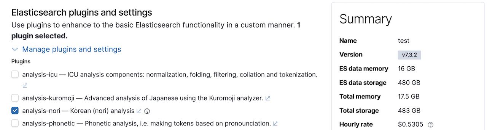
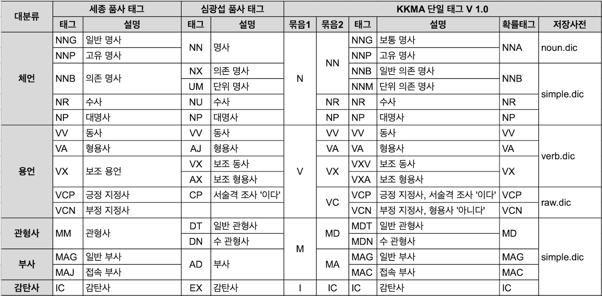

우리가 사용하는 언어들은 영어만 보더라도 문법에 따라 명사 뒤에 **~s**, **~ness** 등이 붙거나 동사 뒤에 **~ing**, **~ed** 등이 붙는 등 변화가 많습니다. 검색을 할 때는 보통 이런 문법에 따른 단어의 변형에 상관 없이 검색이 가능해야 하기 때문에 텍스트 데이터를 분석할 때 각각의 텀에 있는 단어들을 기본 형태인 어간을 추출하는 과정을 진행해야 합니다. 이 과정을 보통 **어간 추출** 또는 **형태소 분석** 이라고 하며 영어로는 **stemming** 이라고 합니다. 그리고 형태소 분석을 하는 도구를 형태소 분석기, 영어로는 **stemmer** 라고 합니다.

Elasticsearch 에서는 다양한 형태소 분석기들을 지원하며 Elastic사에서 공식적으로 지원하지 않는 국가의 언어들도 플러그인 형태로 사용 가능하도록 오픈소스로 배포되는 분석기들이 많이 있습니다. Elasticsearch 에서 사용 가능한 형태소 분석기 중에서 가장 많이 알려진 형태소 분석 알고리즘인 Snowball 과 한글 형태소 분석기인 Nori에 대해 살펴보도록 하겠습니다.

## 6.7.1 Snowball

**Snowball** 은 2000년 경에 정보 검색의 선구자인 마틴 포터 박사가 개발하여 무료로 공개한 형태소 분석 알고리즘입니다. 보통 ~ing, ~s 등을 제거하여 문장에 쓰인 단어들을 기본 형태로 변경합니다. Elasticsearch 에서 Snowball 은 애널라이저, 토크나이저, 토큰 필터가 모두 정의되어 있으며 사용 방법은 앞의 <DocLink id="esG7-06-03-analyzer" text="사용자 정의 애널라이저"/> 부분에 설명되어 있으니 기억나지 않으면 앞으로 가서 다시 확인 해 보시기 바랍니다.

## 6.7.2 노리 (nori) 한글 형태소 분석기

### 커뮤니티 한글 형태소 분석기 - 아리랑, 은전한닢, Open Korean Text

한글은 형태의 변형이 매우 복잡한 언어입니다. 특히 복합어, 합성어 등이 많아 하나의 단어도 여러 어간으로 분리해야 하는 경우가 많아 한글을 형태소 분석을 하려면 반드시 한글 형태소 사전이 필요합니다. 오픈 소스 커뮤니티에서 개발되어 Elasticsearch에서 사용 가능한 한글 형태소 분석기는 다음과 같은 것들이 있습니다.

- **아리랑 (arirang)**
  - URL: [https://github.com/HowookJeong/elasticsearch-analysis-arirang](https://github.com/HowookJeong/elasticsearch-analysis-arirang)
  - 설명: korean analyzer (lucene analyzer kr arirang)
  - License: as-is
- **은전한닢 (seunjeon)**
  - URL: [https://bitbucket.org/eunjeon/seunjeon](https://bitbucket.org/eunjeon/seunjeon)
  - 설명: mecab-ko-dic 기반으로 만들어진 JVM 상에서 돌아가는 한국어 형태소분석기입니다. 기본적으로 java와 scala 인터페이스를 제공합니다. 사전이 패키지 내에 포함되어 있기 때문에 별도로 mecab-ko-dic을 설치할 필요가 없습니다. 특징으로는 (시스템 사전에 등록되어 있는 단어에 한하여) 복합명사 분해와 활용어 원형 찾기가 가능합니다.
  - License: Apache 2.0
- **Open Korean Text**
  - URL: [https://github.com/open-korean-text/open-korean-text](https://github.com/open-korean-text/open-korean-text)
  - 설명: 오픈소스 한국어 처리기 (Official Fork of twitter-korean-text). 스칼라로 쓰여진 한국어 처리기입니다. 현재 텍스트 정규화와 형태소 분석, 스테밍을 지원하고 있습니다. 짧은 트윗은 물론이고 긴 글도 처리할 수 있습니다.
  - License: Apache 2.0

([https://www.elastic.co/kr/blog/using-korean-analyzers](https://www.elastic.co/kr/blog/using-korean-analyzers) 에서 발췌)

Elasticsearch가 한글을 지원하지 않던 시절에 위의 형태소 분석기들은 한글 사용자들에게 큰 도움이 되었습니다. 하지만 외부에서 만들어진 기능이다 보니 Elasticsearch 버전이 올라가 구조가 변경되면 사용이 불가능해지고, 버그가 오류가 있어도 누군가가 나서서 쉽게 고치기 어려운 문제가 있었습니다.

### Nori 개요

Elasticsearch 6.6 버전 부터 공식적으로 **Nori(노리)** 라고 하는 한글 형태소 분석기를 Elastic사에서 공식적으로 개발해서 지원을 하기 시작했습니다. 특이하게 nori는 프랑스 엔지니어인 [Jim Ferenczi](https://github.com/jimczi) 에 의해 처음 개발이 되었습니다. Jim 은 아파치 루씬의 커미터이며 Elasticsearch의 일본어 형태소 분석기인 **Kuromoji(구로모지)** 역시 Jim 이 처음 개발했습니다. Nori 는 **은전한닢**에서 사용하는 **mecab-ko-dic** 사전을 재 가공 하여 사용하고 있습니다. Nori 는 루씬의 기능으로 개발되었으며 루씬 소스에 반영되어 있으며 개발 이력은 
[https://issues.apache.org/jira/browse/LUCENE-8231](https://issues.apache.org/jira/browse/LUCENE-8231)
에서 확인 할 수 있고 프로그램 소스는 
[https://github.com/apache/lucene-solr/tree/master/lucene/analysis/nori](https://github.com/apache/lucene-solr/tree/master/lucene/analysis/nori)
에서 확인이 가능합니다.

Nori 에 관련한 설명은 공식 홈페이지의 문서 페이지의 [Elasticsearch : Plugins and Integrations > Analysis Plugins > Nori](https://www.elastic.co/guide/en/elasticsearch/plugins/current/analysis-nori.html) 페이지에서 찾을 수 있습니다.

### Nori 설치

Nori 를 사용하기 위해서는 먼저 elasticsearch에 analysis-nori 플러그인을 설치해야 합니다. elasticsearch 홈 디렉토리에서 다음 명령을 실행하면 버전에 맞는 nori 플러그인을 받아서 자동으로 설치합니다.

```bash
# nori 플러그인 설치
$ bin/elasticsearch-plugin install analysis-nori
```

설치된 nori 플러그인을 제거하려면 다음 명령을 실행합니다.

```bash
# nori 플러그인 제거
$ bin/elasticsearch-plugin remove analysis-nori
```

[Elastic 클라우드 서비스](https://cloud.elastic.co/)에서 사용하기 위해서는 클러스터를 배포할 때 Customize deployment 메뉴의 Manage plugins and settings 부분에서 analysis-nori 부분을 선택합니다.



### nori_tokenizer

Nori는 **nori_tokenizer** 토크나이저와 **nori_part_of_speech**, **nori_readingform** 토큰 필터를 제공합니다. 먼저 nori_tokenizer 토크나이저를 사용해서 한글을 간단하게 테스트 할 수 있습니다. 다음은 standard와 nori_tokenizer 를 비교해서 **"동해물과 백두산이"** 를 분석한 예제입니다. 당연히 테스트 하는 elasticsearch 에는 analysis-nori 플러그인이 설치되어 있어야 합니다.

<DocTabs>
  <DocTab name="request">
```javascript
# standard 토크나이저로 "동해물과 백두산이" 문장 분석
GET _analyze
{
  "tokenizer": "standard",
  "text": [
    "동해물과 백두산이"
  ]
}
```
  </DocTab>
  <DocTab name="response">
```javascript
# standard 토크나이저로 "동해물과 백두산이" 문장 분석 결과
{
  "tokens" : [
    {
      "token" : "동해물과",
      "start_offset" : 0,
      "end_offset" : 4,
      "type" : "<HANGUL>",
      "position" : 0
    },
    {
      "token" : "백두산이",
      "start_offset" : 5,
      "end_offset" : 9,
      "type" : "<HANGUL>",
      "position" : 1
    }
  ]
}
```
  </DocTab>
</DocTabs>

<DocTabs>
  <DocTab name="request">
```javascript
# nori_tokenizer 토크나이저로 "동해물과 백두산이" 문장 분석
GET _analyze
{
  "tokenizer": "nori_tokenizer",
  "text": [
    "동해물과 백두산이"
  ]
}
```
  </DocTab>
  <DocTab name="response">
```javascript
# nori_tokenizer 토크나이저로 "동해물과 백두산이" 문장 분석 결과
{
  "tokens" : [
    {
      "token" : "동해",
      "start_offset" : 0,
      "end_offset" : 2,
      "type" : "word",
      "position" : 0
    },
    {
      "token" : "물",
      "start_offset" : 2,
      "end_offset" : 3,
      "type" : "word",
      "position" : 1
    },
    {
      "token" : "과",
      "start_offset" : 3,
      "end_offset" : 4,
      "type" : "word",
      "position" : 2
    },
    {
      "token" : "백두",
      "start_offset" : 5,
      "end_offset" : 7,
      "type" : "word",
      "position" : 3
    },
    {
      "token" : "산",
      "start_offset" : 7,
      "end_offset" : 8,
      "type" : "word",
      "position" : 4
    },
    {
      "token" : "이",
      "start_offset" : 8,
      "end_offset" : 9,
      "type" : "word",
      "position" : 5
    }
  ]
}
```
  </DocTab>
</DocTabs>

Standard 토크나이저는 공백 외에 아무런 분리를 하지 못했지만 nori_tokenizer는 한국어 사전 정보를 이용해 `"token" : "동해"`, `"token" : "산"` 같은 단어을 분리 한 것을 확인할 수 있습니다. nori_tokenizer 에는 다음과 같은 옵션들이 있습니다.

- **user_dictionary** : 사용자 사전이 저장된 파일의 경로를 입력합니다.
- **user_dictionary_rules** : 사용자 정의 사전을 배열로 입력합니다.
- **decompound_mode** : 합성어의 저장 방식을 결정합니다. 다음 3개의 값을 사용 가능합니다.
  - `none` : 어근을 분리하지 않고 완성된 합성어만 저장합니다.
  - `discard` (디폴트) : 합성어를 분리하여 각 어근만 저장합니다.
  - `mixed` : 어근과 합성어를 모두 저장합니다.

**user_dictionary**는 다른 애널라이저들과 마찬가지로 config 디렉토리의 상대 경로를 입력하며 변경시 인덱스를 _close / _open 하면 반영됩니다. 사전의 단어들에는 우선순위가 있으며 문장 **"동해물과"** 에서는 **"동해"** 가 가장 우선순위가 높아 "동해" 가 먼저 추출되고 다시 **"물"** 그리고 **"과"** 가 추출되어 **"동해"+"물"+"과"** 같은 형태가 됩니다. user_dictionary 경로에 있는 사전 파일이나 user_dictionary_rules 설정값에 단어만 나열 해 주면 이 단어들을 가장 우선으로 추출합니다.

다음은 **my_nori** 인덱스에 **user_dictionary_rules**옵션을 이용하여 사용자 사전 **"해물"** 을 지정하고 **"동해물과"** 를 분석한 예제입니다.

```javascript
# my_nori 인덱스에 "해물" 사전을 추가한 my_nori_tokenizer 생성
PUT my_nori
{
  "settings": {
    "analysis": {
      "tokenizer": {
        "my_nori_tokenizer": {
          "type": "nori_tokenizer",
          "user_dictionary_rules": [
            "해물"
          ]
        }
      }
    }
  }
}
```

<DocTabs>
  <DocTab name="request">
```javascript
# my_nori_tokenizer 토크나이저로 "동해물과" 분석
GET my_nori/_analyze
{
  "tokenizer": "my_nori_tokenizer",
  "text": [
    "동해물과"
  ]
}
```
  </DocTab>
  <DocTab name="response">
```javascript
# my_nori_tokenizer 토크나이저로 "동해물과" 분석 결과
{
  "tokens" : [
    {
      "token" : "동",
      "start_offset" : 0,
      "end_offset" : 1,
      "type" : "word",
      "position" : 0
    },
    {
      "token" : "해물",
      "start_offset" : 1,
      "end_offset" : 3,
      "type" : "word",
      "position" : 1
    },
    {
      "token" : "과",
      "start_offset" : 3,
      "end_offset" : 4,
      "type" : "word",
      "position" : 2
    }
  ]
}
```
  </DocTab>
</DocTabs>

이렇게 사용자 사전에 **"해물"** 이라는 단어를 추가하면 "동해물과" 는 **"동"+"해물"+"과"** 로 분석이 되어 이 문장이 포함된 도큐먼트는 "동해" 로는 검색이 되지 않고 **"해물"**로 검색이 됩니다.

"백두산" 은 "백두"+"산" 두 어근이 합쳐진 합성어 입니다. 보통 "미역"+"국" 같은 음식이나 "서울"+"역" 같은 역 이름에 합성어가 많습니다. 다음은 **decompound_mode** 의 3가지 옵션이 문장 "백두산이"을 각각 어떻게 분석되는지 확인하는 예제입니다.

```javascript
# decompound_mode 모드를 각각 none, discard, mixed 로 설정한 토크나이저 설장
PUT my_nori
{
  "settings": {
    "analysis": {
      "tokenizer": {
        "nori_none": {
          "type": "nori_tokenizer",
          "decompound_mode": "none"
        },
        "nori_discard": {
          "type": "nori_tokenizer",
          "decompound_mode": "discard"
        },
        "nori_mixed": {
          "type": "nori_tokenizer",
          "decompound_mode": "mixed"
        }
      }
    }
  }
}
```

<DocTabs>
  <DocTab name="request">
```javascript
# nori_none 토크나이저로 "백두산이" 분석
GET my_nori/_analyze
{
  "tokenizer": "nori_none",
  "text": [ "백두산이" ]
}
```
  </DocTab>
  <DocTab name="response">
```javascript
# nori_none 토크나이저로 "백두산이" 분석 결과
{
  "tokens" : [
    {
      "token" : "백두산",
      "start_offset" : 0,
      "end_offset" : 3,
      "type" : "word",
      "position" : 0
    },
    {
      "token" : "이",
      "start_offset" : 3,
      "end_offset" : 4,
      "type" : "word",
      "position" : 1
    }
  ]
}
```
  </DocTab>
</DocTabs>

<DocTabs>
  <DocTab name="request">
```javascript
# nori_discard 토크나이저로 "백두산이" 분석
GET my_nori/_analyze
{
  "tokenizer": "nori_discard",
  "text": [ "백두산이" ]
}
```
  </DocTab>
  <DocTab name="response">
```javascript
# nori_discard 토크나이저로 "백두산이" 분석 결과
{
  "tokens" : [
    {
      "token" : "백두",
      "start_offset" : 0,
      "end_offset" : 2,
      "type" : "word",
      "position" : 0
    },
    {
      "token" : "산",
      "start_offset" : 2,
      "end_offset" : 3,
      "type" : "word",
      "position" : 1
    },
    {
      "token" : "이",
      "start_offset" : 3,
      "end_offset" : 4,
      "type" : "word",
      "position" : 2
    }
  ]
}
```
  </DocTab>
</DocTabs>

<DocTabs>
  <DocTab name="request">
```javascript
# nori_mixed 토크나이저로 "백두산이" 분석
GET my_nori/_analyze
{
  "tokenizer": "nori_mixed",
  "text": [ "백두산이" ]
}
```
  </DocTab>
  <DocTab name="response">
```javascript
# nori_mixed 토크나이저로 "백두산이" 분석 결과
{
  "tokens" : [
    {
      "token" : "백두산",
      "start_offset" : 0,
      "end_offset" : 3,
      "type" : "word",
      "position" : 0,
      "positionLength" : 2
    },
    {
      "token" : "백두",
      "start_offset" : 0,
      "end_offset" : 2,
      "type" : "word",
      "position" : 0
    },
    {
      "token" : "산",
      "start_offset" : 2,
      "end_offset" : 3,
      "type" : "word",
      "position" : 1
    },
    {
      "token" : "이",
      "start_offset" : 3,
      "end_offset" : 4,
      "type" : "word",
      "position" : 2
    }
  ]
}
```
  </DocTab>
</DocTabs>

각 설정에 따라 어근을 분리하거나 분리하지 않거나 모두 저장하는 것을 확인할 수 있습니다. **decompound_mode** 의 디폴트 값은 **discard** 입니다.

### nori_part_of_speech 와 품사 정보

한글 검색에서는 보통 명사, 동명사 정도만을 검색하고 조사, 형용사 등은 제거하는 것이 바람직합니다. **nori_part_of_speech** 토큰 필터를 이용해서 제거할 **품사(POS - Part Of Speech)** 정보의 지정이 가능하며, 옵션 **stoptags** 값에 배열로 제외할 품사 코드를 나열해서 입력해서 사용합니다. 다음은 품사 코드의 일부 정보들입니다.



이 외의 품사 코드는 출처에 명시된 정보 페이지에서 찾을 수 있습니다. **stoptags**의 디폴트 값은 다음과 같습니다.

```javascript
"stoptags": [
  "E", "IC", "J", "MAG", "MAJ",
  "MM", "SP", "SSC", "SSO", "SC",
  "SE", "XPN", "XSA", "XSN", "XSV",
  "UNA", "NA", "VSV"
]
```

다음은 **my_pos** 인덱스에 **수사(NR)**를 제거하도록 **stoptags**를 지정하고 문장 **"다섯아이가"**를 분석한 예제입니다.

```javascript
# my_pos 인덱스에 수사(NR)을 제거하는 my_pos_f 토큰필터 지정
PUT my_pos
{
  "settings": {
    "index": {
      "analysis": {
        "filter": {
          "my_pos_f": {
            "type": "nori_part_of_speech",
            "stoptags": [
              "NR"
            ]
          }
        }
      }
    }
  }
}
```

<DocTabs>
  <DocTab name="request">
```javascript
# my_pos_f 토큰필터로 "다섯아이가" 분석
GET my_pos/_analyze
{
  "tokenizer": "nori_tokenizer",
  "filter": [
    "my_pos_f"
  ],
  "text": "다섯아이가"
}
```
  </DocTab>
  <DocTab name="response">
```javascript
# my_pos_f 토큰필터로 "다섯아이가" 분석 결과
{
  "tokens" : [
    {
      "token" : "아이",
      "start_offset" : 2,
      "end_offset" : 4,
      "type" : "word",
      "position" : 1
    },
    {
      "token" : "가",
      "start_offset" : 4,
      "end_offset" : 5,
      "type" : "word",
      "position" : 2
    }
  ]
}
```
  </DocTab>
</DocTabs>

본래 **"다섯"+"아이"+"가"** 로 분석되어야 할 문장에서 수사인 **"다섯"**이 제거 된 것을 확인할 수 있습니다.

### nori_readingform

**nori_readingform** 토큰 필터는 한자로 된 단어를 한글로 바꾸어 저장을 합니다. 별도의 옵션 없이 토큰필터로 명시하면 바로 적용이 가능합니다. 다음은 "春夏秋冬"(춘하추동)을 nori_readingform 토큰 필터를 사용해서 한글로 변형하는 예제입니다.

<DocTabs>
  <DocTab name="request">
```javascript
# nori_readingform 토큰필터로 "春夏秋冬"(춘하추동) 분석
GET _analyze
{
  "tokenizer": "nori_tokenizer",
  "filter": [
    "nori_readingform"
  ],
  "text": "春夏秋冬"
}
```
  </DocTab>
  <DocTab name="response">
```javascript
# nori_readingform 토큰필터로 "春夏秋冬"(춘하추동) 분석 결과
{
  "tokens" : [
    {
      "token" : "춘하추동",
      "start_offset" : 0,
      "end_offset" : 4,
      "type" : "word",
      "position" : 0
    }
  ]
}
```
  </DocTab>
</DocTabs>

### explain : true 옵션

query 또는 _analuze API 에서 `"explain": true` 옵션을 추가하면 분석된 한글 형태소들의 품사 정보를 같이 볼 수 있습니다. **explain** 옵션은 nori 외에도 대부분의 애널라이저나 쿼리에서 사용하면 확장된 정보를 보여줍니다. 다음은 **"동해물과 백두산이"** 문장을 분석하면서 explain 옵션을 추가하여 상세 정보를 본 예제입니다.

<DocTabs>
  <DocTab name="request">
```javascript
# "explain": true 옵션을 이용해서 분석 정보 표시
GET _analyze
{
  "tokenizer": "nori_tokenizer",
  "text": "동해물과 백두산이",
  "explain": true
}
```
  </DocTab>
  <DocTab name="response">
```javascript
# "explain": true 옵션을 이용해서 분석 정보 표시 결과
{
  "detail" : {
    "custom_analyzer" : true,
    "charfilters" : [ ],
    "tokenizer" : {
      "name" : "nori_tokenizer",
      "tokens" : [
        {
          "token" : "동해",
          "start_offset" : 0,
          "end_offset" : 2,
          "type" : "word",
          "position" : 0,
          "bytes" : "[eb 8f 99 ed 95 b4]",
          "leftPOS" : "NNP(Proper Noun)",
          "morphemes" : null,
          "posType" : "MORPHEME",
          "positionLength" : 1,
          "reading" : null,
          "rightPOS" : "NNP(Proper Noun)",
          "termFrequency" : 1
        },
        {
          "token" : "물",
          "start_offset" : 2,
          "end_offset" : 3,
          "type" : "word",
          "position" : 1,
          "bytes" : "[eb ac bc]",
          "leftPOS" : "NNG(General Noun)",
          "morphemes" : null,
          "posType" : "MORPHEME",
          "positionLength" : 1,
          "reading" : null,
          "rightPOS" : "NNG(General Noun)",
          "termFrequency" : 1
        },
        {
          "token" : "과",
          "start_offset" : 3,
          "end_offset" : 4,
          "type" : "word",
          "position" : 2,
          "bytes" : "[ea b3 bc]",
          "leftPOS" : "J(Ending Particle)",
          "morphemes" : null,
          "posType" : "MORPHEME",
          "positionLength" : 1,
          "reading" : null,
          "rightPOS" : "J(Ending Particle)",
          "termFrequency" : 1
        },
        {
          "token" : "백두",
          "start_offset" : 5,
          "end_offset" : 7,
          "type" : "word",
          "position" : 3,
          "bytes" : "[eb b0 b1 eb 91 90]",
          "leftPOS" : "NNG(General Noun)",
          "morphemes" : null,
          "posType" : "MORPHEME",
          "positionLength" : 1,
          "reading" : null,
          "rightPOS" : "NNG(General Noun)",
          "termFrequency" : 1
        },
        {
          "token" : "산",
          "start_offset" : 7,
          "end_offset" : 8,
          "type" : "word",
          "position" : 4,
          "bytes" : "[ec 82 b0]",
          "leftPOS" : "NNG(General Noun)",
          "morphemes" : null,
          "posType" : "MORPHEME",
          "positionLength" : 1,
          "reading" : null,
          "rightPOS" : "NNG(General Noun)",
          "termFrequency" : 1
        },
        {
          "token" : "이",
          "start_offset" : 8,
          "end_offset" : 9,
          "type" : "word",
          "position" : 5,
          "bytes" : "[ec 9d b4]",
          "leftPOS" : "J(Ending Particle)",
          "morphemes" : null,
          "posType" : "MORPHEME",
          "positionLength" : 1,
          "reading" : null,
          "rightPOS" : "J(Ending Particle)",
          "termFrequency" : 1
        }
      ]
    },
    "tokenfilters" : [ ]
  }
}
```
  </DocTab>
</DocTabs>

이번 장에서는 elasticsearch가 데이터를 저장하는 색인 과정에서 처리하는 수많은 작업들에 대해 알아보았습니다. 텍스트 분석 및 텀의 개념과, 데이터 분석에 사용되는 애널라이저, 토크나이저, 토큰 필터, 캐릭터 필터 도구들에 대해 학습을 했습니다. 이런 텍스트 데이터 처리 과정을 통해 Elasticsearch는 빠른 풀 텍스트 검색 기능을 제공하며 다양한 방법으로 데이터를 다룰 수 있도록 합니다.

다음 장에서는 인덱스의 세팅 및 매핑 설정 방법과 다양한 형태의 필드들에 대해 알아보도록 하겠습니다.
