## 동적(Dynamic) 매핑

Elasticsearch 를 활용하면서 가장 손이 많이 가는 작업이 매핑 설정입니다. Elasticsearch 는 동적 매핑을 지원하기 때문에 미리 정의하지 않아도 인덱스에 도큐먼트를 새로 추가하면 자동으로 매핑이 생성됩니다. 인덱스가 없는 상태에서 다음의 도큐먼트를 **books** 인덱스에 입력 해 보겠습니다.

```javascript
# books 인덱스가 없는 상태에서 도큐먼트 입력
PUT books/_doc/1
{
  "title": "Romeo and Juliet",
  "author": "William Shakespeare",
  "category": "Tragedies",
  "publish_date": "1562-12-01T00:00:00",
  "pages": 125
}
```

books 인덱스의 매핑을 확인 해 보면 각 필드의 매핑이 자동으로 생성된 것을 확인할 수 있습니다.

<DocTabs>
  <DocTab name="request">
```javascript
# books 인덱스의 매핑 확인
GET books/_mapping
```
  </DocTab>
  <DocTab name="response">
```javascript
# books 인덱스의 매핑 확인 결과
{
  "books" : {
    "mappings" : {
      "properties" : {
        "author" : {
          "type" : "text",
          "fields" : {
            "keyword" : {
              "type" : "keyword",
              "ignore_above" : 256
            }
          }
        },
        "category" : {
          "type" : "text",
          "fields" : {
            "keyword" : {
              "type" : "keyword",
              "ignore_above" : 256
            }
          }
        },
        "pages" : {
          "type" : "long"
        },
        "publish_date" : {
          "type" : "date"
        },
        "title" : {
          "type" : "text",
          "fields" : {
            "keyword" : {
              "type" : "keyword",
              "ignore_above" : 256
            }
          }
        }
      }
    }
  }
}
```
  </DocTab>
</DocTabs>

인덱스의 매핑에서 필드들은 **mappings** 아래 **properties** 항목의 아래에 지정됩니다. 위 예제에서 보면 데이터 형식에 맞게 **title**, **author**, **category** 필드들은 **text**와 **keyword**타입으로, **pages** 필드는 **long** 타입으로, **publish_date** 필드는 **date** 타입으로 자동 지정 된 것을 확인할 수 있습니다.

Elasticsearch 의 매핑이 동적으로 생성 될 때는 필드의 값을 보고 타입을 예상하는데, 항상 그 필드가 포함될 수 있는 가장 넓은 범위 형태의 데이터 타입을 선택합니다. pages 필드의 값은 125로 값이 작지만 자연수를 저장하는 데이터 타입 중 가장 큰 **long** 으로 지정이 됩니다. publish_date 필드는 값이 **"1562-12-01T00:00:00"** 로 JSON 도큐먼트에서 사용하는 [ISO8601 표준 날짜 형식](https://www.iso.org/iso-8601-date-and-time-format.html)의 데이터를 준수하였기 때문에 **date** 타입으로 인식이 되었습니다. 하지만 날짜가 **"1 Dec 1562 00:00:00"** 같이 다른 포맷으로 입력이 되면 보통은 **text** 타입으로 인식이 됩니다.

## 매핑 정의

데이터가 입력되어 자동으로 매핑이 생성되기 전에 미리 먼저 인덱스의 매핑을 정의 해 놓으면 정의 해 놓은 매핑에 맞추어 데이터가 입력됩니다. 매핑은 다음과 같이 선언합니다.

```javascript
# 인덱스의 매핑 정의
PUT <인덱스명>
{
  "mappings": {
    "properties": {
      "<필드명>":{
        "type": "<필드 타입>"
        … <필드 설정>
      }
      …
    }
  }
}
```

이미 만들어진 매핑에 필드를 추가하는것은 가능합니다. 하지만 이미 만들어진 필드를 삭제하거나 필드의 타입 및 설정값을 변경하는 것은 불가능합니다. 필드의 변경이 필요한 경우 인덱스를 새로 정의하고 기존 인덱스의 값을 새 인덱스에 모두 재색인 해야 합니다. 이미 생성된 인덱스에 새로운 필드를 추가 할 때는 다음과 같이 합니다.

```javascript
# 기존 매핑에 새로운 필드 추가
PUT <인덱스명>/_mapping
{
  "properties": {
    "<추가할 필드명>": { 
      "type": "<필드 타입>"
      … <필드 설정>
    }
  }
}
```

<DocCallOut color="danger">
이 때 추가할 필드명이 기존 필드와 중복되는 이름이면 오류가 발생합니다.
</DocCallOut>

필드 추가는 최상위 필드와 object 타입의 내부 필드, 그리고 다중 필드\(multi-field\) 역시 추가가 가능합니다. 

인덱스에 데이터가 입력될 때 기존 매핑에 정의되지 않은 필드가 도큐먼트에 있으면 필드가 자동으로 추가됩니다. **books** 인덱스에서 **page** 필드는 **byte**, **title** 필드는 **text**, **category** 필드는 **keyword** 로 선언하고 위의 첫 예제와 동일한 도큐먼트를 입력한 뒤 필드 내용을 확인해 보겠습니다.

```javascript
# books 인덱스 매핑에 category, pages, title 필드 정의
PUT books
{
  "mappings": {
    "properties": {
      "category": {
        "type": "keyword"
      },
      "pages": {
        "type": "byte"
      },
      "title": {
        "type": "text"
      }
    }
  }
}
```

```javascript
# books 인덱스에 도큐먼트 입력
PUT books/_doc/1
{
  "title": "Romeo and Juliet",
  "author": "William Shakespeare",
  "category": "Tragedies",
  "publish_date": "1562-12-01T00:00:00",
  "pages": 125
}
```

<DocTabs>
  <DocTab name="request">
```javascript
# books 인덱스의 매핑 확인
GET books/_mapping
```
  </DocTab>
  <DocTab name="response">
```javascript
# books 인덱스의 매핑 확인 결과
{
  "books" : {
    "mappings" : {
      "properties" : {
        "author" : {
          "type" : "text",
          "fields" : {
            "keyword" : {
              "type" : "keyword",
              "ignore_above" : 256
            }
          }
        },
        "category" : {
          "type" : "keyword"
        },
        "pages" : {
          "type" : "byte"
        },
        "publish_date" : {
          "type" : "date"
        },
        "title" : {
          "type" : "text"
        }
      }
    }
  }
}
```
  </DocTab>
</DocTabs>

도큐먼트 입력 후 미리 정의 해 둔 **title**, **pages**, **category** 필드들은 선언된 타입 대로 유지가 되었고, **publish_date**, **author** 필드는 디폴트 형식대로 정의되어 추가 된 것을 확인할 수 있습니다.

이제 Elasticsearch 필드에 설정 가능한 타입들을 살펴보겠습니다. 일반적으로 자바 언어 레벨에서 지원하는 **기본 타입**들과 Elasticsearch 또는 루씬 레벨에서 추상화된 **확장 타입**들이 있습니다.

## 7.2.1 문자열 - text, keyword

Elasticsearch 에서 선언이 가능한 문자열 타입에는 **text**, **keyword** 두 가지가 있습니다. 2.x 버전 이전에 문자열은 **string** 이라는 하나의 타입만 있었고 텍스트 분석 여부, 즉 애널라이저 적용을 할 것인지 아닌지를 구분하는 설정이 있었습니다. 5.0 버전 부터는 텍스트 분석의 적용 여부를 **text** 타입과 **keyword** 타입으로 구분을 합니다. 인덱스를 생성할 때 매핑에 필드를 미리 정의하지 않으면 동적 문자열 필드가 생성 될 때 **text** 필드와 **keyword** 필드가 다중 필드로 같이 생성됩니다.

### text

text 타입은 입력된 문자열을 텀 단위로 쪼개어 **역 색인 (inverted index)** 구조를 만듭니다. 보통은 풀텍스트 검색에 사용할 문자열 필드 들을 text 타입으로 지정합니다. text 필드에 설정 가능한 옵션들은 다음과 같은 것들이 있습니다.

- `"analyzer" : "<애널라이저명>"` - 색인에 사용할 애널라이저를 입력하며 디폴트로는 standard 애널라이저를 사용합니다. 토크나이저, 토큰필터들을 따로 지정할수가 없으며 필요하다면 사용자 정의 애널라이저를 settings에 정의 해 두고 사용합니다.
- `"search_analyzer" : "<애널라이저명>"` - 기본적으로 text 필드는 match 쿼리로 검색을 할 때 색인에 사용한 동일한 애널라이저로 검색 쿼리를 분석합니다. **search_analyzer** 를 지정하면 검색시에는 색인에 사용한 애널라이저가 아닌 다른 애널라이저를 사용합니다. 보통 **NGram** 방식으로 색인을 했을 때는 지정 해 주는 것이 바람직합니다.
- `"index" : <true | false>` - 디폴트는 **true** 입니다. false로 설정하면 해당 필드는 역 색인을 만들지 않아 검색이 불가능하게 됩니다.
- `"boost" : <숫자 값>` - 디폴트는 1 입니다. 값이 1 보다 높으면 풀텍스트 검색 시 해당 필드 스코어 점수에 가중치를 부여합니다. 1보다 낮은 값을 입력하면 가중치가 내려갑니다.
- `"fielddata" : <true | false>` - 디폴트는 false 입니다. true로 설정하면 해당 필드의 색인된 텀 들을 가지고 **집계(aggregation)** 또는 **정렬(sorting)**이 가능합니다. 이 설정은 다이나믹 설정으로 이미 정의된 매핑에 true 또는 false로 다시 적용하는 것이 가능합니다.

<DocCallOut color="danger">
`"fielddata": true` 설정이 되면 쿼리에 메모리 사용량이 많아지기 때문에 일반적으로는 권장하지 않는 옵션입니다. 그리고 모든 텀 들은 애널라이저가 적용되어 처리된 형태로 집계나 정렬에 사용되기 때문에 특히 정렬 같은 경우 일반적으로 예상하는 정렬과 결과가 다르게 나오는 경우가 많습니다. 집계와 정렬은 항상 **keyword** 필드로 사용하는 것을 권장합니다.
</DocCallOut>

### keyword

**keyword** 타입은 입력된 문자열을 하나의 토큰으로 저장합니다. text 타입에 keyword 애널라이저를 적용 한 것과 동일합니다. 보통은 **집계(aggregation)** 또는 **정렬(sorting)**에 사용할 문자열 필드를 keyword 타입으로 지정합니다. keyword 필드에 설정 가능한 옵션들은 다음과 같은 것들이 있습니다.

- `index`, `boost` 설정은 text 필드와 동일하게 동작합니다.
- `"doc_values" : <true | false>` - 디폴트는 true 입니다. keyword 값들은 기본적으로 집계나 정렬에 메모리를 소모하지 않기 위해 값들을 **doc_values** 라고 하는 별도의 **열 기반 저장소(columnar store)**를 만들어 저장합니다. 이 값을 false로 하면 doc_values에 값을 저장하지 않아 집계나 정렬이 불가능해집니다.
- `"ignore_above" : <자연수>` - 디폴트는 2,147,483,647 이며 다이나믹 매핑으로 생성되면 **ignore_above: 256** 로 설정이 됩니다. 설정된 길이 이상의 문자열은 색인을 하지 않아 검색이나 집계가 불가능합니다. _source에는 남아있기 때문에 다른 필드 값을 쿼리해서 나온 결과로 가져오는 것은 가능합니다.
- `"normalizer" : "<노멀라이저명>"` - keyword 필드는 애널라이저를 사용하지 않는 대신 **노멀라이저(normalizer)** 의 적용이 가능합니다. 노멀라이저는 애널라이저와 유사하게 settings 에서 정의하며 토크나이저는 적용할 수 없고 캐릭터 필터와 토큰 필터만 적용해서 사용이 가능합니다.

다음은 앞에서 살펴본 text, keyword의 옵션들을 다양하게 사용해서 **blogs** 인덱스를 정의하는 예제입니다. 각각의 옵션들이 어떤 필드에 어떻게 사용이 되었고, 명시된 각 필드들이 어떻게 동작을 할지 한번 짐작 해 보시기 바랍니다.

```javascript
# blogs 인덱스 선언하면서 각 필드의 text, keyword 매핑 설정
PUT blogs
{
  "settings": {
    "analysis": {
      "analyzer": {
        "engram_a": {
          "tokenizer": "standard",
          "filter": [ "lowercase", "engram_f" ]
        }
      },
      "filter": {
        "engram_f": {
          "type": "edge_ngram",
          "min_gram": 2,
          "max_gram": 5
        }
      },
      "normalizer": {
        "norm_low": {
          "type": "custom",
          "filter": [ "lowercase", "asciifolding" ]
        }
      }
    }
  },
  "mappings": {
    "properties": {
      "title": {
        "type": "text",
        "boost": 2,
        "fields": {
          "keyword": {
            "type": "keyword",
            "normalizer": "norm_low"
          }
        }
      },
      "author": {
        "type": "text",
        "analyzer": "engram_a",
        "search_analyzer": "standard",
        "fields": {
          "keyword": {
            "type": "keyword",
            "ignore_above": 256
          }
        }
      },
      "synopsis": {
        "type": "text",
        "fielddata": true
      },
      "category": {
        "type": "keyword"
      },
      "content": {
        "type": "text",
        "index": false
      }
    }
  }
}
```

지금까지 text와 keyword의 주요 설정에 대해 살펴보았습니다. 이 외에도 추가적으로 지정 가능한 다른 설정들이 있으니 공식 도큐먼트에서 확인 해 보시기 바랍니다.

## 7.2.2 숫자 - long, double ...

Elasticsearch는 자바에서 기본으로 사용되는 숫자 타입들을 지원합니다. 그리고 **half_float**, **scaled_float** 과 같이 Elasticsearch에서만 사용되는 타입들도 있습니다.

- **`long`** : 64비트 정수 (-9,223,372,036,854,775,808 \~ 9,223,372,036,854,775,807)
- **`integer`** : 32비트 정수 (-2147483648 \~ 2147483647)
- **`short`** : 16비트 정수 (-32768 \~ 32767)
- **`byte`** : 8비트 정수 (-128 \~ 127)
- **`double`** : 64비트 실수
- **`float`** : 32비트 실수
- **`half_float`** : 16비트 실수
- **`scaled_float`** : 실수형이지만 부동소수점이 아니라 long 형태로 저장하고 옵션으로 소수점 위치를 지정합니다. 통화 (예: $19.99) 같이 소수점 자리가 고정된 값을 표시할 때 유용합니다.

모든 숫자 필드들에 공통적으로 설정 가능한 옵션들은 다음과 같은 것들이 있습니다.

- `"index"`, `"doc_values"`, `"boost"` 옵션들은 text, keyword 필드의 옵션들과 동일합니다.
- `"coerce": <true | false>`  - 디폴트는 **true** 입니다. 숫자 필드들은 기본적으로 숫자로 이해될 수 있는 값들은 숫자로 변경해서 저장합니다. 예를 들어 integer 필드에 `4`, `"4"`, `4.5` 등을 입력하면 모두 자연수 4로 자동으로 변환되어 저장됩니다. false 로 설정하면 정확한 타입으로 입력되지 않으면 오류가 발생합니다.
- `"null_value" : <숫자값>`  - 필드값이 입력되지 않거나 null 인 경우 해당 필드의 디폴트 값을 지정합니다.
- `"ignore_malformed" : <true | false>`  - 디폴트는 **false** 입니다. 기본적으로 숫자 필드에 숫자가 아닌 문자나 불린 값이 들어오면 Elasticsearch는 오류를 리턴합니다. true로 설정하게 되면 숫자가 아닌 값이 들어와도 도큐먼트를 정상적으로 저장합니다. 하지만 해당 필드의 값은 _source 에만 저장되고 검색이나 집계에는 무시됩니다.

다음은 **scaled_float** 타입에서만 사용되는 옵션입니다.

- `"scaling_factor" : <10의 배수>`  - **scaled_float** 를 사용하려면 필수로 지정해야 하는 옵션입니다. 소수점 몇 자리까지 저장할지를 지정합니다. 12.3456 이라는 값을 저장하는 경우 scaling_factor: 10 으로 설정했으면 실제로는 12.3 이 저장됩니다. scaling_factor : 100 으로 설정했으면 12.34 가 저장됩니다.

<DocCallOut color="danger">
`"coerce": true` 로 인해 **"4.5"** 가 integer 필드에 정상적으로 저장 되어도 **_source** 의 값은 그대로 **"4.5"** 입니다. 하지만 검색 또는 집계는 **4**로 적용됩니다. null_value 옵션도 마찬가지로 _source 에는 해당 필드가 null 또는 존재하지 않는 것으로 표시되지만 검색, 또는 집계에는 null_value에 해당하는 값으로 적용이 됩니다.

**명심하세요. 전처리된 데이터가 아니면 항상 _source의 값은 변경되지 않습니다.**
</DocCallOut>

다음과 같이 my_number 인덱스에 number_val 필드를 byte 로 선언 한 뒤 도큐먼트들을 색인 해 보겠습니다. `"coerce"` 의 기본 값은 true 이지만 확실하게 하기 위해 이 옵션도 같이 지정하였습니다.

```javascript
# my_number 인덱스 선언
PUT my_number
{
  "mappings": {
    "properties": {
      "number_val" : {
        "type": "byte",
        "coerce" : true
      }
    }
  }
}
```

<DocTabs>
  <DocTab name="request">
```javascript
# my_bumber 인덱스에 벌크로 도큐먼트 색인
PUT my_number/_bulk
{ "index" : { "_id": "1" }}
{ "number_val": 3 }
{ "index" : { "_id": "2" }}
{ "number_val": 4.5 }
{ "index" : { "_id": "3" }}
{ "number_val": "5.2" }
{ "index" : { "_id": "4" }}
{ "number_val": 1024 }
```
  </DocTab>
  <DocTab name="response">
```javascript
# my_bumber 인덱스에 벌크로 도큐먼트 색인 결과
{
  "took" : 46,
  "errors" : true,
  "items" : [
    {
      "index" : {
        "_index" : "my_number",
        "_type" : "_doc",
        "_id" : "1",
        "_version" : 1,
        "result" : "created",
        "_shards" : {
          "total" : 2,
          "successful" : 2,
          "failed" : 0
        },
        "_seq_no" : 0,
        "_primary_term" : 1,
        "status" : 201
      }
    },
    {
      "index" : {
        "_index" : "my_number",
        "_type" : "_doc",
        "_id" : "2",
        "_version" : 1,
        "result" : "created",
        "_shards" : {
          "total" : 2,
          "successful" : 2,
          "failed" : 0
        },
        "_seq_no" : 1,
        "_primary_term" : 1,
        "status" : 201
      }
    },
    {
      "index" : {
        "_index" : "my_number",
        "_type" : "_doc",
        "_id" : "3",
        "_version" : 1,
        "result" : "created",
        "_shards" : {
          "total" : 2,
          "successful" : 2,
          "failed" : 0
        },
        "_seq_no" : 2,
        "_primary_term" : 1,
        "status" : 201
      }
    },
    {
      "index" : {
        "_index" : "my_number",
        "_type" : "_doc",
        "_id" : "4",
        "status" : 400,
        "error" : {
          "type" : "mapper_parsing_exception",
          "reason" : "failed to parse field [number_val] of type [byte] in document with id '4'. Preview of field's value: '1024'",
          "caused_by" : {
            "type" : "illegal_argument_exception",
            "reason" : "Value [1024] is out of range for a byte"
          }
        }
      }
    }
  ]
}
```
  </DocTab>
</DocTabs>

먼저 number_val 은 byte 이기 때문에 `"_id": "4"` 도큐먼트인 1024 값은 색인이 되지 않고 오류가 발생합니다. 이제 range 쿼리를 이용해서 3 보다 크거나 같고 4.2 보다 작은 값을 검색 해 봅니다.

<DocTabs>
  <DocTab name="request">
```javascript
# 3 이상, 4.2 미만인 값 검색
GET my_number/_search
{
  "query": {
    "range": {
      "number_val": {
        "gte": 3,
        "lt": 4.2
      }
    }
  }
}
```
  </DocTab>
  <DocTab name="response">
```javascript
# 3 이상, 4.2 미만인 값 검색 결과
{
  "took" : 1,
  "timed_out" : false,
  "_shards" : {
    "total" : 1,
    "successful" : 1,
    "skipped" : 0,
    "failed" : 0
  },
  "hits" : {
    "total" : {
      "value" : 2,
      "relation" : "eq"
    },
    "max_score" : 1.0,
    "hits" : [
      {
        "_index" : "my_number",
        "_type" : "_doc",
        "_id" : "1",
        "_score" : 1.0,
        "_source" : {
          "number_val" : 3
        }
      },
      {
        "_index" : "my_number",
        "_type" : "_doc",
        "_id" : "2",
        "_score" : 1.0,
        "_source" : {
          "number_val" : 4.5
        }
      }
    ]
  }
}
```
  </DocTab>
</DocTabs>

분명 4.2 보다 작은 값을 검색했는데 결과에 4.5 값을 가진 `"_id": "2"` 도큐먼트가 같이 검색이 되었습니다. _source 에는 4.5 로 값이 들어가 있지만 number_val 필드는 byte 이기 때문에 실제로는 **4.5** 가 아닌 **4** 가 저장이 되어 있습니다. 따라서 4.2 보다 작은 값으로 검색이 됩니다. 같은 이유로 _source 에는 텍스트 "5.2" 가 있는 `"_id": "3"` 도큐먼트 역시 실제로는 자연수 **5** 가 저장이 됩니다.

<DocCallOut color="danger">
조금 전 살펴 본 이유로 숫자 필드를 동적으로 생성하는 것은 매우 위험합니다. 다량의 데이터가 색인 될 때 만약에 가장 처음 들어 온 도큐먼트의 숫자 값이 4 와 같은 자연수인 경우 필드는 자동으로 **long** 타입으로 생성이 됩니다. 이후에 정수가 아닌 5.5 같은 소수점을 포함한 실수가 들어와도 오류가 발생되지 않고 정상적으로 도큐먼트가 저장됩니다. 하지만 실제로는 5.5 가 아닌 정수 5 가 저장되기 때문에 나중에 검색이나 집계에 오류가 발생하게 됩니다.
</DocCallOut>

## 7.2.3 날짜 - date

Elasticsearch 에서 날짜 타입은 [ISO8601](https://www.iso.org/iso-8601-date-and-time-format.html) 형식을 따라 입력을 합니다. 일반적으로 다음과 같은 형태로 입력된 경우 자동으로 날짜 타입으로 인식이 됩니다.

- "2019-06-12"
- "2019-06-12T17:13:40"
- "2019-06-12T17:13:40+09:00"
- "2019-06-12T17:13:40.428Z"

위와 같은 **ISO8601** 형식이 아니라 **"2019/06/12 12:10:30"** 와 같이 입력하면 보통은 **text**, **keyword** 로 저장됩니다. 이 외에도 **1550282065513** 와 같이 **long** 타입의 정수인 **epoch_millis** 형태의 입력도 가능합니다. **epoch_millis** 는 **1970-01-01 00:00:00** 부터의 시간을 밀리초 단위로 카운트 한 값입니다. 필드가 **date** 형으로 정의 된 이후에는 long 타입의 정수를 입력하면 날짜 형태로 저장이 가능합니다. "2019/06/10 12:10:30" 같은 형식으로 날짜를 저장하려면 **format** 옵션을 사용해서 형태를 지정해야 합니다.

다음은 날짜 타입에서 사용 가능한 옵션들입니다.

- `"doc_values"`, `"index"`, `"null_value"`, `"ignore_malformed"` 옵션들은 문자열, 숫자 필드와 기능이 동일합니다.
- `"format" : "<문자열 || 문자열 ...>"` 입력 가능한 날짜 형식을 || 로 구분해서 입력합니다.

다음은 **my_date** 인덱스에서 **"2019/06/10"**, **"2019-06-10 12:10:30"** 그리고 **epoch_millis** 형태로 입력받도록 **date_val** 날짜 필드를 지정하는 예제입니다.

```javascript
# my_date 인덱스 선언
PUT my_date
{
  "mappings": {
    "properties": {
      "date_val": {
        "type": "date",
        "format": "yyyy-MM-dd HH:mm:ss||yyyy/MM/dd||epoch_millis"
      }
    }
  }
}
```

long 타입의 정수형은 **epoch_millis** 외에도 **epoch_second** 의 사용이 가능합니다. 그 외에도 **basic_date**, **strict_date_time** 등과 같이 미리 정의 된 포맷을 이용하거나, [joda.time.format](https://www.joda.org/joda-time/apidocs/org/joda/time/format/DateTimeFormat.html) 심볼을 사용하여 지정할 수 있습니다.

정의된 포맷들은 Elastic 홈페이지의 공식 도큐먼트
[https://www.elastic.co/guide/en/elasticsearch/reference/current/mapping-date-format.html](https://www.elastic.co/guide/en/elasticsearch/reference/current/mapping-date-format.html#built-in-date-formats)
페이지에서 볼 수 있으며, joda 심볼 기호들은 다음과 같습니다.

| 심볼   | 의미                 | 예) 2019-09-12T17:13:07.428+09:00 |
| ---- | ------------------ | -------------------------------- |
| yyyy | 년도                 | 2019                             |
| MM   | 월 - 숫자             | 09                               |
| MMM  | 월 - 문자 (3자리)       | Sep                              |
| MMMM | 월 - 문자 (전체)        | September                        |
| dd   | 일                  | 12                               |
| a    | 오전 / 오후            | PM                               |
| HH   | 시각 (0\~23)         | 17                               |
| kk   | 시각 (01\~24)        | 17                               |
| hh   | 시각 (01\~12)        | 05                               |
| h    | 시각 (1\~12)         | 5                                |
| mm   | 분 (00\~59)         | 13                               |
| m    | 분 (0\~59)          | 13                               |
| ss   | 초 (00\~59)         | 07                               |
| s    | 초 (0\~59)          | 7                                |
| SSS  | 밀리초                | 428                              |
| Z    | 타임존                | +0900 / +09:00                   |
| e    | 요일 (숫자 1:월 \~ 7:일) | 4                                |
| E    | 요일 (텍스트)           | Thu                              |

날짜 필드는 입력된 값들을 실제로 내부에서는 모두 **long** 형태의 **epoch_millis** 로 저장합니다. 또한 매핑의 **format** 형식만 지정 해 놓으면 지정된 어떤 형식으로도 색인 및 쿼리가 가능합니다. 다시 말해 _source 의 날짜 는 **"2019-09-12"** 형식으로 입력 되었어도 **"2019/09/12"** 형식으로 range 쿼리를 해도 정상적으로 동작합니다. range 쿼리는 <DocLink id="esG7-05-06-range" text="5.6 범위 쿼리 - Range Query"/> 에서 확인 하시기 바랍니다.

다음은 앞에서 선언한 **my_date** 인덱스에 `"date_val": "2019-09-12 15:01:23"` 인 도큐먼트를 입력하고 "2019/09/10" 보다 크고 "2019-09-13 12:00:00" 의 epoch_millis 값인 1568332800000 보다 작은 값을 검색하는 쿼리입니다.

```javascript
# "yyyy-MM-dd HH:mm:ss" 형식으로 날짜값 입력
PUT my_date/_doc/1
{
  "date_val": "2019-09-12 15:01:23"
}
```

<DocTabs>
  <DocTab name="request">
```javascript
# "yyyy/MM/dd", epoch_millis 형식으로 날짜 검색
GET my_date/_search
{
  "query": {
    "range": {
      "date_val": {
        "gt": "2019/09/10",
        "lt": 1568332800000
      }
    }
  }
}
```
  </DocTab>
  <DocTab name="response">
```javascript
# "yyyy/MM/dd", epoch_millis 형식으로 날짜 검색 결과
{
  "took" : 1,
  "timed_out" : false,
  "_shards" : {
    "total" : 1,
    "successful" : 1,
    "skipped" : 0,
    "failed" : 0
  },
  "hits" : {
    "total" : {
      "value" : 1,
      "relation" : "eq"
    },
    "max_score" : 1.0,
    "hits" : [
      {
        "_index" : "my_date",
        "_type" : "_doc",
        "_id" : "1",
        "_score" : 1.0,
        "_source" : {
          "date_val" : "2019-09-12 15:01:23"
        }
      }
    ]
  }
}
```
  </DocTab>
</DocTabs>

입력된 포맷과 검색 쿼리 포맷이 달라도 정상적으로 검색되는 것을 확인할 수 있습니다.

## 7.2.4 불리언 - boolean

불리언은 **true** 와 **false** 두가지 값을 갖는 필드 타입입니다. 선언은 `"type": "boolean"` 로 합니다. `"true"` 와 같이 문자열로 입력이 되어도 `true` 로 해석이 되어 저장됩니다. 불리언 필드를 사용 할 때는 일반적으로 term 쿼리를 이용해서 검색을 합니다.

다음은 불리언 필드에서 사용 가능한 옵션들입니다.

- `"doc_values"`, `"index"` 옵션들은 문자열, 숫자 필드와 기능이 동일합니다.
- `"null_value" : <true | false>`  - 필드가 존재하지 않거나 값이 **null** 일 때 디폴트 값을 지정합니다. 지정하지 않으면 불리언 필드가 없거나 값이 null인 경우 존재하지 않는 것으로 처리되어 true / false 모두 쿼리나 집계에 나타나지 않습니다.

## 7.2.5 Object 와 Nested

### Object

JSON 에서는 한 필드 안에 하위 필드를 넣는 **object**, 즉 **객체** 타입의 값을 사용할 수 있습니다. 보통은 한 요소가 여러 하위 정보를 가지고 있는 경우 object 타입 형태로 사용합니다. 다음은 **movie** 인덱스에 하위 필드 **"name"**, **"age"**, **"side"** 를 가진 **object** 타입 **"characters"** 필드의 예제입니다.

```javascript
# object 타입 characters 필드를 가진 도큐먼트
PUT movie/_doc/1
{
  "characters": {
    "name": "Iron Man",
    "age": 46,
    "side": "superhero"
  }
}
```

object 필드를 선언 할 때는 다음과 같이 `"properties"` 를 입력하고 그 아래에 하위 필드 이름과 타입을 지정합니다.

```javascript
# 매핑에 object 타입 characters 필드 선언
PUT movie
{
  "mappings": {
    "properties": {
      "characters": {
        "properties": {
          "name": {
            "type": "text"
          },
          "age": {
            "type": "byte"
          },
          "side": {
            "type": "keyword"
          }
        }
      }
    }
  }
}
```

object 필드를 쿼리로 검색 하거나 집계를 할 때는 다음과 같이 마침표 `.` 를 이용해서 하위 필드에 접근합니다.

<DocTabs>
  <DocTab name="request">
```javascript
# characters 하위의 name 필드 쿼리
GET movie/_search
{
  "query": {
    "match": {
      "characters.name": "Iron Man"
    }
  }
}
```
  </DocTab>
  <DocTab name="response">
```javascript
# characters 하위의 name 필드 쿼리 결과
{
  "took" : 262,
  "timed_out" : false,
  "_shards" : {
    "total" : 1,
    "successful" : 1,
    "skipped" : 0,
    "failed" : 0
  },
  "hits" : {
    "total" : {
      "value" : 1,
      "relation" : "eq"
    },
    "max_score" : 0.5753642,
    "hits" : [
      {
        "_index" : "movie",
        "_type" : "_doc",
        "_id" : "1",
        "_score" : 0.5753642,
        "_source" : {
          "characters" : {
            "name" : "Iron Man",
            "age" : 46,
            "side" : "superhero"
          }
        }
      }
    ]
  }
}
```
  </DocTab>
</DocTabs>

<DocCallOut>
Elasticsearch에는 따로 배열(array) 타입의 필드를 선언하지 않습니다. 필드 타입의 값만 일치하면 다음과 같이 값을 배열로도 넣을 수 있습니다.

- `{ "title": "Romeo and Juliet" }`
- `{ "title": [ "Romeo and Juliet", "Hamlet" ] }`
</DocCallOut>

이번에는 다음과 같이 **title** 필드 값이 각각 **"The Avengers"**, **"Avengers: Infinity War"** 이고 **characters** 필드에 object 값이 2개씩 들어있는 두 개의 도큐먼트를 입력 해 보겠습니다.

```javascript
# characters 필드에 2개의 ojbect 값들을 배열로 가진 도큐먼트 2개 입력
PUT movie/_doc/2
{
  "title": "The Avengers",
  "characters": [
    {
      "name": "Iron Man",
      "side": "superhero"
    },
    {
      "name": "Loki",
      "side": "villain"
    }
  ]
}

PUT movie/_doc/3
{
  "title": "Avengers: Infinity War",
  "characters": [
    {
      "name": "Loki",
      "side": "superhero"
    },
    {
      "name": "Thanos",
      "side": "villain"
    }
  ]
}
```

두 개 도큐먼트 모두 characters 필드의 하위 필드 값으로 `"name": "Loki"` 가 있습니다. 그리고 한 도큐먼트는 "name": "Loki" 의 "side" 필드 값이 **"villain"** 이고 다른 도큐먼트는 **"superhero"** 입니다. 이제 characters 필드의 name 값은 "Loki" 이고 side 값은 "villain" 인 도큐먼트를 검색 해 보겠습니다.

<DocTabs>
  <DocTab name="request">
```javascript
# characters 하위 필드의 name: Loki, side: villain 검색
GET movie/_search
{
  "query": {
    "bool": {
      "must": [
        {
          "match": {
            "characters.name": "Loki"
          }
        },
        {
          "match": {
            "characters.side": "villain"
          }
        }
      ]
    }
  }
}
```
  </DocTab>
  <DocTab name="response">
```javascript
# characters 하위 필드의 name: Loki, side: villain 검색 결과
{
  "took" : 2,
  "timed_out" : false,
  "_shards" : {
    "total" : 1,
    "successful" : 1,
    "skipped" : 0,
    "failed" : 0
  },
  "hits" : {
    "total" : {
      "value" : 2,
      "relation" : "eq"
    },
    "max_score" : 1.0611372,
    "hits" : [
      {
        "_index" : "movie",
        "_type" : "_doc",
        "_id" : "3",
        "_score" : 1.0611372,
        "_source" : {
          "title" : "Avengers: Infinity War",
          "characters" : [
            {
              "name" : "Loki",
              "side" : "superhero"
            },
            {
              "name" : "Thanos",
              "side" : "villain"
            }
          ]
        }
      },
      {
        "_index" : "movie",
        "_type" : "_doc",
        "_id" : "2",
        "_score" : 0.9827781,
        "_source" : {
          "title" : "The Avengers",
          "characters" : [
            {
              "name" : "Iron Man",
              "side" : "superhero"
            },
            {
              "name" : "Loki",
              "side" : "villain"
            }
          ]
        }
      }
    ]
  }
}
```
  </DocTab>
</DocTabs>

분명 `{"name": "Loki", "side": "villain"}` 값을 포함하고 있는 도큐먼트는 `"_id" : "2"` 인 `"title": "The Avengers"` 도큐먼트 뿐인데 `{"name": "Loki", "side": "superhero"}` 를 포함하고 있는 `"title": "Avengers: Infinity War"` 도큐먼트도 같이 검색이 되었습니다. *(심지어 스코어도 더 높습니다)*

얼핏 생각했을 때는 `"title": "The Avengers"` 도큐먼트만 검색이 되어야 맞는 것으로 생각이 되는데 실제 결과는 그렇지가 않습니다. 이유는 Elasticsearch는 위 예제에서 역 색인을 다음과 같은 모양으로 생성하기 때문입니다. 기억하세요. 역 색인은 필드 별로 생성됩니다.

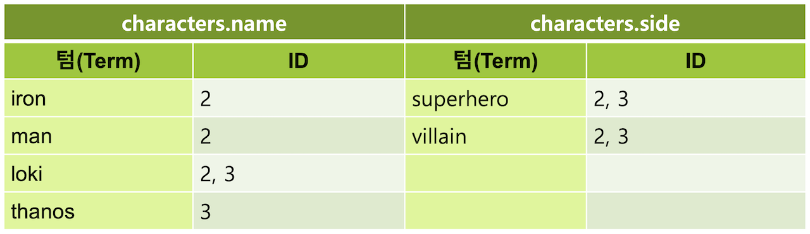

역 색인에서는 object 필드의 하위 필드들은 모두 상위 필드의 이름과 함께 펼쳐져서 한 필드로 저장이 됩니다. 그렇기 때문에 `"characters.name": "Loki"`, `"characters.side": "villain"` 두 필드값들은 `"_id" : "2"` , `"_id" : "3"` 두 도큐먼트 모두를 리턴합니다.

### Nested

만약에 object 타입 필드에 있는 여러 개의 object 값들이 서로 다른 역 색인 구조를 갖도록 하려면 **nested** 타입으로 지정해야 합니다. nested 타입으로 지정하려면 매핑에 다음과 같이 `"type": "nested"` 를 명시합니다. 다른 부분은 object 와 동일합니다.

```javascript
# 매핑에 nested 타입 characters 필드 선언
PUT movie
{
  "mappings": {
    "properties": {
      "characters": {
        "type": "nested",
        "properties": {
          "name": {
            "type": "text"
          },
          "side": {
            "type": "keyword"
          }
        }
      }
    }
  }
}
```

입력할 데이터는 의 object 예제에서 입력 한 데이터와 동일합니다. 매핑을 위와 같이 nested 형식으로 선언하고 앞에서 했던 **title** 필드 값이 각각 **"The Avengers"**, **"Avengers: Infinity War"** 이고 characters 필드에 object 값이 2개씩 들어있는 두 개의 도큐먼트를 다시 한번 입력 해 보도록 합니다. 그 뒤 다시 characters 필드의 name 값은 **"Loki"** 이고 side 값은 **"villain"** 인 도큐먼트를 검색 해 보도록 합니다.

<DocTabs>
  <DocTab name="request">
```javascript
# characters 하위 필드의 name: Loki, side: villain 검색
GET movie/_search
{
  "query": {
    "bool": {
      "must": [
        {
          "match": {
            "characters.name": "Loki"
          }
        },
        {
          "match": {
            "characters.side": "villain"
          }
        }
      ]
    }
  }
}
```
  </DocTab>
  <DocTab name="response">
```javascript
# characters 하위 필드의 name: Loki, side: villain 검색 결과
{
  "took" : 1,
  "timed_out" : false,
  "_shards" : {
    "total" : 1,
    "successful" : 1,
    "skipped" : 0,
    "failed" : 0
  },
  "hits" : {
    "total" : {
      "value" : 0,
      "relation" : "eq"
    },
    "max_score" : null,
    "hits" : [ ]
  }
}
```
  </DocTab>
</DocTabs>

검색 결과가 하나도 나타나지 않았습니다.

nested 필드를 검색 할 때는 반드시 **nested 쿼리**를 써야 합니다. nested 쿼리 안에는 **path** 라는 옵션으로 nested로 정의된 필드를 먼저 명시하고 그 안에 다시 쿼리를 넣어서 입력합니다.

<DocTabs>
  <DocTab name="request">
```javascript
# nested 쿼리로 characters 하위 필드의 name: Loki, side: villain 검색
GET movie/_search
{
  "query": {
    "nested": {
      "path": "characters",
      "query": {
        "bool": {
          "must": [
            {
              "match": {
                "characters.name": "Loki"
              }
            },
            {
              "match": {
                "characters.side": "villain"
              }
            }
          ]
        }
      }
    }
  }
}
```
  </DocTab>
  <DocTab name="response">
```javascript
# nested 쿼리로 characters 하위 필드의 name: Loki, side: villain 검색 결과
{
  "took" : 1,
  "timed_out" : false,
  "_shards" : {
    "total" : 1,
    "successful" : 1,
    "skipped" : 0,
    "failed" : 0
  },
  "hits" : {
    "total" : {
      "value" : 1,
      "relation" : "eq"
    },
    "max_score" : 1.4480599,
    "hits" : [
      {
        "_index" : "movie",
        "_type" : "_doc",
        "_id" : "2",
        "_score" : 1.4480599,
        "_source" : {
          "title" : "The Avengers",
          "characters" : [
            {
              "name" : "Iron Man",
              "side" : "superhero"
            },
            {
              "name" : "Loki",
              "side" : "villain"
            }
          ]
        }
      }
    ]
  }
}
```
  </DocTab>
</DocTabs>

결과로 `{"name" : "Loki", "side" : "villain"}` 값을 포함하고 있는 `"_id" : "2"` 도큐먼트만 검색이 되었습니다.

nested 쿼리로 검색하면 nested 필드의 내부에 있는 값 들을 모두 별개의 도큐먼트로 취급합니다. 앞의 예제에서 본 object 도큐먼트와 nested 도큐먼트를 그림으로 비교 해 보면 다음과 같습니다.

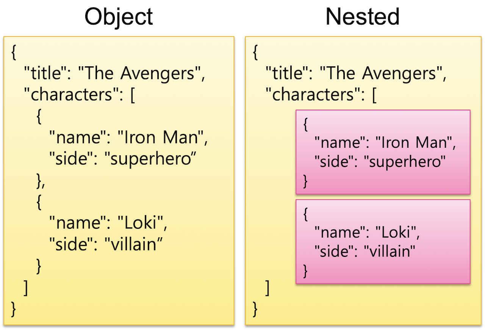

object 필드 값들은 실제로 하나의 도큐먼트 안에 전부 포함되어 있습니다. 반면에 nested 필드 값들은 내부적으로 별도의 도큐먼트로 분리되어 저장되며 쿼리 결과에서 상위 도큐먼트와 합쳐져서 보여지게 됩니다.

## 7.2.6 위치 정보 - Geo

검색엔진을 사용하는 여러 서비스들 중에 요즘은 모바일 기기들을 이용해서 위치 정보를 표시하거나 검색하는 서비스들이 많이 있습니다. Elasticsearch는 자바와 기타 프로그래밍 언어에서 제공하는 기본 데이터 타입 외에도 여러가지의 추상화 된 데이터 타입들이 있습니다. 그 중에 이런 위치정보를 저장할 수 있는 **Geo Point** 와 **Geo Shape** 같은 타입들이 있습니다.

### Geo Point

**Geo Point** 는 위도(**latitude**)와 경도(**longitude**) 두 개의 실수 값을 가지고 지도 위의 한 점을 나타내는 값입니다. Geo Point 필드의 값들은 다음과 같이 다양한 방법으로 입력이 가능합니다.

```javascript
# object 형식으로 geo_point 입력
PUT my_locations/_doc/1
{
  "location": {
    "lat": 41.12,
    "lon": -71.34
  }
}
```

```javascript
# text 형식으로 geo_point 입력
PUT my_index/_doc/2
{
  "location": "41.12,-71.34"
}
```

```javascript
# geohash 형식으로 geo_point 입력
PUT my_index/_doc/3
{
  "location": "drm3btev3e86"
}
```

```javascript
# 실수의 배열 형식으로 geo_point 입력
PUT my_index/_doc/4
{
  "location": [
    -71.34,
    41.12
  ]
}
```

Text 와 실수 방식은 위도와 경도의 입력 순서가 서로 반대이기 때문에 헷갈리기 쉽습니다. 그래서 보통은 `{"lat": 41.12, "lon": -71.34}` 와 같이 알아보기 편한 **object** 형식으로 입력합니다.

**geohash** 는 전 세계 지도를 바둑판 모양의 격자로 나누어 각 칸 마다 숫자와 알파벳으로 기호를 메기고, 그 칸을 다시 나누어 다시 기호를 추가하는 방식으로 표현한 것입니다. 자릿수가 커질수록 정밀도가 높아집니다. 보통 1자리 값이면 대륙, 2자리 값이면 대한민국 영토 정도의 크기이고 4자리 값이면 대도시, 7자리 값이면 길거리 한 블록 정도의 정밀도를 나타냅니다. 아래 예시에서 `sg` 값은 북유럽 스칸디나비아 반도 부근의 크기입니다.

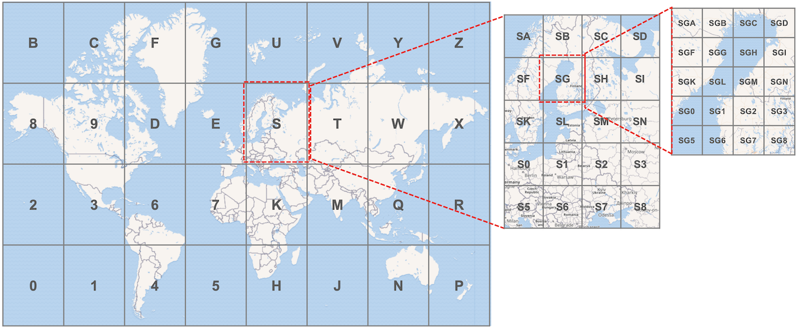

Geo Point 필드는 매핑에서 다음과 같이 `"type": "geo_point"` 로 선언합니다.

```javascript
# object 형식으로 geo_point 입력
PUT my_geo
{
  "mappings": {
    "properties": {
      "location": {
        "type": "geo_point"
      }
    }
  }
}
```

Geo Point 필드의 경우는 반드시 데이터를 입력하기 전에 인덱스 매핑을 정의 해 주어야 합니다. 매핑을 정의하지 않고 `{ "location": { "lat" : 41.12, "lon": -71.34 } }` 와 같은 값을 입력하면 다이나믹 매핑으로 필드가 자동 생성될 때 geo_point 타입의 필드가 생기는 것이 아니라 다음과 같이 **float** 타입의 **lat, lon** 두개의 하위 필드가 생깁니다.

<DocTabs>
  <DocTab name="request">
```javascript
# 도큐먼트 입력으로 my_geo 인덱스 동적 생성
PUT my_geo/_doc/1
{
  "location": {
    "lat": 41.12,
    "lon": -71.34
  }
}

# my_geo 인덱스의 매핑 확인
GET my_geo/_mapping
```
  </DocTab>
  <DocTab name="response">
```javascript
# 도큐먼트 입력으로 my_geo 인덱스 동적 생성 후 매핑 확인 결과
{
  "my_geo" : {
    "mappings" : {
      "properties" : {
        "location" : {
          "properties" : {
            "lat" : {
              "type" : "float"
            },
            "lon" : {
              "type" : "float"
            }
          }
        }
      }
    }
  }
}
```
  </DocTab>
</DocTabs>

### geo_bounding_box 쿼리

Elasticsearch에는 위치정보를 검색할 수 있는 다양한 쿼리들이 있습니다. **geo_point** 값의 검색에 주로 사용 되는 것은 **geo_bounding_box** 쿼리와 **geo_distance** 쿼리 입니다. 예제 위해 먼저 다음 도큐먼트들을 my_geo 인덱스에 벌크로 입력하겠습니다. location 필드의 타입을 `"type": "geo_point"` 로 매핑을 먼저 설정해야 하는 것을 잊지 마세요.

```javascript
# my_geo 인덱스에 예제 데이터 입력
PUT my_geo/_bulk
{"index":{"_id":"1"}}
{"station":"강남","location":{"lon":127.027926,"lat":37.497175},"line":"2호선"}
{"index":{"_id":"2"}}
{"station":"종로3가","location":{"lon":126.991806,"lat":37.571607},"line":"3호선"}
{"index":{"_id":"3"}}
{"station":"여의도","location":{"lon":126.924191,"lat":37.521624},"line":"5호선"}
{"index":{"_id":"4"}}
{"station":"서울역","location":{"lon":126.972559,"lat":37.554648},"line":"1호선"}
```

**geo_bounding_box** 쿼리는 **top_left** 와 **bottom_right** 두 개의 옵션에 각각 위치점을 입력하고 이 점들을 토대로 그린 네모 칸 안에 위치하는 도큐먼트들을 불러옵니다. 다음은 `{"lat": 37.4899, "lon": 127.0388}`, `{"lat": 37.5779, "lon": 126.9617}` 두 점을 기준으로 하는 네모 영역 안에 있는 도큐먼트들을 가져오는 예제입니다.

<DocTabs>
  <DocTab name="request">
```javascript
# geo_bounding_box 쿼리로 네모 영역 안에 있는 도큐먼트 쿼리
GET my_geo/_search
{
  "query": {
    "geo_bounding_box": {
      "location": {
        "bottom_right": {
          "lat": 37.4899,
          "lon": 127.0388
        },
        "top_left": {
          "lat": 37.5779,
          "lon": 126.9617
        }
      }
    }
  }
}
```
  </DocTab>
  <DocTab name="response">
```javascript
# geo_bounding_box 쿼리로 네모 영역 안에 있는 도큐먼트 쿼리 결과
{
  "took" : 0,
  "timed_out" : false,
  "_shards" : {
    "total" : 1,
    "successful" : 1,
    "skipped" : 0,
    "failed" : 0
  },
  "hits" : {
    "total" : {
      "value" : 3,
      "relation" : "eq"
    },
    "max_score" : 1.0,
    "hits" : [
      {
        "_index" : "my_geo",
        "_type" : "_doc",
        "_id" : "1",
        "_score" : 1.0,
        "_source" : {
          "station" : "강남",
          "location" : {
            "lon" : 127.027926,
            "lat" : 37.497175
          },
          "line" : "2호선"
        }
      },
      {
        "_index" : "my_geo",
        "_type" : "_doc",
        "_id" : "2",
        "_score" : 1.0,
        "_source" : {
          "station" : "종로3가",
          "location" : {
            "lon" : 126.991806,
            "lat" : 37.571607
          },
          "line" : "3호선"
        }
      },
      {
        "_index" : "my_geo",
        "_type" : "_doc",
        "_id" : "4",
        "_score" : 1.0,
        "_source" : {
          "station" : "서울역",
          "location" : {
            "lon" : 126.972559,
            "lat" : 37.554648
          },
          "line" : "1호선"
        }
      }
    ]
  }
}
```
  </DocTab>
</DocTabs>

`"station" : "강남"`, `"station" : "종로3가"`, `"station" : "서울역"` 총 3개의 결과가 리턴 되었습니다. 위 쿼리 내용을 지도에 표현 해 보면 다음과 같습니다.

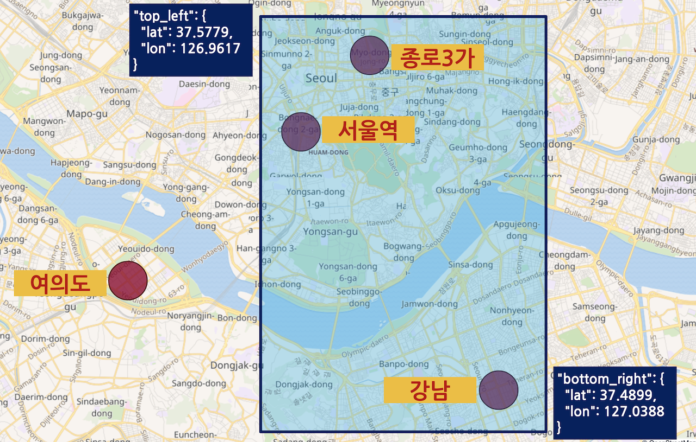

### geo_distance 쿼리

**geo_distance** 쿼리는 하나의 위치점을 찍고 **distance** 옵션을 이용해서 입력한 반경의 원 안에 있는 도큐먼트들을 불러옵니다. 다음은 `{"lat": 37.5358, "lon": 126.9559}` 기준으로 **반경 5킬로미터** 안에 있는 도큐먼트들을 불러오는 예제입니다.

<DocTabs>
  <DocTab name="request">
```javascript
# geo_distance 쿼리로 기준점에서 반경 5km 안에 있는 도큐먼트 쿼리
GET my_geo/_search
{
  "query": {
    "geo_distance": {
      "distance": "5km",
      "location": {
        "lat": 37.5358,
        "lon": 126.9559
      }
    }
  }
}
```
  </DocTab>
  <DocTab name="response">
```javascript
# geo_distance 쿼리로 기준점에서 반경 5km 안에 있는 도큐먼트 쿼리 결과
{
  "took" : 71,
  "timed_out" : false,
  "_shards" : {
    "total" : 1,
    "successful" : 1,
    "skipped" : 0,
    "failed" : 0
  },
  "hits" : {
    "total" : {
      "value" : 2,
      "relation" : "eq"
    },
    "max_score" : 1.0,
    "hits" : [
      {
        "_index" : "my_geo",
        "_type" : "_doc",
        "_id" : "3",
        "_score" : 1.0,
        "_source" : {
          "station" : "여의도",
          "location" : {
            "lon" : 126.924191,
            "lat" : 37.521624
          },
          "line" : "5호선"
        }
      },
      {
        "_index" : "my_geo",
        "_type" : "_doc",
        "_id" : "4",
        "_score" : 1.0,
        "_source" : {
          "station" : "서울역",
          "location" : {
            "lon" : 126.972559,
            "lat" : 37.554648
          },
          "line" : "1호선"
        }
      }
    ]
  }
}
```
  </DocTab>
</DocTabs>

`"station" : "여의도"`, `"station" : "서울역"` 총 2개의 결과가 리턴되었습니다. **distance** 값을 10km, 20km 등으로 변경해서 다시 쿼리를 해 보면 종로3가, 강남이 결과에 나타나는 것도 확인할 수 있습니다. 위 쿼리를 지도에 표시 해 보면 다음과 같습니다.

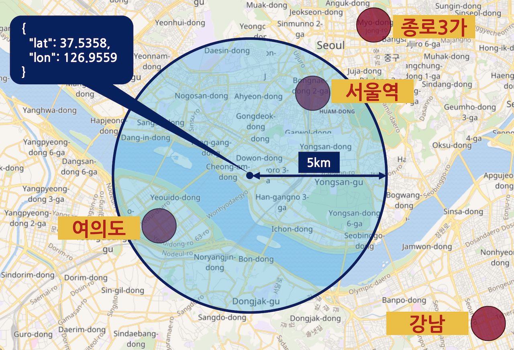

### Geo Shape

앞에서 살펴본 Geo Point 는 위도 경도 두개의 값을 가진 1차원 데이터 "점" 입니다. Elasticsearch 에서 사용 가능한 또 다른 위치정보 타입인 **Geo Shape** 은 선, 면 등의 2차원 값을 저장하고 쿼리할 수 있습니다. Geo Shape 필드는 `"type": "geo_shape"` 으로 선언합니다.

```javascript
# geo_shape 필드 선언
PUT my_shape
{
  "mappings": {
    "properties": {
      "location": {
        "type": "geo_shape"
      }
    }
  }
}
```

도큐먼트에도 점, 선, 다중점, 다중선, 다각형 등을 `"type"` 값에 각각 다음과 같이 지정하고 `"coordinates"` 값에 위치 정보를 **\[ -71.34, 41.12 ]** 같이 **\[경도, 위도]** 의 순서로 배열 형식으로 입력합니다. 위치정보 순서가 반대로 되면 엉뚱한 값이 되기 때문에 주의해야 합니다.

- `"type": "point"` - 단일 점 입니다. 보통은 geo_point 와 같은 용도로 사용됩니다.

```javascript
# "type": "point" 형태의 geo_shape 값 입력
PUT my_shape/_doc/1
{
  "location": {
    "type": "point",
    "coordinates": [
      127.027926,
      37.497175
    ]
  }
}
```

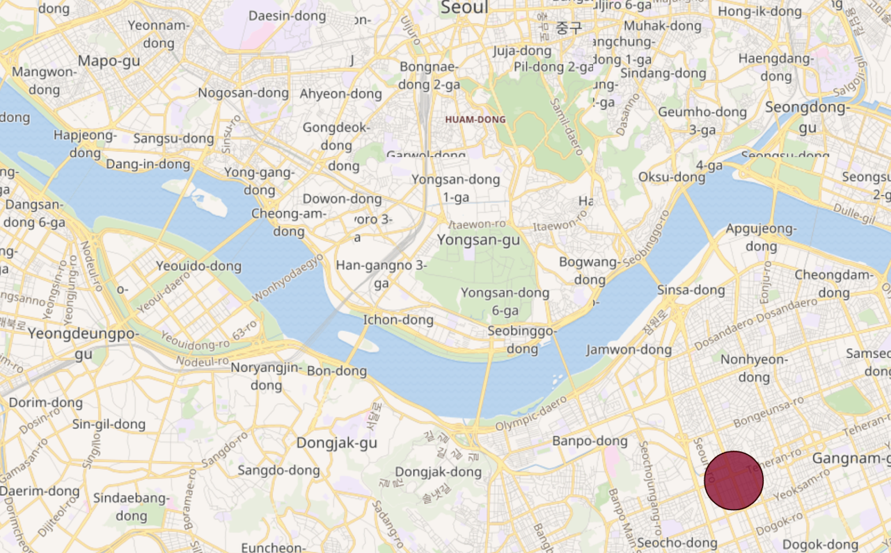

- `"type": "multipoint"` - 여러 점을 하나의 값으로 저장합니다. 점들을 배열로 입력합니다.

```javascript
# "type": "multipoint" 형태의 geo_shape 값 입력
PUT my_shape/_doc/2
{
  "location": {
    "type": "multipoint",
    "coordinates": [
      [ 127.027926, 37.497175 ],
      [ 126.991806, 37.571607 ],
      [ 126.924191, 37.521624 ],
      [ 126.972559, 37.554648 ]
    ]
  }
}
```

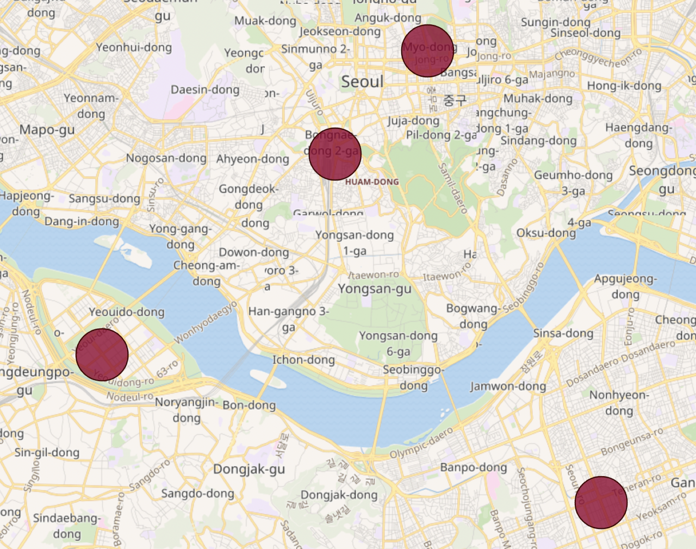

- `"type": "linestring"` - 점 2개 값를 배열로 입력하여 두 점을 잇는 **직선**을 저장합니다. 비행 경로 등을 저장할때 유용합니다.

```javascript
# "type": "linestring" 형태의 geo_shape 값 입력
PUT my_shape/_doc/3
{
  "location": {
    "type": "linestring",
    "coordinates": [
      [ 127.027926, 37.497175 ],
      [ 126.991806, 37.571607 ]
    ]
  }
}
```

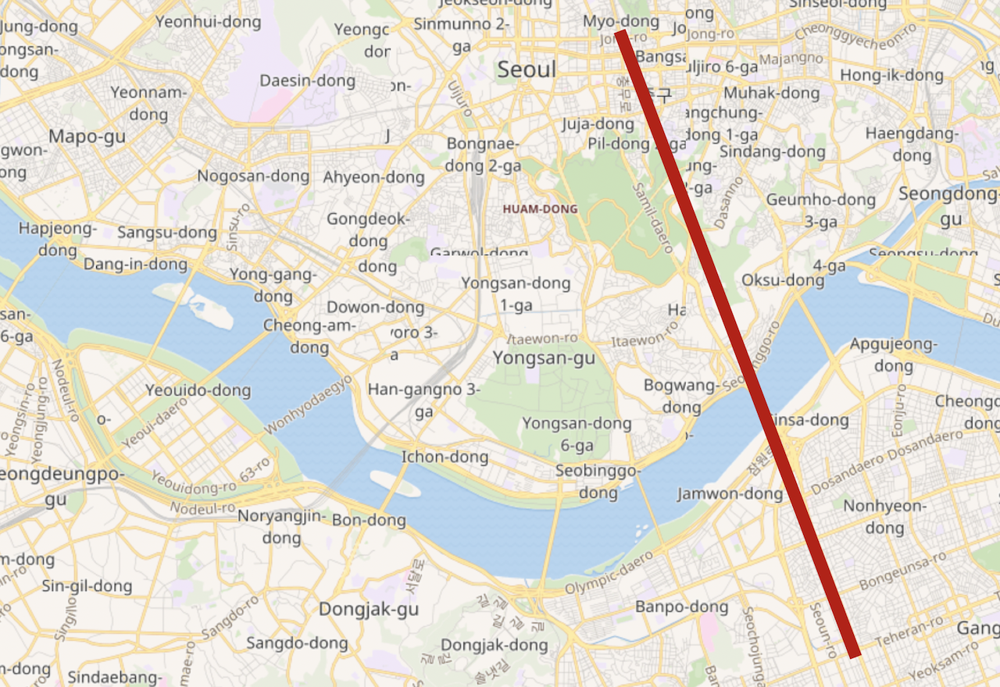

- `"type": "multilinestring"` - 여러개의 직선을 배열로 입력하여 저장합니다.

```javascript
# "type": "multilinestring" 형태의 geo_shape 값 입력
PUT my_shape/_doc/4
{
  "location": {
    "type": "multilinestring",
    "coordinates": [
      [
        [ 127.027926, 37.497175 ],
        [ 126.991806, 37.571607 ]
      ],
      [
        [ 126.924191, 37.521624 ],
        [ 126.972559, 37.554648 ]
      ]
    ]
  }
}
```

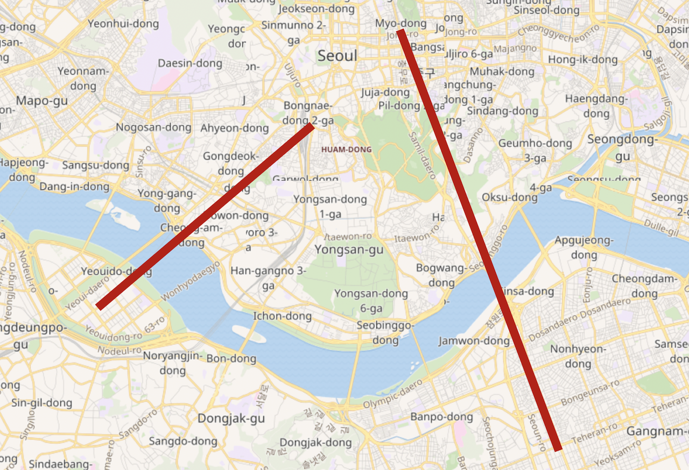

- `"type": "polygon"` - 다각형을 저장합니다. 내부에 배열을 추가하고 점들을 배열로 입력하며 순서대로 이어집니다. **배열 마지막에는 반드시 처음과 같은 점이 입력되어야 합니다.** 영토 정보 등을 저장할때 유용합니다.

```javascript
# "type": "polygon" 형태의 geo_shape 값 입력
PUT my_shape/_doc/5
{
  "location": {
    "type": "polygon",
    "coordinates": [
      [
        [ 127.027926, 37.497175 ],
        [ 126.991806, 37.571607 ],
        [ 126.924191, 37.521624 ],
        [ 126.972559, 37.554648 ],
        [ 127.027926, 37.497175 ]
      ]
    ]
  }
}
```

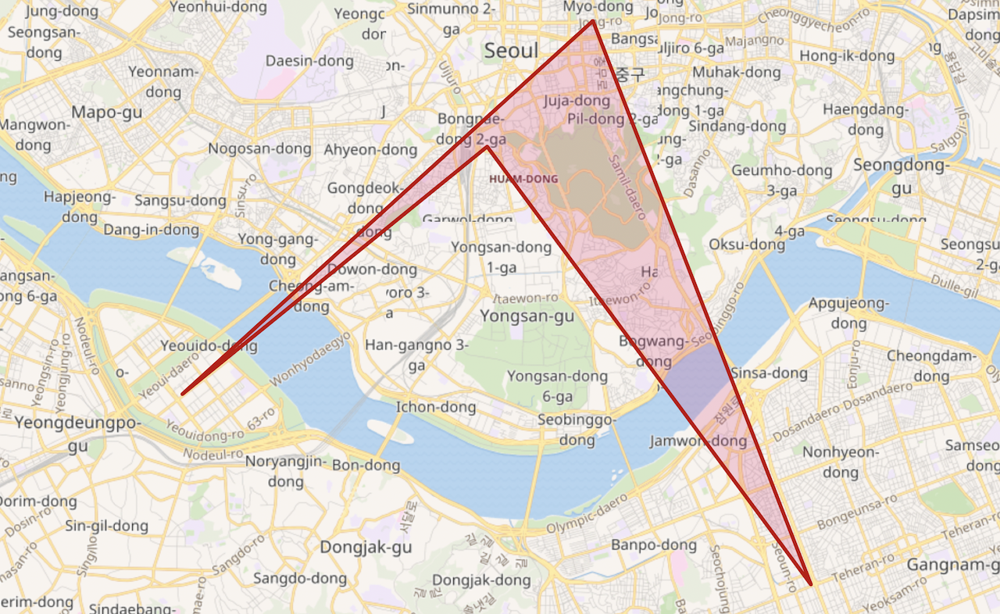

- `"type": "multipolygon"` - 여러 개의 다각형을 배열로 저장합니다. 미국의 알래스카, 하와이, 본토 등과 같이 분리된 영토를 같이 저장하는데 유용합니다.

```javascript
# "type": "multipolygon" 형태의 geo_shape 값 입력
PUT my_shape/_doc/6
{
  "location": {
    "type": "multipolygon",
    "coordinates": [
      [
        [
          [ 127.027926, 37.497175 ],
          [ 126.991806, 37.571607 ],
          [ 126.924191, 37.521624 ],
          [ 127.004943, 37.504810 ],
          [ 127.027926, 37.497175 ]
        ]
      ],
      [
        [
          [ 126.936893, 37.555134 ],
          [ 126.967894, 37.529170 ],
          [ 126.924191, 37.521624 ],
          [ 126.936893, 37.555134 ]
        ]
      ]
    ]
  }
}
```

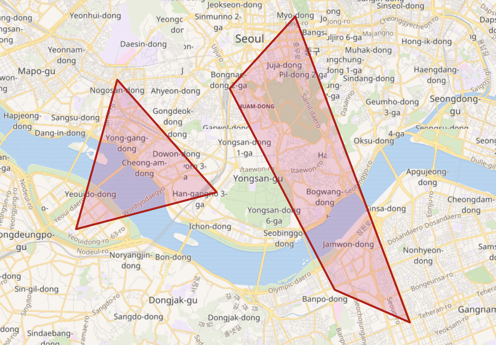

- `"type": "envelope"` - 바른 각도의 직사각형 영역을 저장할때는 **polygon** 으로 4개의 점을 입력하여 지정할 수도 있지만, 대신 **envelope** 을 사용하면 좌측 **상단(upper left)** 와 **우측 하단(lower right)** 점 두개만 이용해서 그리는 것도 가능합니다.

```javascript
# "type": "envelope" 형태의 geo_shape 값 입력
PUT my_shape/_doc/7
{
  "location": {
    "type": "envelope",
    "coordinates": [
      [ 126.936893, 37.555134 ],
      [ 127.004943, 37.50481 ]
    ]
  }
}
```

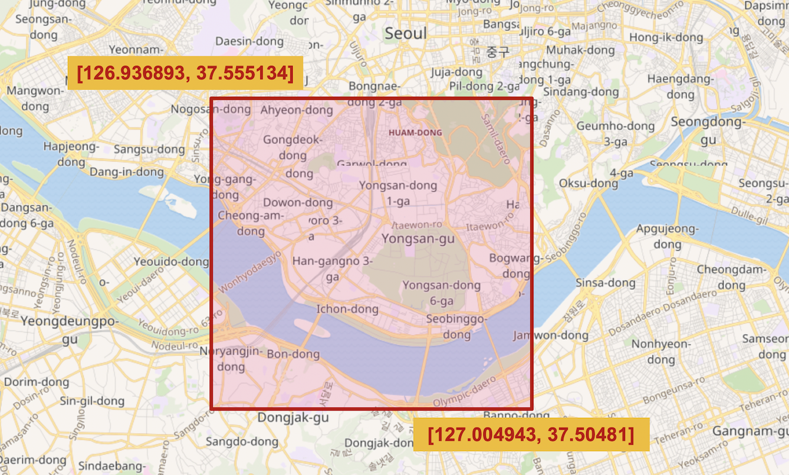

<DocCallOut color="warning">
6.5 이전 버전 까지는 한 점의 coordinates 와 `"radius": "5km"` 같은 반경을 지정하는 값을 이용해서 `"type": "circle"` 인 원 형태의 데이터도 사용이 가능했습니다. 버전6.6 부터는 geo_shape 데이터의 저장 방식이 변경되면서 6.6 버전 이후 부터 필자가 글을 쓰고 있는 현재 7.4 버전에서의 원 형태의 데이터는 지원하지 않고 있습니다. 이후 다시 구현 될 가능성은 있습니다.
</DocCallOut>

### geo_shape 쿼리

Geo Shape 타입의 값들을 검색하려면 **geo_shape** 쿼리를 사용해야 합니다. 입력해야하는 옵션으로는 `"shape": { }` 에 검색할 영역의 `"type"` 과 `"coordinates"` 값을 입력하고, `"relation"` 에 검색할 영역과 검색되는 도큐먼트가 겹치거나 포함되는 관계 조건 값을 입력합니다. relation 옵션에 입력 가능한 값은 **intersects**, **disjoint**, **within** 3가지가 있습니다.

- `"relation": "intersects"` - 디폴트 값입니다. 쿼리 영역과 도큐먼트 값 영역이 일부라도 겹쳐지면 참 입니다.
- `"relation": "disjoint"` - 도큐먼트 값 영역이 쿼리 영역과 겹치지 않는 쿼리 영역 바깥에 있는 도큐먼트들을 가져옵니다.
- `"relation": "within"` - 도큐먼트의 값들이 모두 쿼리 영역 안에 완전히 포함 되어 있는 도큐먼트들을 가져옵니다.

예제 실행을 위해 my_shape 인덱스에 다음 세 개의 **envelope** 방식의 **geo_shape** 값을 입력하겠습니다. 먼저 **location** 필드의 매핑을 `"type": "geo_shape"` 으로 지정해야 하는 것을 명심하세요.

```javascript
# geo_shape 예제를 위한 3개의 도큐먼트 입력
PUT my_shape/_doc/1
{
  "place": "경복궁",
  "location": {
    "type": "envelope",
    "coordinates": [
      [ 126.9735, 37.5837 ],
      [ 126.9802, 37.5756 ]
    ]
  }
}

PUT my_shape/_doc/2
{
  "place": "명동",
  "location": {
    "type": "envelope",
    "coordinates": [
      [ 126.9778, 37.5656 ],
      [ 126.9884, 37.5558 ]
    ]
  }
}

PUT my_shape/_doc/3
{
  "place": "홍대",
  "location": {
    "type": "envelope",
    "coordinates": [
      [ 126.9199, 37.5583 ],
      [ 126.9347, 37.5481 ]
    ]
  }
}
```

이제 **geo_shape** 쿼리를 이용해서 `"top_left": {"lat": 37.5800, "lon": 126.9687}`, `"bottom_right": {"lat": 37.5543, "lon": 126.9900}` 의 직사각형 (envelope) 범위 안에 있는 도큐먼트 들을 relation 별로 검색을 해 보겠습니다. 먼저 위에 입력한 도큐먼트와 이후 검색할 쿼리 범위를 지도에 표시하면 다음과 같습니다.

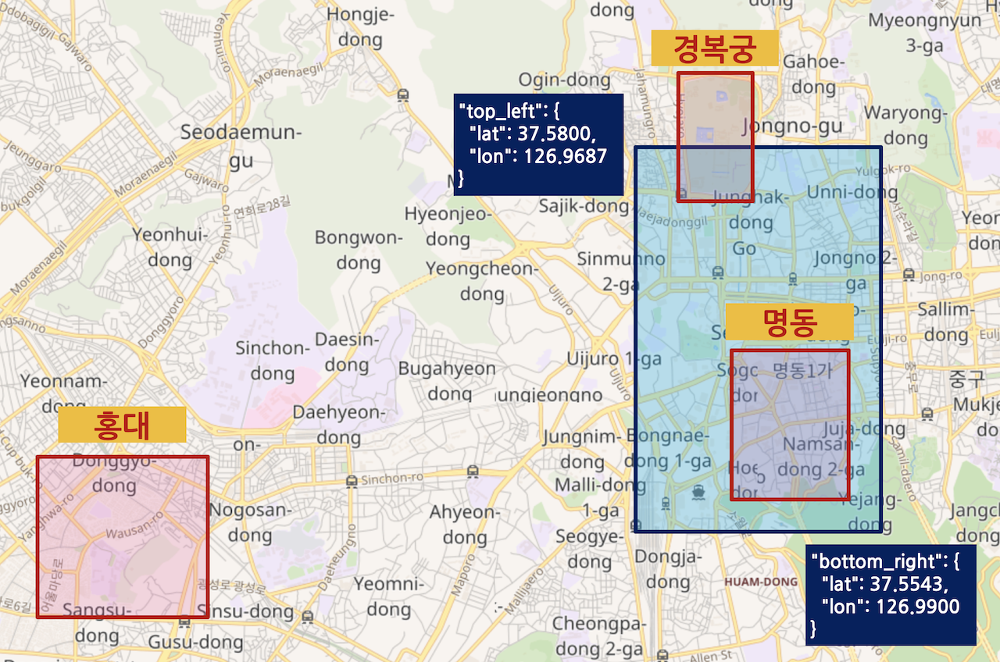

다음은 **geo_shape** 쿼리의 **relation** 값을 각각 **intersects**, **within**, **disjoint** 한 결과입니다.

<DocTabs>
  <DocTab name="request">
```javascript
# "relation": "intersects" 으로 geo_shape 쿼리
GET my_shape/_search
{
  "query": {
    "geo_shape": {
      "location": {
        "shape": {
          "type": "envelope",
          "coordinates": [
            [ 126.9687, 37.58 ],
            [ 126.99, 37.5543 ]
          ]
        },
        "relation": "intersects"
      }
    }
  }
}
```
  </DocTab>
  <DocTab name="response">
```javascript
# "relation": "intersects" 으로 geo_shape 쿼리 결과
{
  "took" : 2,
  "timed_out" : false,
  "_shards" : {
    "total" : 1,
    "successful" : 1,
    "skipped" : 0,
    "failed" : 0
  },
  "hits" : {
    "total" : {
      "value" : 2,
      "relation" : "eq"
    },
    "max_score" : 1.0,
    "hits" : [
      {
        "_index" : "my_shape",
        "_type" : "_doc",
        "_id" : "1",
        "_score" : 1.0,
        "_source" : {
          "place" : "경복궁",
          "location" : {
            "type" : "envelope",
            "coordinates" : [
              [
                126.9735,
                37.5837
              ],
              [
                126.9802,
                37.5756
              ]
            ]
          }
        }
      },
      {
        "_index" : "my_shape",
        "_type" : "_doc",
        "_id" : "2",
        "_score" : 1.0,
        "_source" : {
          "place" : "명동",
          "location" : {
            "type" : "envelope",
            "coordinates" : [
              [
                126.9778,
                37.5656
              ],
              [
                126.9884,
                37.5558
              ]
            ]
          }
        }
      }
    ]
  }
}
```
  </DocTab>
</DocTabs>

- `"relation": "intersects"` - 쿼리 영역에 조금이라도 걸쳐 있는 `"place" : "경복궁"` 과 `"place" : "명동"` 도큐먼트들이 결과로 나타납니다.

<DocTabs>
  <DocTab name="request">
```javascript
# "relation": "within" 으로 geo_shape 쿼리
GET my_shape/_search
{
  "query": {
    "geo_shape": {
      "location": {
        "shape": {
          "type": "envelope",
          "coordinates": [
            [ 126.9687, 37.58 ],
            [ 126.99, 37.5543 ]
          ]
        },
        "relation": "within"
      }
    }
  }
}
```
  </DocTab>
  <DocTab name="response">
```javascript
# "relation": "within" 으로 geo_shape 쿼리 결과
{
  "took" : 1,
  "timed_out" : false,
  "_shards" : {
    "total" : 1,
    "successful" : 1,
    "skipped" : 0,
    "failed" : 0
  },
  "hits" : {
    "total" : {
      "value" : 1,
      "relation" : "eq"
    },
    "max_score" : 1.0,
    "hits" : [
      {
        "_index" : "my_shape",
        "_type" : "_doc",
        "_id" : "2",
        "_score" : 1.0,
        "_source" : {
          "place" : "명동",
          "location" : {
            "type" : "envelope",
            "coordinates" : [
              [
                126.9778,
                37.5656
              ],
              [
                126.9884,
                37.5558
              ]
            ]
          }
        }
      }
    ]
  }
}
```
  </DocTab>
</DocTabs>

- `"relation": "within"` - 쿼리 영역에 완전히 포함되어 있는 `"place" : "명동"` 도큐먼트만 결과로 나타납니다.

<DocTabs>
  <DocTab name="request">
```javascript
# "relation": "disjoint" 으로 geo_shape 쿼리
GET my_shape/_search
{
  "query": {
    "geo_shape": {
      "location": {
        "shape": {
          "type": "envelope",
          "coordinates": [
            [ 126.9687, 37.58 ],
            [ 126.99, 37.5543 ]
          ]
        },
        "relation": "disjoint"
      }
    }
  }
}
```
  </DocTab>
  <DocTab name="response">
```javascript
# "relation": "disjoint" 으로 geo_shape 쿼리 결과
{
  "took" : 1,
  "timed_out" : false,
  "_shards" : {
    "total" : 1,
    "successful" : 1,
    "skipped" : 0,
    "failed" : 0
  },
  "hits" : {
    "total" : {
      "value" : 1,
      "relation" : "eq"
    },
    "max_score" : 1.0,
    "hits" : [
      {
        "_index" : "my_shape",
        "_type" : "_doc",
        "_id" : "3",
        "_score" : 1.0,
        "_source" : {
          "place" : "홍대",
          "location" : {
            "type" : "envelope",
            "coordinates" : [
              [
                126.9199,
                37.5583
              ],
              [
                126.9347,
                37.5481
              ]
            ]
          }
        }
      }
    ]
  }
}
```
  </DocTab>
</DocTabs>

- `"relation": "disjoint"` - 쿼리 영역 바깥에 있는 `"place" : "홍대"` 도큐먼트가 결과로 나타납니다.

이 외에도 정사각형이 아닌 다각형으로 쿼리할 수 있는 **geo_polygon** 쿼리가 있습니다. 이 책에서 geo_polygon 쿼리는 다루지 않으니 [공식 도큐먼트](https://www.elastic.co/guide/en/elasticsearch/reference/7.0/query-dsl-geo-polygon-query.html)를 확인 하시기 바랍니다. 앞에서 배운 쿼리들을 이해 하셨으면 공식 도큐먼트를 참고 해서 어렵지 않게 사용이 가능 할 것입니다.

## 7.2.7 기타 필드 타입 - IP, Range, Binary

지금까지 문자열, 숫자, 날짜, 불리언, 객체, 위치정보 들을 저장하는 필드 타입들을 살펴보았습니다. 이 외에도 Elasticsearch에는 다음과 같은 추상화 된 데이터 타입들이 있습니다.

### IP

IP 주소 형식을 저장합니다. 매핑은 `"type": "ip"` 으로 선언합니다. 값은 `"192.168.1.1"` 같은 **IPv4** 형식과 `"0:0:0:0:0:ffff:c0a8:105"` 같은 **IPv6** 형식을 문자열 처럼 입력합니다.

### 범위(Range)

숫자나 날짜, IP 등을 시작과 끝이 있는 2차원의 범위 형태로 저장합니다. 매팽의 "type" 에 선언 가능한 값은 **integer_range**, **float_range**, **long_range**, **double_range**, **date_range**, **ip_range** 들이 있습니다. 데이터의 범위는 다음과 같이 **gt**, **gte**, **lt**, **lte** 를 사용해서 지정합니다.

```javascript
PUT my_range
# integer_range 와 date_range 타입의 필드 선언
{
  "mappings": {
    "properties": {
      "amount": {
        "type": "integer_range"
      },
      "days": {
        "type": "date_range"
      }
    }
  }
}
```

쿼리를 테스트 하기 위해 먼저 다음 도큐먼트를 입력하겠습니다.

```javascript
# integer_range, date_range 타입의 값을 가진 도큐먼트 입력
PUT my_range/_doc/1
{
  "amount": {
    "gte": 19,
    "lt": 28
  },
  "days": {
    "gt": "2019-06-01T09:00:00",
    "lt": "2019-06-20"
  }
}
```

Range 필드의 쿼리는 일반적인 숫자나 날짜 처럼 range 쿼리를 사용합니다. 다만 범위 데이터를 range 쿼리로 검색 할 때는 추가로 **relation** 옵션의 값을 입력해야 하며 입력하지 않으면 오류가 납니다. relation 옵션에 지정 가능한 값은 **within**, **contains**, **intersects** 3가지가 있습니다.

- within : 도큐먼트 범위 값이 쿼리한 범위 안에 완전히 포함되는 도큐먼트들을 가져옵니다.
- contains : within과 반대로 쿼리 범위가 도큐먼트 범위 값 안에 완전히 포함되는 도큐먼트들을 가져옵니다.
- Intersects : 도큐먼트 범위 값과 쿼리 범위에 공통적인 부분이 있는 도큐먼트들을 가져옵니다.

사용 예제는 다음과 같습니다.

<DocTabs>
  <DocTab name="request">
```javascript
# "relation": "intersects" 으로 range 쿼리
GET my_range/_search
{
  "query": {
    "range": {
      "amount": {
        "gte": "16",
        "lte": "25",
        "relation": "intersects"
      }
    }
  }
}
```
  </DocTab>
  <DocTab name="response">
```javascript
# "relation": "intersects" 으로 range 쿼리 결과
{
  "took" : 950,
  "timed_out" : false,
  "_shards" : {
    "total" : 1,
    "successful" : 1,
    "skipped" : 0,
    "failed" : 0
  },
  "hits" : {
    "total" : {
      "value" : 1,
      "relation" : "eq"
    },
    "max_score" : 1.0,
    "hits" : [
      {
        "_index" : "my_range",
        "_type" : "_doc",
        "_id" : "1",
        "_score" : 1.0,
        "_source" : {
          "amount" : {
            "gte" : 19,
            "lt" : 28
          },
          "days" : {
            "gt" : "2019-06-01T09:00:00",
            "lt" : "2019-06-20"
          }
        }
      }
    ]
  }
}
```
  </DocTab>
</DocTabs>

다른 값을 가진 도큐먼트를 더 입력하고 relation 값을 contains, within 으로 변경 해 가면서 더 실습 해 보시기 바랍니다.

여행이나 출장 정보를 담은 도큐먼트가 있다면 시작일, 종료일 두 필드를 지정하는 대신 출장기간 이라는 date_range 타입의 단일 필드로 값을 저장해서 더욱 편하고 유용하게 사용할 수 있습니다.

### Binary

`"type": "binary"` 로 지정해서 시스템 파일이나 이미지 정보 같은 바이너리 값을 저장할 수 있습니다. binary 필드는 기본적으로 색인이 되지 않아 검색이나 집계가 불가능하고 _source에만 남아 있습니다.

<DocCallOut>
바이너리 정보들은 일반적으로 용량이 크기 때문에 elasticsearch 도큐먼트에 저장하는 것은 불필요한 저장소와 통신 데이터의 낭비가 될 수 있습니다. 가능하면 바이너리 데이터의 저장은 S3 또는 HDFS 같은 저렴한 저장소를 이용하고 elasticsearch 도큐먼트에는 해당 자원에 접근 가능한 키 또는 URL 등만 저장해서 따로 가져오도록 하는 것이 바람직합니다.
</DocCallOut>

<DocCallOut color="warning">
지금까지 설명한 필드 외에도 수많은 종류의 필드 타입들이 있습니다. 새 버전이 나올 때 마다 새로운 필드 타입들이 추가되거나 기존에 있던 타입들의 사용이 만료되고 있기 때문에 항상 공식 도큐먼트를 잘 참고하시기 바랍니다.
</DocCallOut>
