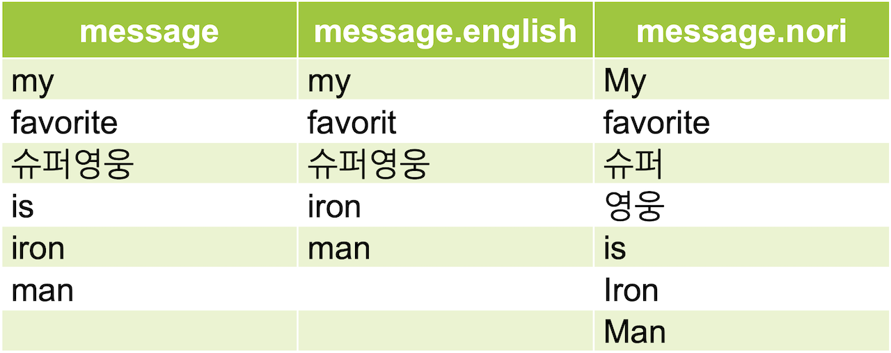

Elasticsearch 의 도큐먼트에는 하나의 필드값만 있지만 이 필드의 값을 여러 개의 역 색인 및 doc_values 들로 저장할 수 있는 다중 필드, 즉 **멀티 필드** 기능이 있습니다. 사실 이 내용은 앞에서 이미 여러 번 나왔습니다. 사용 방법은 다음과 같이 매핑에서 필드명 아래에 `"fields" : { }` 항목에서 다시 새로운 필드를 정의하고 설정합니다.

```javascript
# 멀티 필드 설정
PUT my_index
{
  "mappings": {
    "properties": {
      "<필드명1>": {
        "type": "text",
        "fields": {
          "<필드명2>": {
            "type": "<타입>"
          }
        }
      }
    }
  }
}
```

보통은 **text** 타입 아래에 **keyword** 타입을 같이 정의하기 위해서 사용됩니다. 다이나믹 매핑으로 문자열 값이 입력되면 자동으로 이런 모양으로 생성됩니다. 이 외에도 하나의 텍스트 필드에 **여러 개의 애널라이저를 적용**하기 위해서도 사용할 수 있습니다. 다음은 **my_index** 인덱스의 **message** 필드에 서로 다른 애널라이저들을 사용하는 **english**, **nori** 멀티 필드를 정의하는 예제입니다.

```javascript
# english, nori_analyzer 를 사용하는 message 의 멀티필드 정의
PUT my_index
{
  "settings": {
    "analysis": {
      "analyzer": {
        "nori_analyzer": {
          "tokenizer": "nori_tokenizer"
        }
      }
    }
  },
  "mappings": {
    "properties": {
      "message": {
        "type": "text",
        "fields": {
          "english": {
            "type": "text",
            "analyzer": "english"
          },
          "nori": {
            "type": "text",
            "analyzer": "nori_analyzer"
          }
        }
      }
    }
  }
}
```

<DocCallOut color="warning">
nori_analyzer 는 기본적으로 제공되는 애널라이저가 아니기 때문에 `"settings" : { }` 에서 만들어 줘야 합니다.
</DocCallOut>

위와 같이 매핑을 정의하면 도큐먼트에는 **message** 필드값만 있어도 **message**, **message.english**, **message.nori** 총 3개의 역 색인이 생성됩니다. 위의 인덱스에 `{ "message": "My favorite 슈퍼영웅 is Iron Man" }` 이라는 값을 입력하면 다음과 같이 3개의 역 색인이 생성됩니다.



**message.english** 에는 "favorite" 가 형태소 분석이 되어 **"favorit"** 로 저장되었습니다. **message.nori** 에는 "슈퍼영웅" 이 한글로 분석되어 **"슈퍼"**, **"영웅"** 으로 분리되어 저장되었습니다. 즉 match 쿼리를 할 때 `"messages": "영웅"` 으로는 검색이 안되지만 `"messages.nori": "영웅"` 으로 검색하면 검색이 됩니다.

<DocTabs>
  <DocTab name="request">
```javascript
# message 역 색인에서 "영웅" 검색
GET my_index/_search
{
  "query": {
    "match": {
      "message": "영웅"
    }
  }
}
```
  </DocTab>
  <DocTab name="response">
```javascript
# message 역 색인에서 "영웅" 검색 결과
{
  "took" : 0,
  "timed_out" : false,
  "_shards" : {
    "total" : 1,
    "successful" : 1,
    "skipped" : 0,
    "failed" : 0
  },
  "hits" : {
    "total" : {
      "value" : 0,
      "relation" : "eq"
    },
    "max_score" : null,
    "hits" : [ ]
  }
}
```
  </DocTab>
</DocTabs>

<DocTabs>
  <DocTab name="request">
```javascript
# message.nori 역 색인에서 "영웅" 검색
GET my_index/_search
{
  "query": {
    "match": {
      "message.nori": "영웅"
    }
  }
}
```
  </DocTab>
  <DocTab name="response">
```javascript
# message.nori 역 색인에서 "영웅" 검색 결과
{
  "took" : 3,
  "timed_out" : false,
  "_shards" : {
    "total" : 1,
    "successful" : 1,
    "skipped" : 0,
    "failed" : 0
  },
  "hits" : {
    "total" : {
      "value" : 1,
      "relation" : "eq"
    },
    "max_score" : 0.2876821,
    "hits" : [
      {
        "_index" : "my_index",
        "_type" : "_doc",
        "_id" : "1",
        "_score" : 0.2876821,
        "_source" : {
          "message" : "My favorite 슈퍼영웅 is Iron Man"
        }
      }
    ]
  }
}
```
  </DocTab>
</DocTabs>

멀티 필드는 한 필드에 여러 애널라이저를 적용해야 하는 경우, 특히 다국어로 씌여진 도큐먼트를 분석해야 할 때 매우 유용합니다.

이번 장에서는 인덱스가 가지는 **settings** 와 **mappings** 의 설정 방법, 그리고 여러 종류의 **필드 타입** 들에 대해서 알아보았습니다. 많은 내용을 다루었지만 아직도 설명하지 못한 인덱스의 또다른 많은 설정들이 있습니다. 항상 공식 도큐먼트를 같이 참고 하시기 바랍니다.
